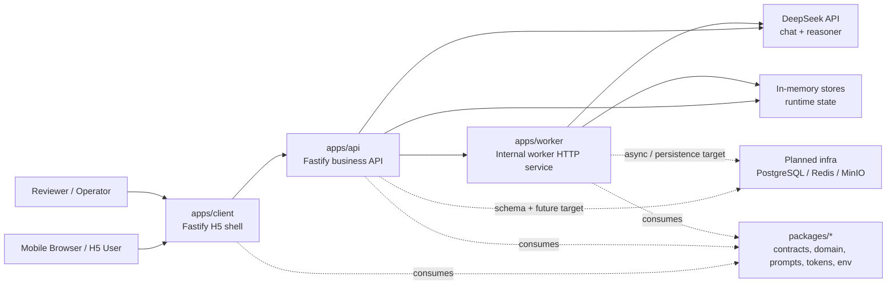
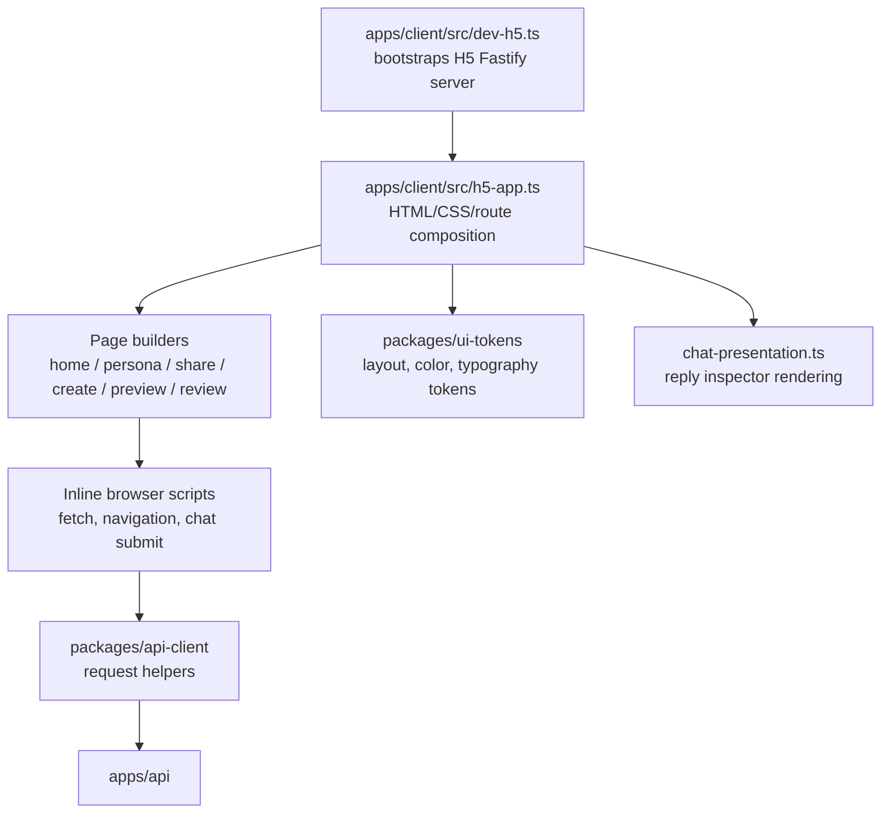
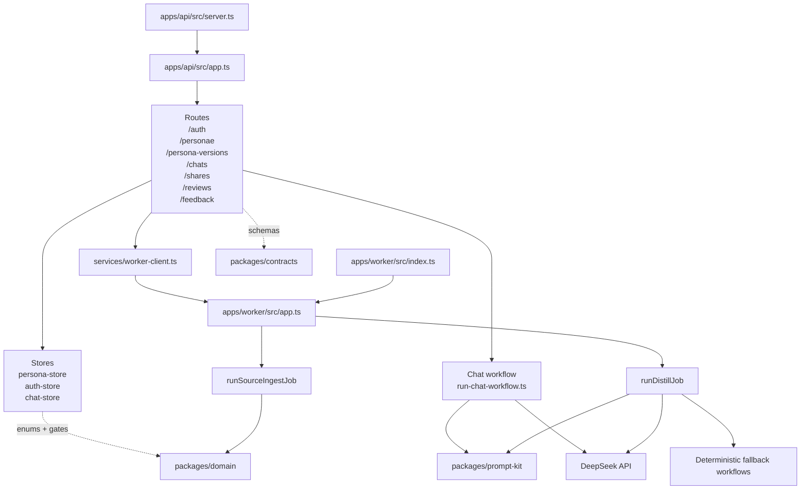
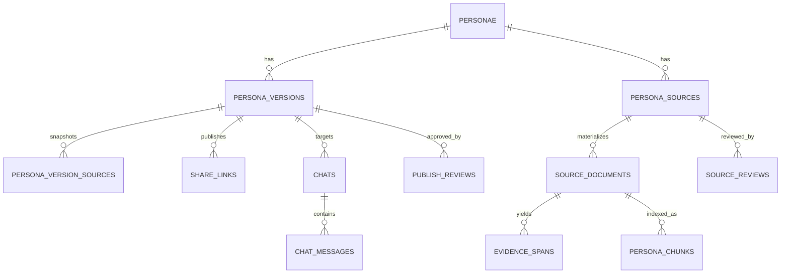
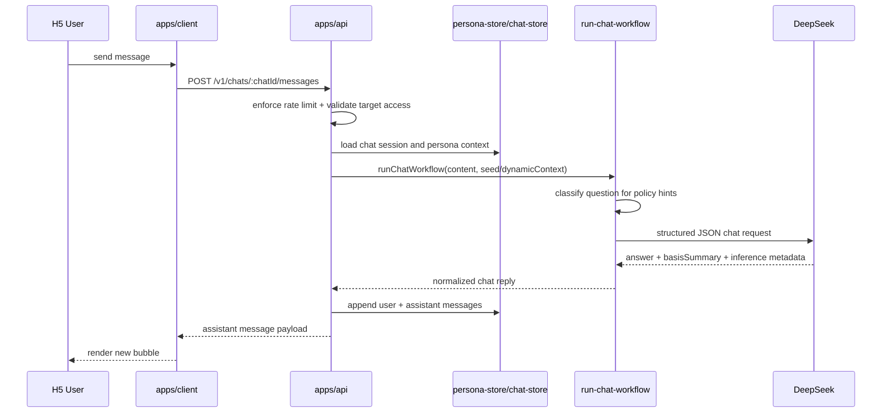
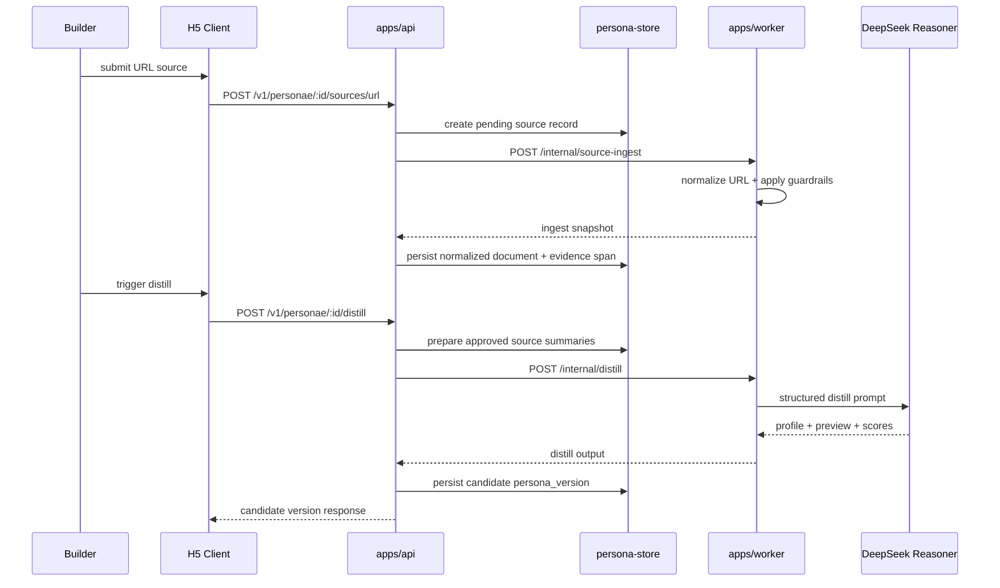
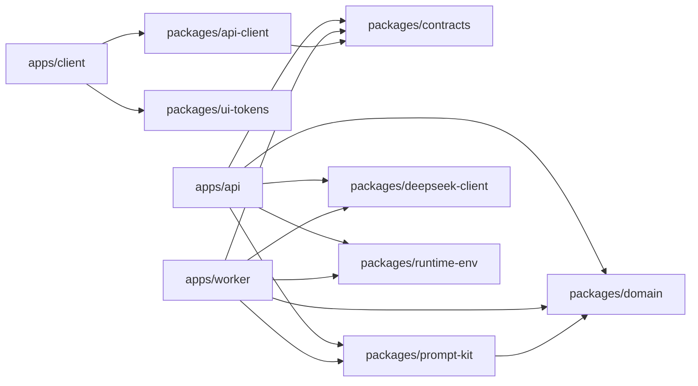

# Project Architecture Blueprint

- Generated: 2026-04-16
- Source branch: `feat/task1-bootstrap`
- Scope: current implemented architecture in `/apps/api`, `/apps/worker`, `/apps/client`, and shared `/packages/*`
- Audience: contributors who need an accurate front-end and back-end blueprint before extending the system

## 1. Executive Summary

This repository is a `pnpm` monorepo with three runtime applications and a set of shared packages:

- `apps/api`: unified business API
- `apps/worker`: ingestion and distillation worker
- `apps/client`: current H5 delivery shell
- `packages/*`: contracts, domain model, prompt kit, DeepSeek client, environment loader, design tokens, and API client helpers

The implemented architecture is best described as:

- `Layered monorepo`
- `Single business API + internal worker service`
- `Shared package boundaries instead of duplicated front/back logic`
- `LLM workflow runtime embedded into application services, not a standalone agent platform`

Important distinction:

- **Target product architecture** in product and technical docs still points toward `Taro + React` shared client targets for `H5 + WeChat Miniapp`.
- **Current implemented frontend runtime** is an `H5 Fastify-rendered shell` in `apps/client/src/h5-app.ts`.

The diagrams below reflect the **current implementation first**, then call out the target-state gaps where they matter.

## 2. Top-Level System Context



## 3. Monorepo Structure

```text
apps/
  api/        Fastify API, auth/session, chat, review, publish, share
  worker/     URL ingest + distill jobs, DeepSeek orchestration, fallback workflows
  client/     Current H5 Fastify shell, page HTML generation, browser-side fetch
packages/
  contracts/      Zod request/response schemas shared across services
  domain/         domain enums, guards, quality gates, URL normalization helpers
  api-client/     typed client helpers used by frontend/browser code
  deepseek-client thin structured JSON client for DeepSeek chat completions
  prompt-kit/     chat + distill prompt builders and output schemas
  runtime-env/    local .env/.env.local loader
  ui-tokens/      shared design tokens for H5 presentation
docs/
  technical-architecture.md
  implementation-plan.md
  product-design.md
  superpowers/specs/*
```

## 4. Frontend Architecture

## 4.1 Current Implemented Frontend

The current live frontend is not a SPA and not yet a full Taro runtime. It is:

- a Fastify server in `apps/client`
- server-generated HTML/CSS/JS in `apps/client/src/h5-app.ts`
- browser-side fetch against `apps/api`
- design driven by `packages/ui-tokens`

### Frontend Component Diagram



### Frontend Layering

| Layer | Current Implementation | Responsibility |
| --- | --- | --- |
| Delivery | `apps/client/src/dev-h5.ts` | loads env, boots Fastify, exposes H5 routes |
| Composition | `apps/client/src/h5-app.ts` | route handling, page layout, inline scripts, shell generation |
| Presentation | `packages/ui-tokens`, `chat-presentation.ts` | shared tokens, visual grammar, reply explanation rendering |
| Data access | browser `fetch` + `packages/api-client` | talk to API routes |
| Future target | `pages/`, `features/`, `services/`, `adapters/` in Taro React | documented target architecture, not yet the live primary runtime |

### Current H5 Routes

- `/`
- `/persona/:personaId`
- `/share/:shareSlug`
- `/create`
- `/preview/:personaVersionId`
- `/review`

### Frontend Architectural Notes

1. `apps/client/src/h5-app.ts` is currently the main UI composition boundary.
2. The React/Taro page files under `apps/client/src/pages/*` and `features/*` exist, but the live H5 UX is driven by the Fastify-rendered shell.
3. Shared UI consistency is centralized in `packages/ui-tokens`, which is the most stable front-end seam today.
4. Browser-side behavior is intentionally thin: submit forms, navigate routes, send chat messages, and render returned payloads.

## 4.2 Frontend Target-State Gap

Documented target state still intends:

- one client codebase
- `Taro + React + TypeScript`
- shared business logic across `H5 + WeChat Miniapp`

Current implementation has only partially moved in that direction:

- shared packages exist
- route contracts exist
- H5 works
- true dual-target client runtime is still a future step

That gap should be treated as an explicit architectural transition, not hidden.

## 5. Backend Architecture

## 5.1 Runtime Services



## 5.2 API Responsibilities

`apps/api` is the business boundary. It owns:

- auth entrypoints and bearer session handling
- persona creation and editing
- source submission
- source review and publish review
- persona version preview and publish flow
- share creation and share resolution
- chat session lifecycle
- feedback ingestion

### API Route Groups

| Route group | Responsibility |
| --- | --- |
| `/v1/auth/*` | anonymous, SMS, WeChat, reviewer session issuance and refresh |
| `/v1/personae/*` | persona CRUD, source creation, distill trigger, source listing |
| `/v1/persona-versions/*` | preview retrieval, publish submission, version-based share creation |
| `/v1/chats/*` | chat session creation, message send, chat history retrieval |
| `/v1/shares/*` | resolve share slug to published version and persona |
| `/v1/reviews/*` | reviewer queues for source approval and publish approval |
| `/v1/feedback/*` | post-chat feedback persistence |

## 5.3 Worker Responsibilities

`apps/worker` is intentionally narrower than the API:

- normalize and guard public URL ingest
- run distillation jobs
- orchestrate DeepSeek structured output calls
- fall back to deterministic workflows when DeepSeek is unavailable or invalid

It is exposed as an internal HTTP service today:

- `POST /internal/source-ingest`
- `POST /internal/distill`

This is a service boundary, even though both services still run inside the same monorepo and development environment.

## 5.4 Current Persistence Model

This is the most important implementation caveat in the backend blueprint:

- the repo contains a fairly complete PostgreSQL schema in `apps/api/src/db/schema.sql`
- but the current implementation still persists runtime state in memory inside `apps/api/src/store/*`

Current in-memory stores own:

- users and sessions
- personae and persona versions
- sources, documents, evidence spans
- share links
- chats and chat messages
- source and publish review records
- feedback

This means the architecture is currently:

- **domain model and relational schema are designed**
- **runtime persistence is not yet moved to PostgreSQL**

That should be treated as a deliberate MVP stage, not mistaken for a completed data layer.

## 6. Key Data Architecture

## 6.1 Canonical Domain Objects

The implemented domain model centers around these entities:

- `personae`
- `persona_versions`
- `persona_sources`
- `source_documents`
- `evidence_spans`
- `persona_chunks`
- `share_links`
- `chats`
- `chat_messages`
- `source_reviews`
- `persona_version_publish_reviews`
- `persona_feedback`

## 6.2 Data Relationship Diagram



## 6.3 Versioning Rule

The most important business invariant is:

- shares bind to `persona_version`
- publish review binds to `persona_version`
- preview access binds to `persona_version`
- chats resolve against `persona_version`

The mutable `persona` is therefore the aggregate root for ownership and listing, while `persona_version` is the immutable unit for publishable behavior.

## 7. Chat Request Flow



### Chat Runtime Design Notes

- `run-chat-workflow.ts` is the conversation orchestration seam
- question classification is now a policy hint, not a hard gate
- DeepSeek response is normalized before persistence
- deterministic fallback still exists when DeepSeek is unavailable
- official seeds and dynamic personas both feed the same runtime shape

## 8. Distill and Source Ingest Flow



### Distill Architecture Notes

- source ingest currently returns a guarded snapshot placeholder, not full readability extraction
- distill jobs call `deepseek-reasoner` when configured
- deterministic distill fallback exists for local development and API resilience
- the worker boundary is already present, even though queue-backed execution is still future work

## 9. Shared Package Boundaries

## 9.1 Package Dependency Roles

| Package | Role in architecture |
| --- | --- |
| `@hall-of-fame/contracts` | transport schemas for API and worker boundaries |
| `@hall-of-fame/domain` | domain enums, validation helpers, quality gates, URL rules |
| `@hall-of-fame/api-client` | thin typed request surface for frontend/browser consumers |
| `@hall-of-fame/deepseek-client` | structured JSON wrapper around DeepSeek chat completions |
| `@hall-of-fame/prompt-kit` | chat and distill prompt builders + schema expectations |
| `@hall-of-fame/runtime-env` | upward-search env loader for local dev bootstrap |
| `@hall-of-fame/ui-tokens` | visual tokens shared across H5 shell |

## 9.2 Dependency Rules

Recommended dependency direction, already mostly visible in code:



Architectural consequence:

- shared packages are the main mechanism preventing front/back drift
- if new logic leaks directly from app to app without going through packages, the monorepo will lose its current architectural advantage

## 10. Cross-Cutting Concerns

## 10.1 Authentication and Authorization

Current implementation:

- bearer access token in headers
- session roles: `ANONYMOUS`, `USER`, `REVIEWER`
- anonymous upgrade path exists in `auth-store`
- reviewer-only endpoints are enforced in route-level guards

Caveat:

- auth is still in-memory today
- production-grade refresh/session persistence is designed but not fully implemented against the database schema

## 10.2 Validation

Validation is a strong point in the current architecture:

- route payloads parse through `@hall-of-fame/contracts`
- LLM outputs parse through `@hall-of-fame/prompt-kit` schemas
- domain-specific enums and gates live in `@hall-of-fame/domain`

This is one of the clearest architectural seams already worth preserving.

## 10.3 Error Handling and Fallbacks

Implemented resilience patterns:

- DeepSeek missing/malformed response -> deterministic fallback
- worker request error -> API-level error response
- rate limit on chat send
- URL guardrails in ingest workflow

Current limitation:

- no durable retry queue yet
- no persistent dead-letter handling

## 10.4 Observability

Current observability is minimal but explicit:

- Fastify logger in API and worker
- worker workflow observer/logger
- eval notes in `docs/evals.md`

Missing for production maturity:

- persisted structured logs
- metrics and tracing backend
- job dashboards and failure alerting

## 11. Architectural Assessment

## 11.1 What Is Architecturally Strong Today

1. Clear monorepo runtime split: API, worker, client.
2. Strong shared schema discipline via `contracts`, `domain`, and `prompt-kit`.
3. Correct business emphasis on `persona_version` as immutable publish/chat/share unit.
4. Explicit internal worker boundary instead of burying distill logic inside route handlers.
5. Practical resilience through deterministic fallbacks during local development.

## 11.2 What Is Intentionally Transitional

1. Persistence is still in-memory.
2. H5 is server-rendered Fastify HTML, not yet the documented shared Taro client runtime.
3. Worker execution is HTTP-triggered, not queue-driven.
4. URL ingestion is still placeholder snapshot extraction, not full article parsing.

These are not documentation errors. They are current architectural facts and should be treated as migration steps.

## 12. Blueprint for New Development

## 12.1 If adding a new frontend feature

Prefer this sequence:

1. Define transport contract in `packages/contracts`
2. Add API-client helper in `packages/api-client`
3. Add route/service behavior in `apps/api`
4. Add H5 shell rendering and browser fetch wiring in `apps/client`
5. Add or update `ui-tokens` only if the feature introduces a reusable visual primitive

Do not:

- add raw fetch payloads without a contract
- duplicate request/response shapes inside `apps/client`
- hide business rules inside H5-only scripts

## 12.2 If adding a new backend workflow

Prefer this sequence:

1. Add domain enums or gates in `packages/domain` if business meaning changes
2. Add request/response schemas in `packages/contracts`
3. Decide whether the workflow belongs to API synchronous path or worker path
4. Put LLM prompt/schema changes in `packages/prompt-kit`
5. Keep provider-specific HTTP logic inside `packages/deepseek-client`

Do not:

- scatter prompt literals across route files
- call DeepSeek directly from unrelated modules
- introduce business-state mutations inside worker code without API/store ownership

## 12.3 If moving toward production architecture

Next architectural migrations should be:

1. Replace in-memory stores with PostgreSQL-backed repositories
2. Introduce queue-backed worker execution for ingest and distill
3. Move from placeholder URL snapshots to robust content extraction
4. Converge the current H5 shell and the documented Taro client target
5. Add persistent observability for jobs, chat failures, and review actions

## 13. Update Guidance

This blueprint should be regenerated or revised when any of these change:

- frontend delivery model changes from Fastify H5 shell to Taro runtime
- persistence moves from in-memory stores to PostgreSQL repositories
- worker communication changes from internal HTTP to queue/event execution
- DeepSeek provider integration changes shape
- new runtime apps are introduced

Until then, this file should be treated as the authoritative description of the current implemented architecture on `feat/task1-bootstrap`.
