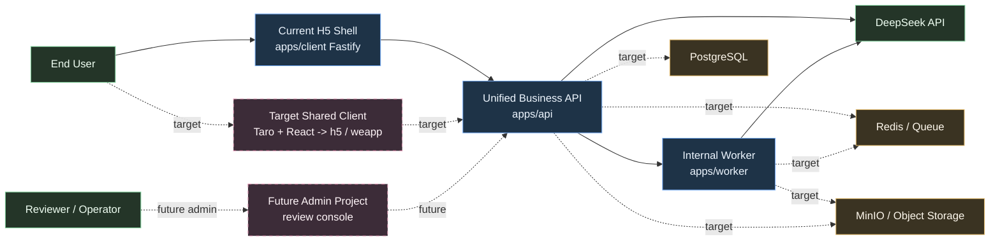
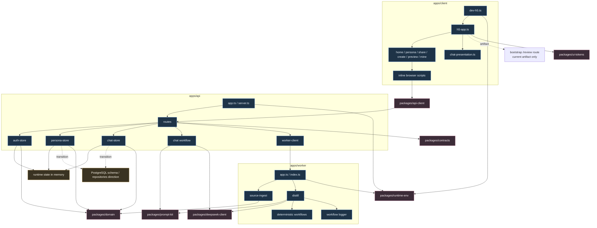
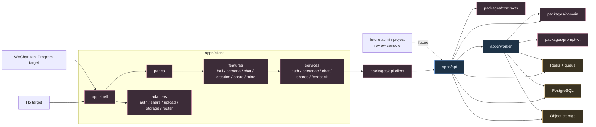
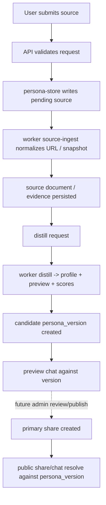
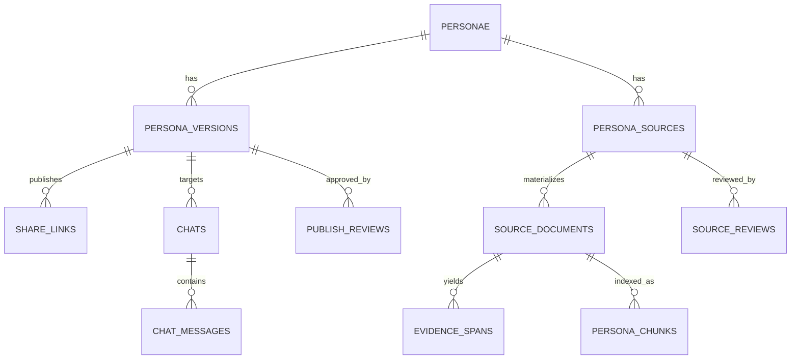

# Project Architecture Blueprint

- Generated: 2026-04-17
- Updated: 2026-04-21, review UI removed from current user-facing scope and deferred to a future admin project
- Scope: Hall of Fame miniapp user-facing requirement architecture plus the currently implemented bootstrap architecture
- Evidence base:
  - [technical-architecture.md](/Users/wentao.yu/Documents/code/hall-of-fame-miniapp/docs/technical-architecture.md)
  - [frontend-backend-architecture-blueprint.md](/Users/wentao.yu/Documents/code/hall-of-fame-miniapp/docs/frontend-backend-architecture-blueprint.md)
  - [docs/Project_Architecture_Blueprint.md](/Users/wentao.yu/Documents/code/hall-of-fame-miniapp/docs/Project_Architecture_Blueprint.md)
  - [apps/client/src/h5-app.ts](/Users/wentao.yu/Documents/code/hall-of-fame-miniapp/apps/client/src/h5-app.ts)
  - [apps/api/src/app.ts](/Users/wentao.yu/Documents/code/hall-of-fame-miniapp/apps/api/src/app.ts)
  - [apps/worker/src/app.ts](/Users/wentao.yu/Documents/code/hall-of-fame-miniapp/apps/worker/src/app.ts)
- Audience: requirement, architecture, and implementation windows that need one authoritative architecture view

## 1. Architecture Detection and Analysis

The codebase currently resolves into a `Node.js + TypeScript + pnpm monorepo` with these detected runtime and shared layers:

- runtime apps
  - `apps/client`: current H5 Fastify-rendered shell
  - `apps/api`: unified Fastify business API
  - `apps/worker`: internal worker HTTP service for ingest and distill
- shared packages
  - `packages/contracts`
  - `packages/domain`
  - `packages/api-client`
  - `packages/prompt-kit`
  - `packages/deepseek-client`
  - `packages/runtime-env`
  - `packages/ui-tokens`

Primary detected technologies and patterns:

- `TypeScript`
- `Fastify`
- `Zod`
- `DeepSeek chat + reasoner`
- `pnpm workspace monorepo`
- requirement target of `Taro + React + TypeScript`

The architecture pattern is not a pure single-style textbook architecture. It is best described as:

- `Layered monorepo`
- `Single business API + internal worker service`
- `Shared contracts/domain packages as the main anti-drift mechanism`
- `Workflow-first LLM orchestration embedded into application services`

## 2. Architectural Overview

The most important architectural fact is that this project currently has two truths that must be kept separate:

1. `Current implemented architecture`
   This is the bootstrap currently visible in the main workspace.
   It runs as:
   - H5 Fastify shell
   - unified Fastify API
   - internal worker HTTP service
   - shared packages
   - mostly in-memory runtime state, with PostgreSQL schema and repository direction already present

2. `Target requirement architecture`
   This is the locked product and technical direction in the docs:
   - one client codebase
   - compiled to `h5` and `weapp`
   - current user-facing navigation limited to `chat / create / mine`
   - platform divergence isolated in adapters
   - PostgreSQL as primary state store
   - worker + queue for distill and ingest
   - immutable `persona_version` as publish/share/chat unit
   - review UI moved out of the user-facing client and into a future admin project

If these two truths are not separated, architecture diagrams become misleading. A correct blueprint for this project must show both the implemented bootstrap and the target-state architecture, plus the migration seam between them.

## 3. Architecture Visualization

## 3.1 Top-Level System Context

## 3.2 Current Implemented Component Architecture

## 3.3 Target Requirement Architecture

## 3.4 Core Runtime Data Flows

## 4. Core Architectural Components

## 4.1 `apps/client`

Purpose:

- current user-facing shell
- page routing and rendering for H5 bootstrap
- request dispatch into the unified API
- current user-facing scope excludes reviewer workbench

Current internal structure:

- `dev-h5.ts` boots the H5 Fastify server
- `h5-app.ts` owns page composition and inline scripts
- `dev-weapp.ts` is still only a scaffold placeholder
- `chat-presentation.ts` renders reply explanation UI fragments
- bootstrap still contains a `/review` route, but it is no longer part of the user-facing product scope

Evolution pattern:

- current shape is intentionally transitional
- target shape is a shared Taro app compiled to `h5` and `weapp`
- platform divergence should move into `adapters`, not spread through business modules

## 4.2 `apps/api`

Purpose:

- single business truth boundary
- owns auth/session, persona lifecycle, sharing, and chat orchestration
- keeps review/publish state transitions as backend capability reserved for a future admin project

Internal structure:

- `routes/*` expose `/v1/...` business APIs
- `store/*` own current business orchestration
- `workflows/chat/*` own model-driven reply generation
- `services/worker-client.ts` bridges to worker compute

Interaction pattern:

- synchronous JSON API for client calls
- internal HTTP calls to worker
- strong request/response validation through `packages/contracts`

## 4.3 `apps/worker`

Purpose:

- compute-heavy or pipeline-like tasks outside the request path
- source ingest and distill execution

Internal structure:

- `jobs/source-ingest/*`
- `jobs/distill/*`
- deterministic fallback workflows
- workflow logging/observability helpers

Evolution pattern:

- current form is internal HTTP service
- target form is queue-backed execution with Redis/BullMQ or equivalent

## 4.4 Shared Packages

`packages/contracts`

- transport boundary
- shared schemas for API and worker I/O

`packages/domain`

- business vocabulary
- states, enums, quality gates, URL normalization and safety primitives

`packages/api-client`

- shared request surface for frontend callers

`packages/prompt-kit`

- chat and distill prompt construction
- output schema expectations for LLM workflows

`packages/deepseek-client`

- provider-specific structured JSON client

`packages/runtime-env`

- env loading and process bootstrapping support

`packages/ui-tokens`

- visual primitives and design token layer

## 5. Architectural Layers and Dependencies

Current implemented dependency direction:

- `apps/client -> packages/api-client -> apps/api`
- `apps/client -> packages/ui-tokens`
- `apps/api -> packages/contracts / domain / prompt-kit / deepseek-client / runtime-env`
- `apps/worker -> packages/contracts / domain / prompt-kit / deepseek-client / runtime-env`

Target requirement dependency direction:

- `pages -> features -> services -> api-client -> api`
- `app shell -> adapters -> services`
- `worker` must not own business truth
- `share`, `publish`, and `version` truth remain inside business backend
- future `review` truth still remains in backend, but reviewer UI leaves the user-facing client

Dependency rules that matter most:

- no raw business payloads duplicated in UI
- no provider-specific DeepSeek calls outside `packages/deepseek-client`
- no platform-specific branch logic leaking through core feature code
- no business-state mutation hidden inside worker-only code

## 6. Data Architecture

Canonical domain entities:

- `personae`
- `persona_versions`
- `persona_sources`
- `source_documents`
- `evidence_spans`
- `persona_chunks`
- `chats`
- `chat_messages`
- `share_links`
- `source_reviews`
- `persona_version_publish_reviews`
- `persona_feedback`

Key invariant:

- `persona` is the mutable container
- `persona_version` is the immutable publish/chat/share unit

Requirement boundary update:

- the user-facing client still centers on `persona_version`
- review UI is no longer part of the current client scope
- if review returns later, it should attach through a separate admin surface instead of re-entering the user nav

Data access state today:

- schema and repository direction already exist
- runtime truth is still partially in memory in the bootstrap

Target data access state:

- PostgreSQL as primary state store
- Redis for queueing and async workflow scheduling
- MinIO or S3-compatible object storage for artifacts and source payloads

## 7. Cross-Cutting Concerns Implementation

## 7.1 Authentication and Authorization

Current implementation:

- bearer access token carried through headers
- roles:
  - `ANONYMOUS`
  - `USER`
  - `REVIEWER`
- anonymous-to-user merge path exists in auth store
- reviewer-only routes enforced in route guards

Target requirement:

- web and miniapp have different identity entrypoints
- after login they both normalize into the backend’s own session model
- current user-facing client mainly serves `ANONYMOUS` and `USER`
- `REVIEWER` remains a backend/admin role, not a current user-facing navigation role

## 7.2 Error Handling and Resilience

Implemented patterns:

- route-level validation errors
- worker call failure propagation
- rate limiting on chat and feedback
- URL guardrails in ingest
- deterministic fallback when DeepSeek is unavailable or invalid

Missing for mature production:

- durable retry queues
- dead-letter handling
- persistent failure monitoring

## 7.3 Logging and Monitoring

Current:

- Fastify logger in API and worker
- worker workflow observer

Target:

- persistent structured logs
- job-level metrics
- alerting on chat/distill/review failures

## 7.4 Validation

This is one of the strongest parts of the architecture:

- transport validation in `packages/contracts`
- LLM output validation in `packages/prompt-kit`
- business rules and vocabularies in `packages/domain`

## 7.5 Configuration Management

Current:

- env loading through `packages/runtime-env`
- local `.env` bootstrap strategy

Target:

- clear separation of API, worker, and client runtime configuration
- secret handling for DeepSeek, storage, database, and queue infrastructure

## 8. Service Communication Patterns

Current communication model:

- client -> API via synchronous JSON over HTTP
- API -> worker via internal HTTP
- API/worker -> DeepSeek via structured JSON API requests

Target communication model:

- client -> API remains synchronous JSON
- API -> worker should become queue-backed for ingest/distill
- chat remains synchronous in API for latency reasons

Important boundary decisions:

- login entrypoint may vary by platform
- business API surface stays unified
- share resolution, review, publish, and state transitions stay in the business backend

Long-running operation rule:

- synchronous HTTP is only for fast validation, lightweight persistence, and status reads
- source discovery, web search, URL fetch, evidence extraction, profile synthesis, and media generation must be modeled as jobs
- API accepts the request, persists a job, and returns `jobId/status` immediately
- worker owns execution, retry, heartbeat, failure persistence, and success persistence
- frontend observes progress through polling first; realtime notification can be added later without changing the business state model
- upstream temporary failures from model/search providers should become retryable job failures, not blocking request-time `400` responses

## 9. Technology-Specific Architectural Patterns

## 9.1 Node.js / TypeScript Monorepo

- `pnpm` workspace organizes runtime apps and shared packages
- TypeScript is used end-to-end for transport and domain consistency
- the package structure is the primary mechanism for architectural boundary enforcement

## 9.2 Fastify

- Fastify is the current delivery runtime for both API and H5 shell bootstrap
- route modules are lightweight and delegate orchestration into stores and workflows
- this keeps request parsing and business orchestration relatively cleanly separated

## 9.3 Target React / Taro Client

- target is a shared business frontend compiled to `h5` and `weapp`
- target separation is by `pages / features / services / adapters`
- the architecture explicitly avoids two divergent frontends

## 9.4 LLM Runtime Pattern

- `workflow-first`, not `agent-first`
- `deepseek-reasoner` for distill
- `deepseek-chat` for conversation
- structured outputs parsed and normalized before entering business truth

## 10. Implementation Patterns

Controller/API pattern:

- thin route handler
- schema parse
- access check
- delegate to store/workflow
- normalize response through contracts

Service/workflow pattern:

- chat workflow and distill workflow keep prompt logic out of routes
- provider-specific HTTP logic stays in `packages/deepseek-client`

Repository/data pattern:

- repository-backed direction is visible in bootstrap
- persona-store acts as orchestration seam over official seeds and dynamic personas

Domain model pattern:

- immutable `persona_version`
- mutable `persona`
- quality gates and review gates before publish/share exposure

## 11. Testing Architecture

Detected current testing shape:

- app-level tests in API
- chat workflow tests
- UI token tests
- lightweight client behavior tests

Recommended test boundaries:

- unit:
  - domain helpers
  - prompt builders
  - URL safety
  - quality gates
- integration:
  - route + store + contracts
  - worker job execution
  - publish/review/share invariants
- end-to-end:
  - hall -> persona chat
  - create -> source -> distill -> preview -> publish
  - share landing -> continue chat

## 12. Deployment Architecture

Current development topology:

- local H5 shell
- local API
- local worker
- local infra bootstrap via Docker compose

Target deployment topology:

- one API deployment
- one worker deployment
- one shared client build targeting H5 and miniapp
- PostgreSQL + Redis + object storage
- DeepSeek as external model provider

## 13. Extension and Evolution Patterns

How to extend safely:

- new business transport shape:
  add schema in `packages/contracts` first
- new business vocabulary or invariant:
  add it in `packages/domain`
- new model-driven workflow:
  add prompt/schema in `packages/prompt-kit`, provider access in `packages/deepseek-client`
- new client feature:
  keep business logic in shared layers, platform differences in adapters

Main migration seams:

1. move runtime stores from in-memory to PostgreSQL-backed repositories
2. move worker triggering from internal HTTP to queue-backed execution
3. converge current H5 shell toward the documented shared Taro client
4. upgrade source ingest from placeholder snapshot extraction to real readable-content extraction

## 14. Architecture Governance

What currently keeps the architecture coherent:

- shared schema discipline
- domain vocabulary centralization
- version-first business model
- separation between API truth and worker compute

What should remain non-negotiable:

- `persona_version` remains the immutable publish/share/chat unit
- platform login divergence never leaks into general business routes
- worker never becomes the owner of domain truth
- prompt/provider logic stays out of route files

## 15. Blueprint for New Development

If the next window is implementing against this blueprint, the safe order is:

1. lock transport contract
2. lock domain invariant
3. place logic in the correct runtime boundary
4. keep target/client divergence inside adapter seams only
5. preserve version-first publish/share semantics

Common pitfalls to avoid:

- drawing only the target architecture and pretending bootstrap does not exist
- drawing only bootstrap and losing the target requirement architecture
- letting `persona` replace `persona_version` as the public-facing unit
- treating worker as a business-state owner
- splitting H5 and miniapp into two business frontends too early

## 16. Final Architecture Judgment

The correct architectural interpretation of Hall of Fame is:

- `today`: a layered Node.js monorepo with H5 bootstrap, unified API, internal worker, strong shared package boundaries, and transitional persistence
- `target`: a shared Taro dual-target client, PostgreSQL-backed business truth, queue-backed worker execution, version-first persona publishing, and a separate admin surface for review work

That dual-truth model is not a flaw in the documentation. It is the central architectural reality that every future implementation or review needs to preserve. The matching product boundary is now explicit: the user-facing client stays on `聊天 / 创建 / 我的`, while reviewer work moves to a future admin project instead of re-entering the main navigation.
