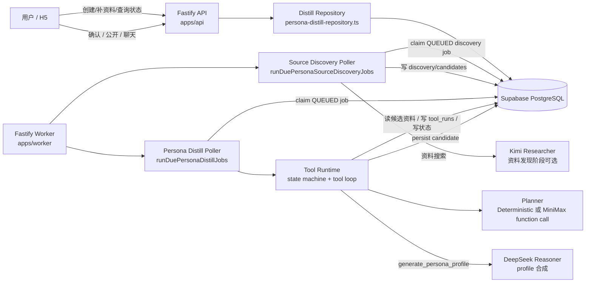
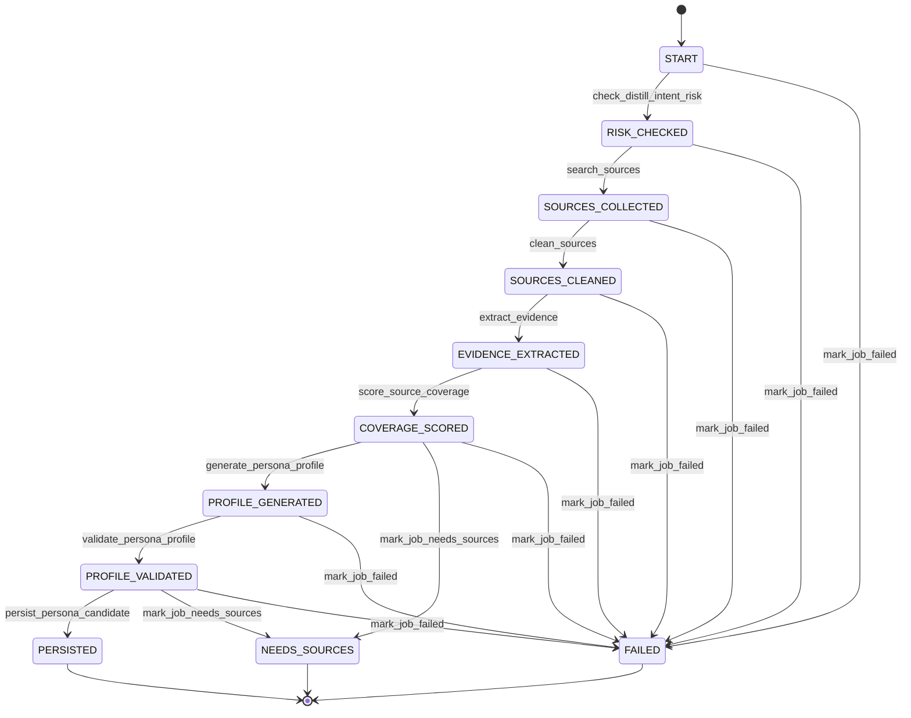
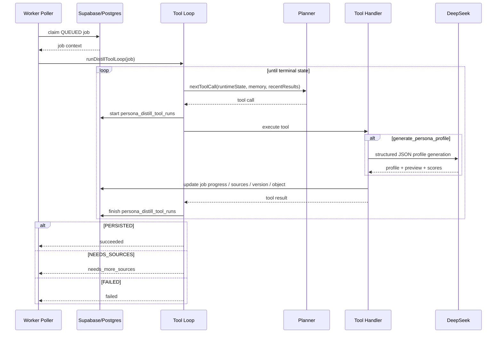
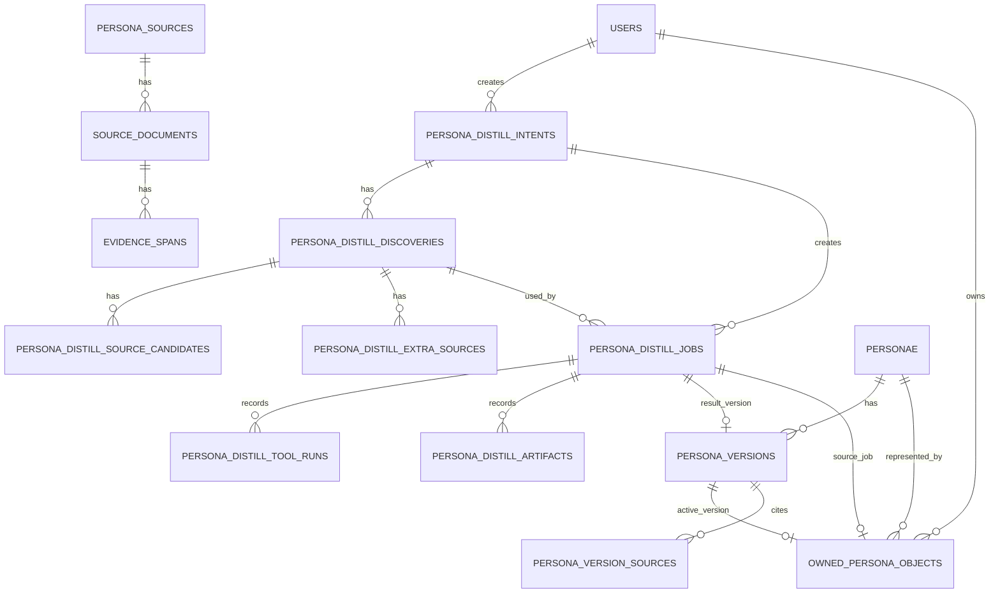
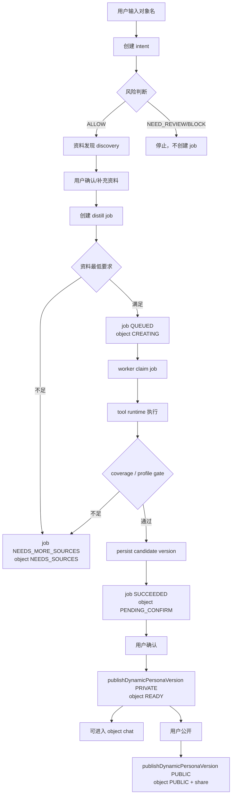

# 后端蒸馏流程架构蓝图

生成日期：2026-05-03

适用范围：当前项目的一键蒸馏后端，包括 API、数据库、worker、模型调用、对象状态流转。

## 1. 架构结论

目标后端蒸馏不是单个同步接口，而是一组异步 job 流程。任何依赖外部搜索、模型调用或长资料处理的步骤，都不能让用户请求同步等待完成：

```text
API 创建 intent / source discovery job / distill job
  -> 数据库保存 job 和 owned object
  -> worker 轮询 QUEUED discovery/distill job
  -> tool runtime 按状态机执行蒸馏工具
  -> DeepSeek 合成人物 profile
  -> 保存 candidate version
  -> 用户确认后对象变 READY
  -> 用户公开后对象变 PUBLIC
```

整体模式是 `Fastify API + PostgreSQL/Supabase 持久化队列 + worker poller + 状态机约束的 tool-calling runtime`。

关键原则：

- API 只负责用户请求、权限、快速校验、job 创建、状态查询和对象管理。
- API 不应该同步等待 Kimi 搜索、URL 抓取、资料清洗、证据抽取或 profile 合成。
- Worker 处理所有长耗时任务，包括资料发现 job 和蒸馏 job。
- MiniMax 只适合作为 planner/router，决定下一步调用哪个 tool。
- DeepSeek 只负责 `generate_persona_profile` 的 profile 合成。
- TypeScript 代码负责状态机、权限、校验、DB 事务、终态落库。
- 普通用户接口不暴露 tool trace、模型名、prompt、质量分、coverage 明细。
- 当前 `POST /v1/persona-distill-source-discovery` 同步等待 Kimi 是过渡实现，已被标记为需要整改的架构债。

## 2. 高层架构图



## 3. 代码入口

| 模块 | 文件 | 职责 |
| --- | --- | --- |
| API 注册 | `apps/api/src/app.ts` | 注册 auth、persona distill、my objects、chat 等路由 |
| 蒸馏 API | `apps/api/src/routes/persona-distill.ts` | intent、source discovery、extra sources、job 创建、job 查询 |
| 我的对象 API | `apps/api/src/routes/my-objects.ts` | 对象详情、编辑、确认、公开、删除、创建聊天 |
| 蒸馏 repository | `apps/api/src/db/repositories/persona-distill-repository.ts` | 业务落库、状态映射、inventory、对象动作 |
| Worker 注册 | `apps/worker/src/app.ts` | worker health、手动 run-due、自动 poller |
| Worker job | `apps/worker/src/jobs/persona-distill/run-persona-distill-jobs.ts` | claim job、tool handlers、candidate persist |
| Tool loop | `apps/worker/src/jobs/persona-distill/tool-runtime/tool-loop.ts` | 调 planner、执行 tool、处理 terminal state |
| 状态机 | `apps/worker/src/jobs/persona-distill/tool-runtime/state-machine.ts` | 限制每个 runtime state 能调用的 tool |
| Planner | `apps/worker/src/jobs/persona-distill/tool-runtime/distill-planner.ts` | deterministic planner 或 MiniMax function call planner |
| 合成模型 | `apps/worker/src/jobs/distill/run-distill-job.ts` | 调 DeepSeek structured JSON，失败时 deterministic fallback |
| Contract | `packages/contracts/src/persona-distill.ts` 和 `packages/contracts/src/distill-tools.ts` | API schema、job 状态、tool schema、runtime state |

## 4. API 阶段流程

### Step 1: 创建 intent

接口：

```http
POST /v1/persona-distill-intents
```

代码入口：

```text
personaDistillRoute -> createDistillIntent
```

做的事情：

- 要求 actor session。
- 写入 `persona_distill_intents`。
- 对用户输入的对象名做 normalize。
- 粗略识别对象类型：`REAL_PERSON | FICTIONAL_CHARACTER | UNKNOWN`。
- 粗略风险判断：`ALLOW | NEED_REVIEW | BLOCK`。
- 返回下一步：`DISCOVER_SOURCES | NEED_REVIEW | BLOCKED`。

当前风险判断是规则式关键词判断，不是模型判断。

### Step 2: 资料发现 discovery

目标接口行为：

```http
POST /v1/persona-distill-source-discovery
```

或后续显式拆为：

```http
POST /v1/persona-distill-source-discovery-jobs
GET  /v1/persona-distill-source-discovery-jobs/:jobId
```

代码入口：

```text
personaDistillRoute -> createDistillSourceDiscovery
```

目标做的事情：

- 校验 intent 属于当前 actor。
- 如果 intent 风险不是 `ALLOW`，直接拒绝搜索。
- 创建 `sourceDiscoveryJob`，状态为 `QUEUED`，接口立即返回 `jobId/status/nextAction`。
- Worker claim 该 job 后执行 Kimi Researcher 搜索公开资料。
- 搜索完成后写入：
  - `persona_distill_discoveries`
  - `persona_distill_source_candidates`
- 计算 bucket 覆盖：
  - `WRITINGS`
  - `CONVERSATIONS`
  - `EXPRESSION_DNA`
  - `EXTERNAL_VIEWS`
  - `DECISIONS`
  - `TIMELINE`

注意：Kimi 只在资料发现阶段使用，不在 worker 主蒸馏 loop 里使用。

当前实现差异：

- 当前 `createDistillSourceDiscovery` 会在 API 请求内直接调用 Kimi。
- 如果 Kimi 返回 `The engine is currently overloaded, please try again later`，前端会拿到同步 `400`。
- 这不符合项目级异步边界，后续需要改为后台 discovery job，并将上游临时错误落为可重试任务失败。

### Step 3: 用户补充资料

接口：

```http
POST /v1/persona-distill-discoveries/:discoveryId/extra-sources
```

代码入口：

```text
personaDistillRoute -> addDistillExtraSources
```

做的事情：

- 用户可以补文本或 URL。
- 文本资料做基础清洗，太短或命中风险词会被标为 `REJECTED`。
- 可用资料写入 `persona_distill_extra_sources`。
- 同时生成对应的 `persona_distill_source_candidates`，供后续 job 选择。

这里仍是确定性规则，不是模型判断。

### Step 4: 创建 distill job

接口：

```http
POST /v1/persona-distill-jobs
```

代码入口：

```text
personaDistillRoute -> createDistillJob
```

做的事情：

- 校验 intent/discovery 都属于当前 actor。
- 选中用户指定资料；如果用户没显式选，则默认取推荐资料前三条。
- 计算最低资料要求：
  - 真实人物至少 3 条可用资料。
  - 虚拟人物至少 2 条可用资料。
  - 至少覆盖 2 类 evidence bucket。
  - 至少 1 条 `PRIMARY` 或 `SECONDARY`。
- 如果资料不足，job 直接进入 `NEEDS_MORE_SOURCES`。
- 如果资料足够，job 进入 `QUEUED`。
- 创建或复用 `personae`。
- 创建或更新 `owned_persona_objects`。

此时用户能在“我的对象”看到稳定 `objectId`。如果 job 是 `QUEUED`，object 状态为 `CREATING`。

## 5. Worker 执行流程

### 5.1 Worker 启动和轮询

Worker 入口：

```text
apps/worker/src/index.ts -> buildWorkerApp
```

自动消费队列的开关：

```text
PERSONA_DISTILL_POLLING_ENABLED=true
```

开发环境默认会自动 claim `QUEUED` job；生产环境必须显式设置 `PERSONA_DISTILL_POLLING_ENABLED=true`。

如果生产环境没开这个变量，`/health` 仍然正常，但 worker 不会自动 claim `QUEUED` job。这就是“worker 健康但对象一直创建中”的常见原因。

手动触发接口：

```http
POST /internal/persona-distill/run-due
```

自动轮询逻辑：

```text
onReady
  -> setInterval(runDuePersonaDistillJobs)
```

### 5.2 Claim job

代码入口：

```text
runDuePersonaDistillJobs -> claimJobs
```

SQL 行为：

```text
select QUEUED jobs
order by created_at asc
for update skip locked
limit batchSize
```

claim 后更新：

```text
job.status = CLAIMED
current_step = 准备资料
progress = 5
claimed_by_worker_id = WORKER_ID 或 local-worker
claimed_at = now()
heartbeat_at = now()
attempt_count += 1
```

### 5.3 Tool runtime 总流程



状态机由 `state-machine.ts` 强制执行。模型或 planner 不能随意跳步。

### 5.4 Tool loop 时序图



## 6. 每个 tool 的职责

| Tool | 允许状态 | 代码职责 | 模型职责 |
| --- | --- | --- | --- |
| `check_distill_intent_risk` | `START` | 校验 intentId/name/type/risk 和 job 上下文一致；非 ALLOW 失败 | 只选择是否调用该工具 |
| `search_sources` | `RISK_CHECKED` | 从 DB 读取用户已选 candidates/extra sources | 不搜索网络 |
| `clean_sources` | `SOURCES_COLLECTED` | 过滤 risk flags；可选丢弃低可信；写 `persona_sources`、`source_documents`、`evidence_spans` | 不决定最终资料是否足够 |
| `extract_evidence` | `SOURCES_CLEANED` | 确认证据片段可用，更新进度 | 不直接抽取自由文本到 DB |
| `score_source_coverage` | `EVIDENCE_EXTRACTED` | 计算资料数量、bucket、PRIMARY/SECONDARY 是否满足最低门槛 | 不决定 DB 终态 |
| `generate_persona_profile` | `COVERAGE_SCORED` | 调 `runDistillJob`，由 DeepSeek 生成 profile/preview/scores | DeepSeek 做合成 |
| `validate_persona_profile` | `PROFILE_GENERATED` | 用 gate 校验 coverage/grounding/style/risk 分数和资料覆盖 | 不落库 |
| `persist_persona_candidate` | `PROFILE_VALIDATED` | DB 事务写 candidate version、job SUCCEEDED、object PENDING_CONFIRM | 不参与 |
| `mark_job_needs_sources` | `COVERAGE_SCORED` 或 `PROFILE_VALIDATED` | 用代码已算出的 missing requirements 写 NEEDS_MORE_SOURCES 和 object NEEDS_SOURCES | 不能自造原因 |
| `mark_job_failed` | 任意非 terminal | 仅系统失败路径可调用，planner 直接请求会被拒绝 | 不允许主动调用 |

## 7. 模型分工

### Kimi

位置：API 资料发现阶段。

作用：

- 根据对象名搜索公开来源。
- 返回 URL、标题、snippet。
- API 再做 bucket 分类、source kind、trust level、risk flags。

边界：

- 不进入 worker tool loop。
- 不直接写 candidate version。
- 不决定对象是否最终可用。

### MiniMax

位置：worker planner，可选。

启用条件：

```text
PERSONA_DISTILL_PLANNER_PROVIDER=minimax
MINIMAX_API_KEY=...
```

作用：

- 通过 function calling 返回下一步 tool。
- 根据 runtime state、memory、最近 tool results 做路由。

边界：

- 不直接写 DB。
- 不决定 terminal state。
- 不允许绕过状态机。
- 不允许调用系统控制的 `mark_job_failed`。

如果未启用 MiniMax，系统使用 deterministic planner，按固定状态机顺序执行。

### DeepSeek

位置：`generate_persona_profile` tool 内。

作用：

- 输入对象名、蒸馏 focus、approved sources。
- 输出结构化 JSON：
  - `profile`
  - `preview`
  - `scores`

边界：

- 输出必须通过 `distillOutputSchema`。
- 质量是否通过由 `validate_persona_profile` 再校验。
- 不能直接 persist。

如果 DeepSeek 未配置或调用失败，会使用 deterministic fallback。

## 8. 数据模型关系图



核心表说明：

| 表 | 作用 |
| --- | --- |
| `persona_distill_intents` | 用户想蒸馏谁、风险判断、对象类型 |
| `persona_distill_discoveries` | 一次资料发现结果 |
| `persona_distill_source_candidates` | 候选资料，含 bucket/source kind/trust/risk |
| `persona_distill_extra_sources` | 用户补充资料 |
| `persona_distill_jobs` | 异步蒸馏队列和状态 |
| `persona_distill_tool_runs` | worker 内部 tool trace |
| `persona_distill_artifacts` | worker 内部产物记录 |
| `owned_persona_objects` | 用户视角稳定 objectId |
| `personae` | 对象主体 |
| `persona_versions` | 蒸馏生成的版本，worker 成功后先是 `CANDIDATE` |
| `persona_sources/source_documents/evidence_spans` | 已清洗证据快照 |

## 9. 状态映射

### Job 状态

| Job status | 含义 | 用户对象状态 |
| --- | --- | --- |
| `QUEUED` | 等 worker 消费 | `CREATING` |
| `CLAIMED` | worker 已领取 | `CREATING` |
| `INGESTING` | 准备/清洗资料 | `CREATING` |
| `EXTRACTING` | 抽取证据 | `CREATING` |
| `SYNTHESIZING` | 合成人物画像 | `CREATING` |
| `VALIDATING` | 校验质量 | `CREATING` |
| `PERSISTING` | 保存候选版本 | `CREATING` |
| `SUCCEEDED` | 生成 candidate version | `PENDING_CONFIRM` |
| `NEEDS_MORE_SOURCES` | 资料不足 | `NEEDS_SOURCES` |
| `FAILED` | 生成失败 | `FAILED` |
| `BLOCKED` | 被规则阻断 | `NEEDS_SOURCES` |
| `SUPERSEDED` | 被新任务替代 | 由新 job 决定 |

### Object 状态

| Object status | 入口 | 可做动作 |
| --- | --- | --- |
| `CREATING` | `/create?jobId=...` | 查看进度 |
| `NEEDS_SOURCES` | `/create?jobId=...&mode=addSources` | 补资料 |
| `FAILED` | `/create?jobId=...&mode=addSources` | 重试/补资料 |
| `PENDING_CONFIRM` | `/profile/objects/:objectId` | 确认、补资料、删除 |
| `READY` | `/profile/objects/:objectId/chat` | 聊天、编辑、补资料、公开、删除 |
| `PUBLIC` | `/profile/objects/:objectId/chat` 或 `/persona/:personaId` | 聊天、编辑、补资料、分享、删除 |
| `DELETED` | 不在列表展示 | 仅旧历史可只读 |

## 10. 成功路径详解



关键点：

- Worker 成功后不是直接 `READY`，而是 `PENDING_CONFIRM`。
- 用户确认后才进入 `READY`。
- 用户公开后才进入 `PUBLIC`。
- 自建对象聊天使用 `draft_version_preview` chat target，但由 object owner 权限保护。

## 11. 失败和恢复路径

### 资料不足

触发点：

- 创建 job 时 `buildMissingRequirements` 判断不足。
- Worker `score_source_coverage` 判断不足。
- Worker `validate_persona_profile` 判断 profile 分数不足。

落库：

```text
persona_distill_jobs.status = NEEDS_MORE_SOURCES
owned_persona_objects.status = NEEDS_SOURCES
missing_requirements_json = [...]
```

用户动作：

```text
/create?jobId=...&mode=addSources
```

用户补资料后再创建新 job。新 job 会 supersede 旧的 `NEEDS_MORE_SOURCES / FAILED / BLOCKED` job，并复用同一个 persona/object。

### 工具执行失败

触发点：

- planner 返回非法 tool。
- tool input schema 不合法。
- tool 顺序不符合状态机。
- handler 抛错。
- tool call 超过上限。

落库：

```text
persona_distill_tool_runs.status = REJECTED 或 FAILED
persona_distill_jobs.status = FAILED
owned_persona_objects.status = FAILED
```

注意：

- `mark_job_failed` 是系统控制工具。
- planner 主动请求 `mark_job_failed` 会被拒绝，然后由系统失败路径接管。

### Worker 没有消费 QUEUED job

表现：

```text
owned_persona_objects.status = CREATING
persona_distill_jobs.status = QUEUED
claimed_by_worker_id = null
persona_distill_tool_runs = empty
```

常见原因：

```text
生产环境 PERSONA_DISTILL_POLLING_ENABLED 未设置为 true
```

重要区别：

- `/health` 只说明 worker HTTP 服务活着。
- `/health` 不代表 persona distill poller 正在跑。

本地推荐启动：

```bash
scripts/dev-all.sh
```

它会用：

```bash
env PERSONA_DISTILL_POLLING_ENABLED=true pnpm dev:worker
```

现在开发环境即使不通过 `scripts/dev-all.sh`，也会默认开启 persona distill poller；脚本里的显式 env 只是保持兼容和可读。

## 12. 普通用户 API 边界

普通用户可见接口：

| 接口 | 用户可见信息 |
| --- | --- |
| `GET /v1/persona-distill-jobs/:jobId` | job 状态、进度、下一步、objectHref、资料候选 |
| `GET /v1/me/persona-inventory` | 我的对象列表，用户状态和动作 |
| `GET /v1/me/objects/:objectId` | 对象详情、可用动作、聊天入口 |
| `POST /v1/me/objects/:objectId/confirm` | 保存到我的对象 |
| `POST /v1/me/objects/:objectId/publish` | 公开分享 |
| `POST /v1/me/objects/:objectId/chats` | 创建自建对象聊天 |

普通用户不应该看到：

- `persona_distill_tool_runs`
- `persona_distill_artifacts`
- planner raw tool call
- model name
- prompt
- quality score
- publish gate reasons
- coverage internals
- DB status 原文解释

当前设计通过 repository response mapping 和前端文案做了隔离。

## 13. 关键技术约束

### 13.1 幂等和并发

`createDistillJob` 使用 advisory lock：

```text
persona-distill:{actorUserId}:{intentId}:{discoveryId}
```

它会：

- 复用同一 active job。
- supersede 旧的 `NEEDS_MORE_SOURCES / FAILED / BLOCKED` job。
- 尽量复用同一个 persona。
- 更新同一个 owned object。

Worker claim 使用：

```sql
for update skip locked
```

用于避免多个 worker 抢同一个 job。

### 13.2 状态机防越权

`executeDistillToolStep` 会做三层校验：

- tool call 必须符合 `distillToolCallSchema`。
- 当前 state 必须允许这个 tool。
- handler 返回的 `stateAfter` 必须等于状态机计算出的 next state。

所以模型不能通过伪造返回值跳过关键步骤。

### 13.3 DB 事务边界

重要事务：

- discovery 和 candidate 批量写入。
- create job、personae、owned object 同事务写入。
- clean sources 写 `persona_sources/source_documents/evidence_spans`。
- persist candidate version 写 version、version source、job SUCCEEDED、object PENDING_CONFIRM。
- object update/delete 使用事务保护。

## 14. 当前实现的风险点

| 风险点 | 当前表现 | 建议 |
| --- | --- | --- |
| 资料发现同步等待 Kimi | Kimi 过载会让用户请求直接等待并返回 `400/429` | 改成 source discovery job；API 只创建任务并返回状态入口 |
| worker health 不代表 poller 正常 | `QUEUED` job 可能长期不被 claim | health 增加 poller 状态或启动时强提示 |
| synthetic discovery 容易掩盖真实搜索问题 | 现在只在显式 `PERSONA_DISTILL_SYNTHETIC_DISCOVERY_ENABLED=true` 时启用 | 测试可以开 synthetic，本地/生产真实体验必须走 Kimi |
| risk 判断较粗 | 当前是关键词规则 | 后续可加独立 risk classifier，但 DB 终态仍由代码决定 |
| extra URL 只做 URL 校验 | 没有实际抓取正文 | 后续可加 source ingest/fetch 工具 |
| `PERSISTING` 卡住需要恢复策略 | 历史数据里可能出现老 job 卡住 | 增加 stale job reaper 或 retry policy |
| tool trace 只在 DB 内部 | 普通用户不可见是对的，但开发排查需要内部接口或脚本 | 后续做 admin/internal debug，不进用户端 |

## 15. 以后新增能力的放置规则

### 新增资料搜索能力

放在 API discovery 阶段：

```text
createDistillSourceDiscovery -> discoverSourceCandidates
```

不要放进 worker tool loop，除非产品明确允许后台自动补充未经用户确认的资料。

### 新增资料清洗/抓取正文

可放在 worker tool：

```text
clean_sources
```

或者新增一个确定性 tool：

```text
fetch_source_documents
```

但必须受状态机约束。

### 新增模型 planner

放在：

```text
buildDistillPlannerFromEnv
```

要求：

- 输出必须符合 `distillToolCallSchema`。
- 不允许直接写 DB。
- 不允许决定 terminal state。

### 新增质量 gate

放在：

```text
score_source_coverage
validate_persona_profile
buildPublishGate
```

不要让 DeepSeek 或 MiniMax 单独决定是否可发布。

## 16. 一句话总结

当前后端蒸馏流程的正确理解是：

```text
用户创建的是 object；API 创建的是 job；worker 生成的是 candidate version；用户确认后才变成可聊天对象。
```

如果页面一直显示“创建中”，优先查：

```text
owned_persona_objects.status
persona_distill_jobs.status
persona_distill_jobs.claimed_by_worker_id
persona_distill_tool_runs
PERSONA_DISTILL_POLLING_ENABLED
```
