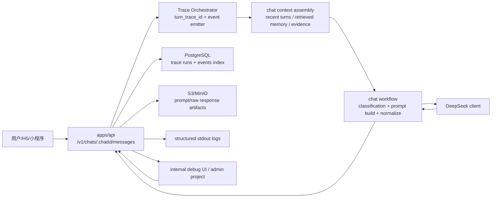

# 对话 Trace V3 可观测性方案

- 日期：2026-04-23
- 状态：方案收敛，待进入实现拆解
- 范围：用户发送一条消息后，系统内部整条对话链路的调试、追踪与回放能力
- 目标层级：直接定义 V3 终态，不再先写 V1/V2 过渡方案
- 依据：
  - `docs/technical-architecture.md`
  - `docs/current-interaction-flow.md`
  - `docs/superpowers/specs/2026-04-13-backend-llm-runtime-design.md`
  - `apps/api/src/routes/chats.ts`
  - `apps/api/src/services/chat-memory/*`
  - `apps/api/src/workflows/chat/run-chat-workflow.ts`
  - `packages/deepseek-client/src/index.ts`

## 1. 一句话结论

V3 不应该只是“多打一批日志”，而应该落成一套 **以单条用户消息为单位的对话 trace 系统**。

但这里的 V3 要按“开发优先、热路径安全、以后不推翻”来落，不做重平台版本：

- 每条消息生成唯一 `turn_trace_id`
- 后端所有关键步骤发出结构化事件
- 元数据和事件可检索
- 关键 artifact 可回放
- 内部调试界面按一条消息完整展示 waterfall

最终你查的不是“某个服务今天打了什么日志”，而是：

`这条消息从用户发出，到上下文组装、检索、prompt、模型请求、模型返回、最终回复落库，具体每一步发生了什么。`

## 2. 当前问题

当前对话主链路已经存在，但调试能力还停留在“进程输出”层：

- API 和 worker 都依赖 stdout / Fastify logger
- chat workflow 只额外打了极少量 `console.info / console.warn`
- 现有日志能看出“请求来了没有、是不是 fallback 了”
- 但看不出“为什么会这样回答”

当前缺失的核心能力：

- 不能按“单条用户消息”聚合
- 不能稳定看到 recent turns / retrieved memory / persona evidence
- 不能回看当轮 prompt
- 不能看到模型原始返回与规范化后的差异
- 不能稳定定位 fallback 的真实原因
- 不能在 UI 里顺序查看整条链路

换句话说，当前系统有“日志”，但没有“trace”。

## 3. 本方案要解决什么

V3 必须解决以下调试诉求：

1. 用户发了一条消息后，可以查到这条消息的唯一 trace
2. 能看见后端每一步处理过程，而不是只有最终 answer
3. 能看见模型调用前后发生了什么
4. 能分清：
   - 检索问题
   - 分类问题
   - prompt 问题
   - 模型输出问题
   - 规范化问题
   - fallback 问题
5. 能支持本地开发、测试环境和受控生产排障

## 4. 明确不做什么

V3 的边界也要收紧，不要把目标扩散成“大而全观测平台”。

本方案不做：

- 通用 APM 平台替代品
- 全链路基础设施监控平台
- 用户端暴露调试界面
- 自动帮你判断 prompt 好坏的评测系统
- 完整模型供应商运营平台

V3 只聚焦：

- `chat turn trace`
- `debug replay`
- `internal observability`

## 5. 方案备选与取舍

### 5.1 方案 A：继续用 stdout 日志 + grep

做法：

- 在 API / workflow / deepseek client 里继续补 `console.log`
- 本地或容器里通过 `grep` / `rg` 查关键字

优点：

- 最快
- 实现成本最低

缺点：

- 不能按单条消息聚合
- 结构不稳定
- prompt / 模型返回不好安全存储
- 查询体验很差
- 后面一定重做

结论：

`不选。` 这只能算临时补丁，不是产品核心链路的调试系统。

### 5.2 方案 B：直接接外部日志/观测平台

做法：

- 接 Datadog / ELK / Loki / OpenSearch 一类系统
- 所有日志都送到外部平台里检索

优点：

- 查询能力成熟
- 支持聚合、过滤、可视化

缺点：

- 过早引入重平台
- 仍然需要先设计事件模型和 trace 结构
- prompt / 模型原始返回的安全边界更复杂
- 当前阶段会显著增加部署和运维复杂度

结论：

`不作为当前终态主方案。` 将来可以接，但不能把外部平台当作领域内 trace 设计的替代品。

### 5.3 方案 C：第一方对话 trace 系统

做法：

- 在业务后端内部定义 `turn_trace_id`
- 每一步发结构化事件
- 元数据和事件进 PostgreSQL
- 大 artifact 进对象存储
- 同时把事件打印到 stdout
- 内部调试页按 `turn_trace_id` 渲染整条 waterfall

优点：

- 最贴合当前代码结构
- 数据模型由业务定义，不受外部平台约束
- 可以精确控制 prompt / 模型返回的留存策略
- 后续仍可把 stdout 送入外部平台

缺点：

- 需要自己定义事件模型、存储模型和调试页

结论：

`推荐。`

## 6. 最终推荐架构

### 6.1 组件图



### 6.2 核心原则

- trace 单位是“一条用户消息”，不是整个 chat session
- 每条消息生成一个 `turn_trace_id`
- 所有事件都围绕这条消息展开
- 事件是结构化 JSON，不是自由文本
- 大对象单独存 artifact，不直接塞日志
- 查询入口是 `turn_trace_id`，不是肉眼翻日志

### 6.3 开发优先实现原则

V3 的第一落地形态必须偏轻量：

- 主链路内先做 request-scope trace collector，而不是每个事件都同步写数据库
- 事件发生时先写结构化 stdout，并同时放进当前请求内存缓冲
- 请求成功或失败时，再把 trace summary + 事件批量 best-effort flush 到存储
- 大 artifact 默认异步落地
- trace 系统异常时，聊天主链路继续成功，最多降级成只有 stdout

这意味着：

- trace 是开发与排障增强，不是聊天主链路的硬依赖
- 对话可用性优先级高于 trace 完整性

## 7. trace 的真实落地形态

V3 最终会落成 5 个东西：

### 7.1 `turn_trace_id`

每次 `POST /v1/chats/:chatId/messages` 时，生成一条业务 trace id。

这一条 id 要贯穿：

- route
- chat context assembly
- memory retrieval
- classification
- prompt build
- model request
- model response normalization
- fallback
- assistant message persist

同时保留 `request_id`，但不拿它代替业务 trace。

两者关系：

- `request_id`：一次 HTTP 请求
- `turn_trace_id`：一次对话轮次

当前对话接口是“一个 HTTP 请求对应一轮消息”，所以两者可以一对一，但语义上仍然要分开。

### 7.2 结构化事件流

每条消息会产出一串固定事件。

最小事件序列：

1. `chat.turn.received`
2. `chat.turn.user_message_persisted`
3. `chat.context.assembly_started`
4. `chat.memory.search_completed`
5. `chat.context.assembled`
6. `chat.classification.completed`
7. `chat.prompt.built`
8. `chat.model.request_started`
9. `chat.model.request_completed`
10. `chat.model.response_normalized`
11. `chat.turn.assistant_message_persisted`
12. `chat.turn.completed`

失败分支：

- `chat.model.request_failed`
- `chat.turn.failed`
- `chat.turn.fallback_triggered`
- `chat.turn.fallback_completed`

### 7.3 可检查 / 可回放 artifact

不是所有内容都该直接打进日志正文。

V3 要单独留存以下 artifact：

- `user_input_snapshot`
- `recent_turns_snapshot`
- `retrieved_memory_snapshot`
- `persona_evidence_snapshot`
- `classification_snapshot`
- `system_prompt`
- `user_prompt`
- `model_request_payload`
- `raw_model_response`
- `normalized_model_response`
- `final_assistant_message`

这里要明确：

- V3 的“回放”首先指 `inspect replay`
  - 可以把当时看到的输入、上下文、prompt、模型原始返回和最终结果完整复盘出来
- V3 暂时不承诺 `deterministic rerun`
  - 即不承诺未来在代码已变化、模型已变化时，还能 100% 重跑出同样结果

这次方案的重点是“开发调试可用”，不是做法证级重演系统。

为了保证 `inspect replay` 足够可信，每条 trace 还必须额外留住以下版本元数据：

- `trace_schema_version`
- `chat_workflow_version`
- `memory_search_version`
- `prompt_template_version`
- `normalization_version`
- `model_provider`
- `model_name`
- `temperature`
- `max_tokens`

### 7.4 可查询 trace 索引

调试时要能按这些维度搜：

- `turn_trace_id`
- `chat_id`
- `request_id`
- `user_id`
- `persona_id`
- `persona_version_id`
- `message_id`
- `assistant_message_id`
- 时间范围
- 状态：`success / fallback / failed`

### 7.5 内部调试页

最终不应该只靠命令行看。

V3 终态需要一个内部调试页，按一条消息展示 waterfall：

- 基本信息
- recent turns
- memory hits
- evidence
- classification
- prompts
- model request / response
- normalization 结果
- final answer
- 所有耗时

### 7.6 开发优先落地形态

虽然终态是 internal/admin 调试页，但开发时不应该先等完整后台项目。

开发优先的第一落地形态建议是：

1. `POST /v1/chats/:chatId/messages` 响应头返回 `x-turn-trace-id`
2. API 同时打印一条简短 stdout 汇总，包含：
   - `turn_trace_id`
   - `chat_id`
   - `message_id`
   - `persona_version_id`
   - `status`
3. `apps/api` 暴露本地/内部只读调试接口：
   - `GET /internal/debug/chat-traces/:turnTraceId`
   - `GET /internal/debug/chat-traces?chatId=...`
4. 本地先用简单 JSON viewer 或极轻量 HTML 页面查看，不强依赖独立 admin 项目

这样做的结果是：

- 开发者今天就能查
- 后续再接 internal/admin UI 时，不需要推翻 trace 数据模型

## 8. 事件模型

### 8.1 统一事件结构

每条事件都使用统一 envelope：

```json
{
  "eventName": "chat.model.request_completed",
  "at": "2026-04-23T12:34:56.789Z",
  "level": "info",
  "turnTraceId": "turn_xxx",
  "requestId": "req_xxx",
  "chatId": "uuid",
  "userId": "uuid-or-null",
  "personaId": "uuid-or-null",
  "personaVersionId": "uuid",
  "messageId": "uuid-or-null",
  "assistantMessageId": "uuid-or-null",
  "stage": "model",
  "status": "completed",
  "durationMs": 412,
  "fields": {},
  "artifactRefs": []
}
```

### 8.2 必带字段

所有事件都必须带：

- `turnTraceId`
- `requestId`
- `traceSchemaVersion`
- `chatWorkflowVersion`
- `chatId`
- `personaVersionId`
- `eventName`
- `stage`
- `status`
- `at`

按情况带：

- `userId`
- `personaId`
- `messageId`
- `assistantMessageId`
- `durationMs`
- `errorCode`
- `errorMessage`

### 8.3 推荐 stage 划分

- `route`
- `persistence`
- `context`
- `memory`
- `classification`
- `prompt`
- `model`
- `normalization`
- `fallback`
- `response`

## 9. 关键事件定义

### 9.1 `chat.turn.received`

表示 API 已收到用户消息。

必须包含：

- `contentPreview`
- `contentLength`
- `targetType`
- `actorRole`

### 9.2 `chat.memory.search_completed`

表示 memory search 已完成。

必须包含：

- `query`
- `topK`
- `returnedHits`
- `totalHits`
- `retrievalMode`
- `truncated`
- `hitReasons`
- `topHitMessageIds`

不要直接把完整命中内容塞进事件字段，完整内容走 artifact。

### 9.3 `chat.classification.completed`

必须包含：

- `category`
- `matchedKeyword`
- `requiredInferenceLevel`
- `shouldEscalateToModelJudge`

### 9.4 `chat.prompt.built`

必须包含：

- `systemPromptHash`
- `userPromptHash`
- `systemPromptChars`
- `userPromptChars`
- `recentTurnsCount`
- `retrievedMemoriesCount`
- `personaEvidenceCount`

本地/测试环境：

- 允许直接关联完整 prompt artifact

生产环境：

- 默认只保留 preview + hash

### 9.5 `chat.model.request_started`

必须包含：

- `provider`
- `model`
- `temperature`
- `maxTokens`
- `baseUrl`

### 9.6 `chat.model.request_completed`

必须包含：

- `provider`
- `model`
- `durationMs`
- `httpStatus`
- `responseBytes`
- `parsedJson`

### 9.7 `chat.model.response_normalized`

必须包含：

- `basisMode`
- `inferenceLevel`
- `conflictDetected`
- `refusalReason`
- `answerLength`

### 9.8 `chat.turn.fallback_triggered`

必须明确告诉你为什么没有正常走模型结果。

必须包含：

- `fallbackKind`
  - `deepseek_not_configured`
  - `model_http_error`
  - `model_invalid_json`
  - `model_schema_error`
  - `runtime_missing_context`
  - `safety_or_policy_downgrade`
- `upstreamStage`
- `reasonPreview`

### 9.9 `chat.turn.completed`

最终收口事件。

必须包含：

- `status`
  - `success`
  - `fallback_success`
  - `failed`
- `totalDurationMs`
- `assistantMessagePersisted`
- `finalInferenceLevel`
- `finalRefusalReason`

### 9.10 `chat.trace.capture_degraded`

当 trace 自身的落地能力出现问题，但聊天主链路继续成功时，必须发出这个事件。

必须包含：

- `degradedComponent`
  - `trace_db`
  - `artifact_store`
  - `trace_reader`
- `fallbackMode`
  - `stdout_only`
  - `metadata_only`
  - `artifact_skipped`
- `reasonPreview`

这个事件的意义是：

- 让你知道“聊天成功了，但 trace 不完整”
- 避免误以为没有 artifact 就代表主链路没跑到

## 10. artifact 策略

## 10.1 为什么 artifact 不能直接打到 stdout

prompt、recent turns、memory hits、模型原始返回都可能很长。

如果全塞 stdout，会带来：

- 日志噪音爆炸
- 查询困难
- 安全边界模糊
- 生产成本不可控

所以必须区分：

- `event`: 可索引、可过滤的小元数据
- `artifact`: 大对象快照

## 10.2 artifact 分层

推荐分为三档：

### A. metadata-only

只记录：

- hash
- length
- 预览摘要

适用于：

- 生产默认

### B. redacted

记录：

- 主要内容
- 局部脱敏

适用于：

- 生产排障
- 审核后可查看的内部 trace

### C. full

完整保存：

- prompt
- model raw response
- memory hit 文本

适用于：

- 本地开发
- staging
- 明确开启 debug capture 的内部会话

## 10.3 环境默认策略

- `local`: `full`
- `staging`: `full`
- `production`: `metadata-only`

生产环境只有在以下情况才允许升级为 `redacted/full`：

- 显式内部 debug session
- 指定 trace 追踪
- 严格受控的排障白名单

## 10.4 artifact 存储位置

V3 推荐按环境分开：

- `local`
  - 元数据、事件索引：`PostgreSQL`
  - 大 artifact：本地文件系统，例如 `./.logs/chat-traces/...`
- `staging / production`
  - 元数据、事件索引：`PostgreSQL`
  - 大 artifact：`S3 / MinIO`

原因：

- PostgreSQL 适合按 trace 查询、过滤、聚合
- prompt 和模型原始返回可能较大，不适合长期塞在主表里
- 系统本来就已经规划了对象存储能力
- 本地开发阶段不应该先被对象存储依赖卡住

## 11. 数据落地模型

V3 推荐至少有 3 组存储对象：

### 11.1 `chat_turn_traces`

一条用户消息一行。

职责：

- trace 顶层索引
- 聚合状态
- 顶层耗时
- 快速搜索入口

核心字段：

- `turn_trace_id`
- `request_id`
- `chat_id`
- `user_id`
- `persona_id`
- `persona_version_id`
- `message_id`
- `assistant_message_id`
- `status`
- `capture_level`
- `started_at`
- `completed_at`
- `total_duration_ms`

### 11.2 `chat_turn_trace_events`

一条 trace 多条事件。

职责：

- waterfall
- 排障定位
- 统计阶段耗时

核心字段：

- `turn_trace_id`
- `seq`
- `event_name`
- `stage`
- `status`
- `at`
- `duration_ms`
- `fields_json`
- `error_json`

### 11.3 `chat_turn_trace_artifacts`

大对象清单表。

职责：

- artifact 类型索引
- artifact 与事件关联
- 指向对象存储

核心字段：

- `turn_trace_id`
- `event_seq`
- `artifact_type`
- `capture_level`
- `content_hash`
- `preview_text`
- `storage_key`
- `content_bytes`

## 12. V3 调试页长什么样

调试页不应该混进当前用户端 H5。

最终放置位置建议：

- 独立 `admin/internal` 项目
- 或未来内部运营后台

不要放在：

- 用户聊天页
- 小程序用户端

### 12.1 列表页

支持筛选：

- 时间范围
- `turn_trace_id`
- `chat_id`
- `user_id`
- `persona_version_id`
- 状态
- 是否 fallback
- 是否 error

列表字段至少展示：

- 时间
- 用户问题 preview
- persona
- inferenceLevel
- 是否 fallback
- 总耗时
- model

### 12.2 详情页

详情页按时间顺序展示一整条 waterfall：

1. 基本信息
2. 用户输入
3. recent turns
4. retrieved memories
5. persona evidence
6. classification
7. prompt
8. model request
9. raw model response
10. normalized response
11. 最终 assistant message
12. 所有错误和 fallback

### 12.3 详情页必须支持的操作

- 复制 `turn_trace_id`
- 复制 prompt
- 折叠/展开 raw response
- 高亮 fallback 原因
- 高亮耗时异常步骤
- 快速跳到上一轮 / 下一轮
- 同一 `chat_id` 视角回看多轮消息

### 12.4 本地开发模式下的最低形态

在 internal/admin UI 未就绪前，本地开发只要求具备下面这套最低形态：

- 浏览器 Network 面板里可看到 `x-turn-trace-id`
- 后端 stdout 可搜到同一个 `turn_trace_id`
- 通过内部只读 API 拉到完整 trace JSON
- 通过一个简单本地 HTML/JSON viewer 把 waterfall 展开

也就是说，本地先解决“能查”，再解决“查得漂亮”。

## 13. 查询入口怎么设计

V3 不建议让调试页直接查数据库。

建议由当前 `apps/api` 提供内部只读调试接口。

推荐边界：

- 写 trace：仍在主业务链路内完成
- 读 trace：通过内部只读 API 暴露
- UI：通过内部 API 拉取

这样做的原因：

- 权限边界清晰
- 便于统一脱敏
- 便于后续迁移底层存储

### 13.1 `turn_trace_id` 如何暴露给开发者

V3 必须把“如何拿到 trace id”定义清楚，否则调试入口不成立。

推荐固定为三条：

1. `POST /v1/chats/:chatId/messages` 在响应头里返回：
   - `x-turn-trace-id`
2. 同时在 stdout 的该轮摘要日志里打印：
   - `turn_trace_id`
   - `chat_id`
   - `message_id`
3. 内部查询接口支持按以下维度回查：
   - `turn_trace_id`
   - `chat_id + 时间范围`
   - `message_id`

为什么优先响应头：

- 不破坏当前 assistant message contract
- 前端、浏览器、curl、测试脚本都容易直接拿到
- 非常适合开发期快速定位

## 14. 安全与隐私边界

这是 V3 最大的风险点，必须提前锁死。

### 14.1 为什么有风险

对话 trace 里天然包含：

- 用户原始输入
- 聊天历史
- 检索命中内容
- prompt
- 模型原始输出

这些内容一旦裸暴露，会比普通业务日志敏感得多。

### 14.2 必须锁定的规则

- 用户端永远不能直接访问 trace 数据
- 调试页必须是内部权限系统保护
- 生产环境默认不存 full prompt / full raw response
- 所有 artifact 访问必须经过后端鉴权，不直接暴露裸对象存储地址
- stdout 中默认只打 metadata，不打完整 prompt 和完整模型返回

### 14.3 脱敏策略

默认需要脱敏：

- 手机号
- token
- access/refresh credential
- 第三方密钥
- 用户显式提供的敏感字段

需要保留但可缩略的内容：

- 用户问题正文
- recent turns
- evidence 片段
- prompt

## 15. 性能与成本控制

V3 如果不做边界控制，很容易把调试系统本身做成负担。

### 15.1 写入策略

推荐：

- 当前请求内用内存 collector 聚合事件
- 结构化 stdout 立即输出
- trace summary + event batch 在请求结束时 best-effort flush
- 大 artifact 可异步落地

不要让：

- 大 prompt 存储
- 大模型原始返回持久化

阻塞主对话响应。

进一步约束：

- 聊天主链路永远不能因为 trace 写入失败而返回 5xx
- trace flush 必须有严格超时预算
- 超时或失败后直接降级，并发出 `chat.trace.capture_degraded`

建议预算：

- summary/event flush：单轮额外开销目标 `<= 10ms`
- artifact upload：不占用户响应时间预算，超时直接跳过

### 15.2 大小限制

每类 artifact 都要有上限：

- `preview_text` 固定截断
- 大内容分块或压缩
- 超限只存 hash + preview

### 15.3 留存策略

推荐：

- `local`: 可长期保留，按开发者自行清理
- `staging`: 7~14 天
- `production`: 3~7 天元数据；完整 artifact 更短

V3 的目标是排障，不是永久保存所有对话执行细节。

### 15.4 热路径降级顺序

V3 要明确定义从重到轻的降级顺序：

1. 正常模式
   - stdout + PostgreSQL + artifact
2. 轻降级
   - stdout + PostgreSQL metadata，artifact 跳过
3. 重降级
   - stdout only

不允许出现的情况：

- trace 系统异常导致聊天失败
- artifact 存储失败导致 assistant message 不落库

## 16. 与当前架构的对齐方式

这个方案和当前代码结构是兼容的，不需要推翻现有主链路。

### 16.1 当前已经存在、可以直接挂事件的节点

- `apps/api/src/routes/chats.ts`
- `apps/api/src/services/chat-memory/assemble-chat-context.ts`
- `apps/api/src/services/chat-memory/search-chat-memory.ts`
- `apps/api/src/workflows/chat/run-chat-workflow.ts`
- `packages/deepseek-client/src/index.ts`

### 16.2 当前不应改变的原则

- chat 主链路仍在 `apps/api`
- `workflow-first` 不变
- `DeepSeek` 单供应商不变
- 业务真相仍在后端和数据库，不交给模型平台
- 用户端聊天体验不暴露内部调试信息

## 17. V3 定稿后的真实使用方式

当你在本地或测试环境调一条回复时，操作应该变成：

1. 用户发消息
2. 系统生成 `turn_trace_id`
3. 这条消息的所有事件和 artifact 都挂在这个 id 下
4. 你从响应头或 stdout 拿到这个 id
5. 你通过内部调试页或只读 API 输入这个 id
6. 直接看到：
   - 用户消息
   - recent turns
   - memory hits
   - evidence
   - classification
   - prompt
   - 模型请求
   - 模型返回
   - fallback 原因
   - 最终 answer

这才是“对话调试能力真正落地”的样子。

## 18. 本方案锁定的最终决策

- V3 的调试单位是“单条用户消息”，不是“单个服务日志文件”
- V3 使用第一方 trace 系统，而不是仅依赖 stdout 或外部日志平台
- 事件采用结构化 JSON
- trace 顶层索引进 PostgreSQL
- 大 artifact 进对象存储
- 内部调试页放在 future admin/internal 侧，不进用户端
- 生产默认只保留 metadata，完整 prompt/raw response 需要受控开启
- `turn_trace_id` 是后续所有对话调试、回放、失败分析的统一主键

## 19. 下一步最自然的拆分

这份文档之后，最自然的后续拆分不是继续讨论抽象原则，而是拆成 4 份实现设计：

1. trace 事件与 artifact contract
2. trace 存储模型与留存策略
3. API 内部调试读接口
4. internal/admin 调试页信息架构

这四份都应该是这份 V3 文档的子设计，而不是重新推翻本方案。
