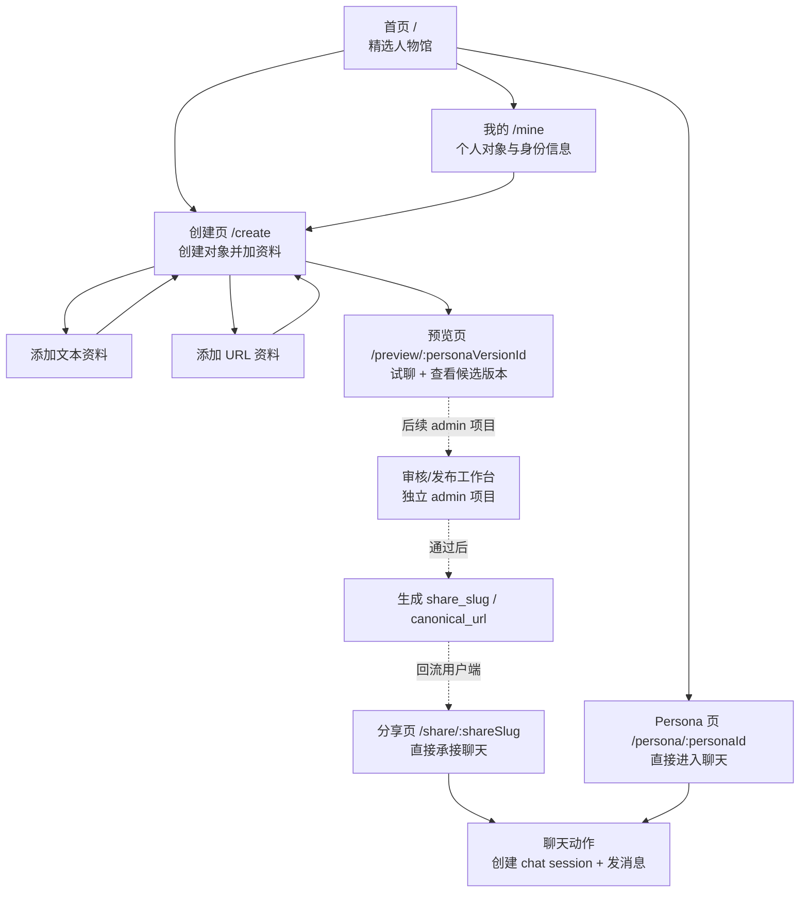
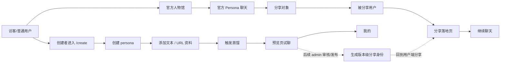
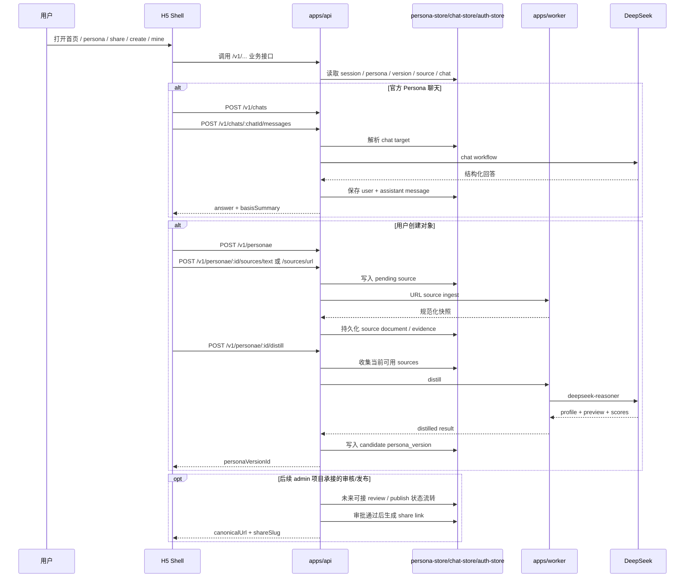

# 名人堂当前交互流程图

- 日期：2026-04-16
- 更新：2026-04-21，用户端范围移除 `review`，审核能力改为后续独立 `admin` 项目承接
- 目标：画清楚当前已经落到 bootstrap 代码里的交互图，以及整体业务流转
- 适用范围：需求讨论、实现对齐、后续拆任务
- 证据来源：
  - `docs/product-design.md`
  - `docs/technical-architecture.md`
  - `.worktrees/task1-bootstrap/apps/client/src/h5-app.ts`
  - `.worktrees/task1-bootstrap/apps/api/src/routes/*`
  - `.worktrees/task1-bootstrap/apps/api/src/store/persona-store.ts`
  - `.worktrees/task1-bootstrap/apps/worker/src/jobs/*`

## 1. 一句话结论

当前真正跑起来的交互，不在主目录代码里，而在 `.worktrees/task1-bootstrap` 这套 H5 bootstrap 里。

按 2026-04-21 这轮需求收敛，当前用户端只保留一个更聚焦的闭环：

- 首页精选人物 -> Persona 聊天
- 分享页 -> 继续聊天
- 创建 Persona -> 提交资料 -> 蒸馏 -> 预览

审核相关能力改为单独说明：

- `review` 不再属于当前 H5 / 小程序用户端范围
- 审核工作台后续放到独立 `admin` 项目
- 当前 bootstrap 代码里的 `/review` 只能视为早期联调残留，不能继续当成产品主流程

同时要明确：

- 当前真实前端是 `Fastify 渲染的 H5 shell`
- `微信小程序` 还只是 scaffold，占位未真正接入页面流
- 当前“对象详情 / 创建”已具备业务动作，但视觉和交互仍偏 bootstrap

## 2. 当前页面与跳转图



## 3. 当前主业务闭环图

这张图更接近“产品怎么流起来”，不是单纯页面跳转。



## 4. 当前运行时交互图

这张图描述的是系统内部怎么协作。



## 5. 当前用户端交互分成 4 条真实链路

## 5.1 官方体验链路

```text
首页精选 -> 点击人物卡 -> Persona 页 -> 首屏看到 persona 先说一句 ->
用户输入 -> 创建 chat session -> 发消息 -> 返回回答 -> 可展开“这句话怎么来的”
```

特点：

- 首页入口是精选人物馆，不是工具首页
- Persona 页是聊天优先，不是先展示一大段说明
- 回答解释层默认折叠，用户主动展开

## 5.2 分享承接链路

```text
外部分享链接 -> /share/:shareSlug -> 直接进入聊天页壳 ->
创建 share_link 类型 chat session -> 继续对话
```

特点：

- 分享承接的是 `persona_version`
- 分享页复用 Persona 页的聊天语言
- 当前实现里，分享页首屏就能开聊

## 5.3 创建链路

```text
/create -> ensureAnonymousSession ->
创建 persona -> 添加文本/URL 资料 -> 刷新资料列表 ->
点击“蒸馏并进入预览页”
```

特点：

- 当前创建页已支持匿名 session 开始
- 当前“升级为手机号用户”已接了一条简化版 H5 登录路径
- URL 和文本资料是平级入口

## 5.4 蒸馏与预览链路

```text
添加资料 -> POST /distill ->
worker distill -> 生成 candidate persona_version ->
/preview/:personaVersionId -> 试聊 -> 返回“我的”或等待后续发布链路
```

特点：

- 预览聊天命中 `draft_version_preview`
- 预览访问当前以创建者为中心，reviewer 页面不再算用户端链路
- “是否公开分享”后续由独立 `admin` 项目承接，不在当前用户端讨论范围

## 6. 当前关键状态机

## 6.1 角色

```text
ANONYMOUS
USER
REVIEWER
```

当前影响：

- `ANONYMOUS` 可以开始创建和体验
- `USER` 是正式手机号或微信身份
- `REVIEWER` 只保留给后续 `admin` 项目，不再对应当前用户端页面

## 6.2 Persona 状态

```text
DRAFT -> PROCESSING -> READY -> PUBLISHED
                           \-> REJECTED
```

说明：

- `persona` 更像容器
- 当前真正参与聊天、审核、分享的是 `persona_version`

## 6.3 Persona Version 状态

```text
DRAFT -> CANDIDATE -> PENDING_PUBLISH_REVIEW -> PUBLISHED
                   \-> REJECTED
                   \-> SUPERSEDED
```

说明：

- 当前用户端主要只讨论 `DRAFT -> CANDIDATE -> 预览`
- `PENDING_PUBLISH_REVIEW / PUBLISHED / REJECTED` 属于后续 `admin` 项目衔接范围

## 6.4 Chat target 三种模式

```text
published_persona
draft_version_preview
share_link
```

这是当前聊天系统最关键的路由分流点：

- 官方聊的是 `published_persona`
- 预览聊的是 `draft_version_preview`
- 分享进来聊的是 `share_link`

## 7. 当前实现与目标产品之间的差距

这些差距后续会直接影响实现拆解。

### 7.1 已经基本成型的部分

- 官方人物馆 -> Persona 聊天
- 分享落地 -> 继续聊天
- 创建 -> 资料 -> 蒸馏 -> 预览
- 分享身份绑定 `persona_version`
- 回答解释层 `basisSummary`

### 7.2 还明显是 bootstrap 的部分

- 当前真实前端仍是 H5 Fastify shell，不是最终的 `Taro + React` 双端运行形态
- 微信小程序还没有真实页面流，只是 scaffold 占位
- “我的”入口当前不是完整个人中心，底部导航仍需要正式收敛成 `聊天 / 创建 / 我的`
- 纠偏反馈入口虽然有 `/v1/feedback`，但 H5 主交互里还没真正挂上
- bootstrap 里仍有 `/review` 残留，但它不属于当前用户端产品态

### 7.3 需求视角最重要的结论

如果后续要继续讨论“现在整体流程是什么”，应该把系统分成两层理解：

1. 产品闭环
   `人物馆体验 -> 创建对象 -> 蒸馏预览 -> 分享传播 -> 再进入聊天`

2. 当前代码态
   `H5 shell 承接用户端页面 -> API 持有业务真相 -> Worker 负责 ingest/distill -> DeepSeek 负责结构化生成`

## 8. 后续文档可直接复用的表达

如果你要把这份图拿去给其他实现窗口，我建议直接用这段话做总述：

> 当前 Hall of Fame 的用户端真实交互闭环已经确定为：官方人物馆吸引进入，Persona 页与分享页都直接承接聊天；用户可在创建页用公开资料创建 persona，并进入 distill 与预览链路；底部导航收敛为 `聊天 / 创建 / 我的`。审核与发布工作台不再属于当前用户端范围，后续由独立 `admin` 项目承接。
