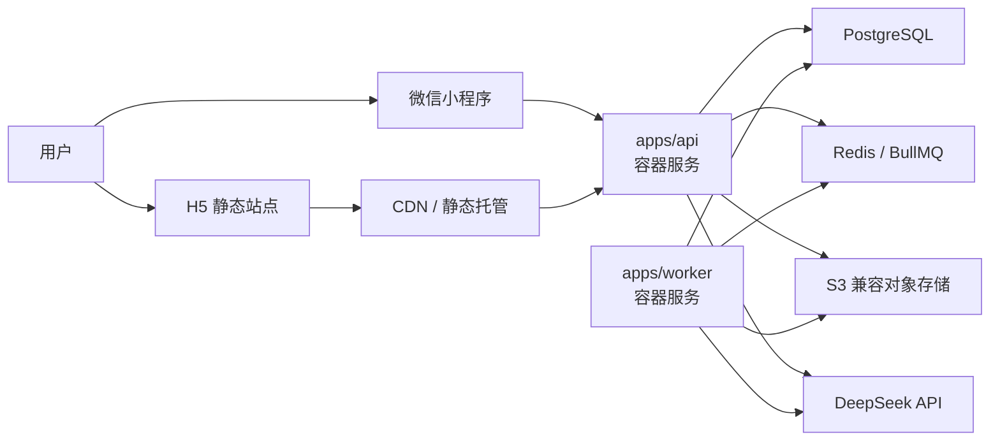

# Hall of Fame 部署架构方案

- 日期：2026-04-17
- 目标：`好迁移`、`便于后续升级扩展`、`兼容当前 bootstrap 和目标态架构`
- 适用范围：
  - 当前文档仓库中的目标方案
  - `.worktrees/task1-bootstrap` 里的已实现骨架

## 1. 当前判断

基于现有文档和 bootstrap，项目已经有几个不会轻易改变的前提：

- 前端是 `一套业务代码 -> H5 + 微信小程序`，不是两套业务前端
- 后端是 `单一 API 面 + 独立 worker`
- 数据主存储是 `PostgreSQL`
- 异步任务依赖 `Redis + queue`
- 文件与资料快照依赖 `S3 兼容对象存储`
- 当前 bootstrap 的 `apps/client` 还是 `Node/Fastify H5 shell`
- 目标态的 `apps/client` 应该收敛到 `Taro + React`，其中 `H5` 更适合静态化部署

这意味着部署方案不能围绕某一家云的私有能力来设计，而应该围绕下面 4 个可迁移标准件来设计：

1. `OCI 容器镜像`
2. `PostgreSQL`
3. `Redis`
4. `S3 兼容对象存储`

一句话结论：

`推荐采用“静态 H5 + 双容器服务(api/worker) + 托管 Postgres/Redis/Object Storage”的标准架构，不把主链路绑定到微信云开发专有能力上。`

## 2. 推荐目标架构

核心原则：

- `apps/api` 和 `apps/worker` 必须是两个独立部署单元
- `H5` 不应该长期作为 Node shell 部署，目标是收敛成静态资源 + CDN
- 小程序只承担前端入口，不承担业务后端
- 业务真相只在 `API + PostgreSQL`，不在 worker
- 资料、快照、分享图、导出文件都进入对象存储，不写本地磁盘

## 3. 为什么这是最适合当前项目的方案

### 3.1 它和现有结构天然一致

现有文档已经把工程边界锁成：

- `apps/api`
- `apps/worker`
- `apps/client`
- `packages/*`

当前 `.worktrees/task1-bootstrap` 也已经具备：

- 独立 `api` 端口
- 独立 `worker` 端口
- `PostgreSQL` / `Redis` / `MinIO` 本地 compose
- 明确的环境变量边界

所以最合理的线上拓扑，就是把本地这套结构原样提升成生产版，而不是换成另一套完全不同的运行模型。

### 3.2 它对迁移最友好

如果你从第一天就坚持：

- 服务只以容器镜像交付
- 数据库只用标准 `PostgreSQL`
- 缓存/队列只用标准 `Redis`
- 文件只走 `S3` 兼容接口

那么未来从：

- 本地 `docker compose`
- 到腾讯云
- 到阿里云
- 到 AWS
- 到自建 Kubernetes

迁移成本都可控。

真正难迁移的不是“换机器”，而是：

- 把核心流程写死在云函数或微信专属运行时
- 把对象存储 API 写死成厂商私有 SDK
- 把队列和任务调度深度绑定到某个云产品
- 让 H5 和小程序分别依赖不同后端入口

### 3.3 它对后续扩展最平滑

这套结构天然支持后续演进：

- `api` 单独横向扩容
- `worker` 按任务压力单独扩容
- `PostgreSQL` 升级高可用或读写分离
- `Redis` 从单实例升级成更高规格或集群
- 对象存储从 `MinIO` 平滑切到 `COS/S3/R2`
- 后续新增 `scheduler`、`admin`、`site` 都不需要推翻现有结构

## 4. 不推荐作为主架构的方案

### 4.1 不建议把主后端直接做成“微信云开发/云托管专属架构”

原因不是它不能用，而是它不符合你这次的第一目标：`好迁移`。

它的优点：

- 微信生态接入快
- 运维门槛低
- 小程序场景体验顺滑

它的问题：

- 容易让后端生命周期和微信生态深度绑定
- H5 和小程序的对等性会被削弱
- 未来如果要把 H5 做强、接第三方登录、接独立站点、迁到别的云，会更受限

结论：

- 可以把它当作 `极短期试运行/活动型 PoC` 备选
- 不建议把它设为 Hall of Fame 的长期主架构

### 4.2 不建议一开始就上完整 Kubernetes 自建集群

原因：

- 当前项目阶段还没有到需要自管集群复杂度的程度
- 团队精力应该优先放在产品闭环、数据模型、审核链路、对话质量

结论：

- 先用 `托管容器服务`
- 保持镜像、健康检查、环境变量、日志输出都兼容 K8s 习惯
- 等业务有明确扩容压力，再升级到更重的编排层

## 5. 推荐的分层部署方式

### 5.1 前端层

#### H5

目标态建议：

- 构建为静态资源
- 部署到 `对象存储 + CDN` 或 `静态站点托管`

原因：

- 当前产品不依赖复杂 SSR
- 分享页、对象页、落地页更适合走 CDN
- 成本低、发布快、回滚简单

短期过渡：

- 在正式 Taro H5 成型之前，当前 bootstrap 的 H5 shell 仍可作为 Node 服务部署
- 但这只是过渡态，不应成为长期目标

#### 微信小程序

- 独立走微信小程序发布链路
- 只把它当作 `客户端分发形态`
- 所有业务能力都仍然调用统一 API

### 5.2 服务层

#### `apps/api`

职责：

- 对外唯一业务 API
- 登录、对象、版本、聊天、审核、分享
- 作为 PostgreSQL 的业务真相入口

部署要求：

- 单独镜像
- 单独扩容
- 健康检查 `/health`
- 所有配置走环境变量

#### `apps/worker`

职责：

- URL 抓取
- 文本清洗
- 蒸馏任务
- 异步评测和后处理

部署要求：

- 单独镜像
- 不对公网暴露业务入口
- 从内部网络访问 `Redis/PostgreSQL/Object Storage`
- 后续从内部 HTTP 调用收敛到真正的 queue consumer

### 5.3 数据层

#### PostgreSQL

- 业务主库
- 保存用户、对象、版本、资料、审核、聊天、分享
- 必须从一开始就避免任何本地文件依赖

#### Redis

- 队列
- 任务状态
- 限流/短期缓存

不要让 Redis 承担：

- 长期业务真相
- 需要强一致回溯的业务数据

#### 对象存储

存放：

- 原始资料快照
- 上传文件
- 蒸馏中间产物
- 分享图或导出文件

要求：

- 统一走 S3 兼容接口
- 不在业务代码里散落厂商私有 SDK 逻辑

## 6. 推荐环境划分

至少 3 套环境：

### `dev`

- 本地 `docker compose`
- `PostgreSQL + Redis + MinIO`
- 用于日常开发和联调

### `staging`

- 和生产同构
- 真实容器部署
- 独立数据库、Redis、对象存储 bucket
- 小程序体验版、H5 预发版都连这里

### `prod`

- 正式域名
- 正式数据库
- 正式对象存储 bucket
- 正式小程序发布环境

要求：

- 严禁 `dev/staging/prod` 共用同一数据库
- bucket 也不要混用
- DeepSeek key、微信密钥必须按环境隔离

## 7. 推荐域名与入口设计

建议尽早固定：

- `api.example.com`：统一 API
- `www.example.com` 或 `m.example.com`：H5 主入口
- `assets.example.com`：静态资源与分享素材

分享建议：

- 所有分享对外身份都绑定 `persona_version`
- H5 分享统一走网页落地页
- 小程序内继续通过 `miniapp_path` 打开

这样做的价值是：

- H5 与小程序共享同一套对象公开身份
- 后续做 SEO、站外传播、运营活动更顺
- 域名策略不会随着前端重构反复变化

## 8. 推荐 CI/CD 形态

推荐最小流水线：

1. `pnpm install`
2. `pnpm lint`
3. `pnpm typecheck`
4. `pnpm test`
5. 构建 `api` 镜像
6. 构建 `worker` 镜像
7. 构建 `H5` 静态产物
8. 部署到 `staging`
9. 人工确认后发布 `prod`

发布策略建议：

- `main` 自动部署 `staging`
- `tag` 或手动审批发布 `prod`
- 数据库 migration 必须显式执行，不要隐式跟随应用启动

## 9. 当前仓库最应该补的部署基础设施

按优先级排序：

1. `apps/api/Dockerfile`
2. `apps/worker/Dockerfile`
3. `apps/client` 的正式 H5 build 方案
4. 生产环境变量模板
5. CI/CD workflow
6. migration 执行脚本
7. staging/prod 配置说明
8. 对象存储 bucket 约定
9. 日志、监控、告警接入

其中最关键的两个工程原则：

- `不要继续依赖应用启动时自动建表` 作为正式发布机制
- `不要让 worker 长期停留在 internal HTTP 触发模型`

## 10. 推荐的落地路线

### Phase 1：近期可上线版本

- `api`：容器服务
- `worker`：容器服务
- `H5`：如果 Taro H5 未就绪，先临时用 Node H5 shell
- `PostgreSQL`：托管版
- `Redis`：托管版
- `Object Storage`：托管版

目标：

- 尽快把运行拓扑和未来拓扑对齐
- 先把部署边界锁住

### Phase 2：收敛到目标态

- `apps/client` 切到正式 `Taro H5 + weapp`
- `H5` 改成静态站点部署
- `worker` 从 internal HTTP 触发改成 queue consumer

目标：

- 去掉过渡期的 Node H5 shell
- 让 API/Worker 的职责更纯

### Phase 3：扩容与增强

- API 水平扩容
- worker 按队列长度扩容
- 增加定时任务调度器
- 增加读副本、审计、观测和灰度发布

## 11. 最终建议

如果只保留一个明确结论，我建议你把部署方案定成下面这版：

- H5：`静态站点 + CDN`
- 小程序：`微信发布链路`
- API：`独立容器服务`
- Worker：`独立容器服务`
- 数据库：`PostgreSQL`
- 队列/缓存：`Redis`
- 文件存储：`S3 兼容对象存储`
- 本地开发：`docker compose`
- 线上策略：`托管容器 + 托管数据库 + 托管缓存 + 托管对象存储`
- 架构原则：`不用微信专属后端能力承载核心业务真相`

这套方案的核心价值不是“现在最省事”，而是：

`今天能用，明天能迁，后天能扩。`
