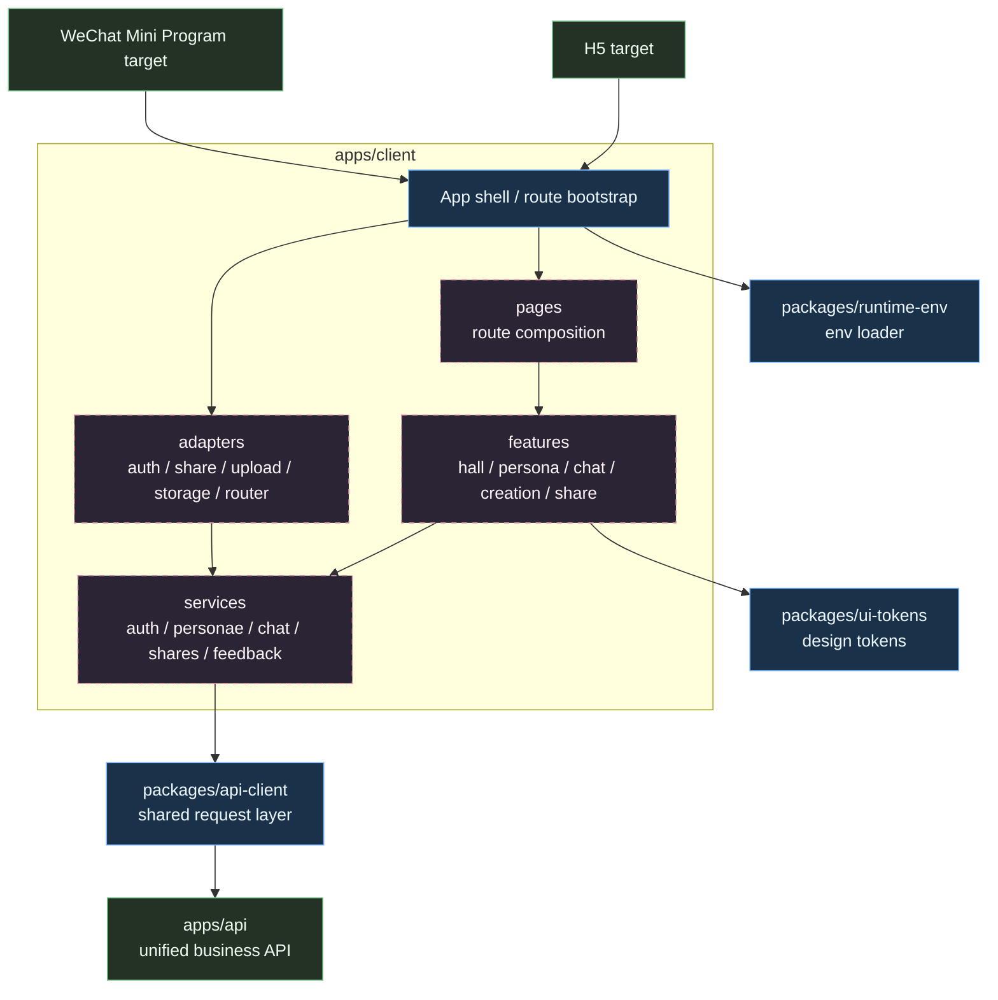
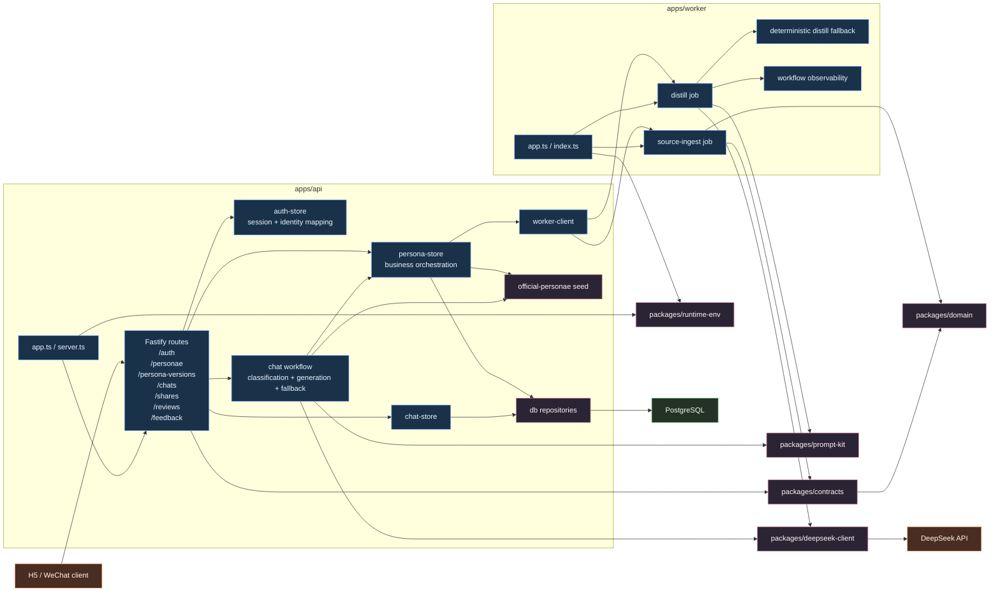

# Hall of Fame Miniapp Frontend / Backend Architecture Blueprint

- Date: 2026-04-16
- Scope: Separate frontend and backend architecture views for the Hall of Fame miniapp
- Evidence base:
  - `/Users/wentao.yu/Documents/code/hall-of-fame-miniapp/docs/technical-architecture.md`
  - `/Users/wentao.yu/Documents/code/hall-of-fame-miniapp/.worktrees/task1-bootstrap`

## 1. Context

This repository is currently the documentation home for the product. The actual engineering bootstrap lives in `.worktrees/task1-bootstrap`.

That means the diagrams below are intentionally split into two truths:

- `target architecture`: the structure already locked in `docs/technical-architecture.md`
- `current bootstrap`: the structure already visible in the worktree code today

The main goal is to keep the frontend and backend boundaries explicit before implementation expands.

## 2. Frontend Architecture

### 2.1 Frontend component view

### 2.2 Frontend layer responsibilities

- `apps/client`
  - Current bootstrap already contains an H5 shell, a reply-inspector renderer, env bootstrapping, and a WeChat-side placeholder entry.
  - Target shape is still one client app compiled to `h5` and `weapp`, not two business codebases.

- `pages`
  - Owns route-level composition and page lifecycle wiring.
  - Should stay thin and avoid direct business logic.

- `features`
  - Owns business modules: featured hall, persona detail, chat, creation flow, share flow.
  - This is where most shared business UI and interaction state should live.

- `services`
  - Owns API-oriented use cases and request orchestration.
  - Converts page intent into contract-safe network calls.

- `adapters`
  - Owns platform divergence only.
  - Expected differences: login, share, upload, storage, routing/lifecycle details.
  - Must not become a second business layer.

- `packages/api-client`
  - Centralizes fetch calls against `/v1/...` endpoints.
  - Already reflects the locked API surface: auth, personae, persona versions, chats, shares, reviews, sources, feedback.

- `packages/ui-tokens`
  - Holds visual constants and motion/layout primitives.
  - Gives H5 and miniapp the same design language even when rendering substrates differ.

- `packages/runtime-env`
  - Handles env discovery consistently across local entrypoints.

### 2.3 Frontend dependency rules

- Allowed direction:
  - `pages -> features -> services -> api-client -> apps/api`
  - `app shell -> adapters -> services`
  - `features -> ui-tokens`

- Forbidden direction:
  - `features -> adapters` only for explicit platform capability bridges exposed by the shell
  - `pages -> api-client` directly
  - business code branching by `h5` vs `weapp`

### 2.4 Frontend architecture notes

- The current worktree does not yet contain the full Taro page/module structure described in the target design.
- The bootstrap proves the package boundaries first:
  - UI tokens are isolated
  - API calls are isolated
  - env loading is isolated
- This is the correct direction, because the hardest architectural requirement is not rendering; it is keeping `one business frontend, two runtime targets`.

## 3. Backend Architecture

### 3.1 Backend component view

### 3.2 Backend layer responsibilities

- `apps/api`
  - Owns the public business API surface.
  - Owns state transitions, access control, review gating, share identity generation, and persistence.
  - Treats worker as a compute dependency, not as the owner of domain state.

- `routes`
  - Exposes unified `/v1/...` endpoints for both H5 and miniapp.
  - Validates input/output through `packages/contracts`.

- `auth-store`
  - Current bootstrap is in-memory.
  - It already models the intended session semantics:
    - anonymous session
    - authenticated user session
    - reviewer session
    - anonymous-to-user merge after login

- `persona-store`
  - This is the backend orchestration center.
  - It merges two data worlds:
    - official seed personae
    - dynamic user-created personae in PostgreSQL
  - It also enforces publish thresholds, source review flow, share creation, and chat target resolution.

- `db repositories`
  - Own persistence details for chat sessions, dynamic personae, sources, versions, reviews, shares, and feedback.
  - PostgreSQL is already the primary system of record for user-generated state.

- `chat workflow`
  - Classifies the user question.
  - Builds controlled prompts.
  - Calls DeepSeek structured JSON generation when configured.
  - Falls back to deterministic replies when the model is unavailable or unsafe.

- `apps/worker`
  - Exposes internal-only task endpoints.
  - Current jobs are:
    - `source-ingest`
    - `distill`
  - Worker is intentionally stateless with respect to business ownership.

- `packages/contracts`
  - Shared API schemas and worker payload schemas.
  - Frontend, API, and worker all compile against the same contract surface.

- `packages/domain`
  - Shared enums, state vocabularies, risk heuristics, profile schema, URL safety primitives.
  - This is the system’s stable semantic core.

- `packages/prompt-kit`
  - Owns prompt templates and structured output schemas for chat and distill pipelines.

- `packages/deepseek-client`
  - Owns structured JSON completion calls to DeepSeek.
  - Shared by API chat runtime and worker distill runtime.

### 3.3 Backend flow highlights

#### A. Source ingestion flow

1. Client submits URL source to `apps/api`
2. API validates ownership and URL shape
3. API creates pending source record in PostgreSQL
4. API calls worker `/internal/source-ingest`
5. Worker normalizes URL and returns guarded snapshot payload
6. API persists normalized source document and evidence span
7. Reviewer later approves or rejects the source

Key boundary:

- Worker computes and sanitizes
- API persists and controls lifecycle

#### B. Persona distill flow

1. Client triggers `/v1/personae/:personaId/distill`
2. API checks persona ownership
3. API gathers approved sources and builds distill input
4. API calls worker `/internal/distill`
5. Worker uses `prompt-kit + deepseek-client`, or deterministic fallback
6. API persists a new `CANDIDATE` version and links approved source documents
7. Publish still requires separate review

Key boundary:

- Distill output is a candidate artifact, not an auto-published artifact

#### C. Publish review flow

1. Owner submits version for publish review
2. Reviewer reads pending review queue
3. API checks hard thresholds:
  - approved source count
  - primary/secondary source count
  - quality scores
  - risk score ceiling
4. On approval:
  - old published version becomes `SUPERSEDED`
  - new version becomes `PUBLISHED`
  - persona becomes `PUBLISHED`
  - primary share link is created if absent

#### D. Chat runtime flow

1. Client creates chat session against:
  - published persona
  - draft preview version
  - share link
2. API resolves target into persona/version context
3. API classifies the user question
4. API builds chat prompt from profile, style examples, and approved evidence
5. API calls DeepSeek structured JSON generation
6. If unavailable, API falls back to deterministic persona reply logic
7. API persists user/assistant messages and basis metadata in PostgreSQL

### 3.4 Backend dependency rules

- `routes` may depend on:
  - `contracts`
  - `store`
  - `utils`
  - `workflow`

- `store` may depend on:
  - repositories
  - seeds
  - worker-client
  - domain utils

- `repositories` may depend on:
  - PostgreSQL client
  - schema mapping only

- `worker` may depend on:
  - `contracts`
  - `domain`
  - `prompt-kit`
  - `deepseek-client`
  - observability

- Worker should not become the owner of:
  - publish state transitions
  - share identity issuance
  - actor/session authorization
  - canonical domain writes

## 4. Current Bootstrap vs Target Architecture

### Frontend

- Already visible now:
  - `apps/client`
  - `packages/api-client`
  - `packages/ui-tokens`
  - `packages/runtime-env`
  - H5 shell and WeChat scaffold entry

- Still target-state, not fully scaffolded:
  - Taro page tree
  - `pages / features / services / adapters` production structure
  - full dual-target runtime implementation

### Backend

- Already visible now:
  - `apps/api`
  - `apps/worker`
  - PostgreSQL schema
  - dynamic persona repository
  - review/publish/share flow
  - chat workflow with DeepSeek + deterministic fallback
  - source ingest + distill task split

- Still intentionally simplified in bootstrap:
  - auth sessions are in-memory, not DB-backed
  - official personae still come from seed data
  - worker currently exposes simple internal HTTP endpoints instead of queue-based execution
  - source ingestion currently stores guarded snapshot text, not full readability extraction

## 5. Architecture Decisions Locked by This Blueprint

- Frontend remains `one business codebase, two runtime targets`
- Platform differences stay in `adapters`, not in page/business modules
- Backend remains `single API surface + separate worker compute plane`
- API owns lifecycle and persistence; worker owns bounded computation
- Contracts and domain vocabulary stay shared packages, not duplicated across apps
- Publish is review-gated and share identity is version-bound, not mutable persona-bound

## 6. Recommended Next Architecture Docs

The next documents to refine after this one are:

1. Database entity and relation diagram
2. API contract map grouped by actor and lifecycle stage
3. Persona/version/source/review/share state machine document
4. Chat runtime sequence diagram for supported vs inferred vs refusal paths
