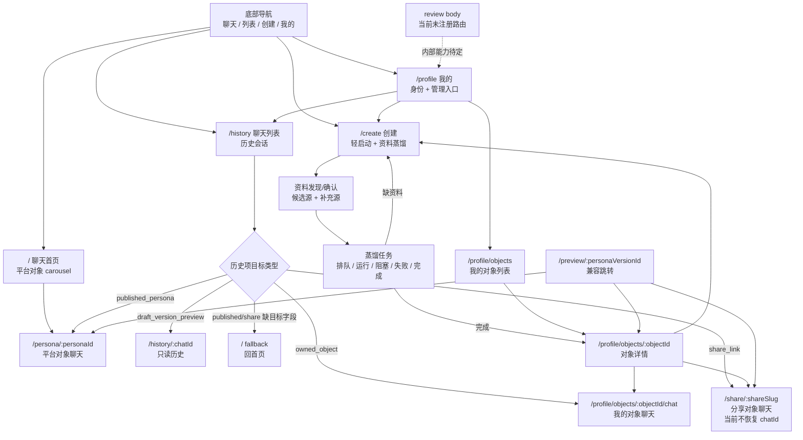
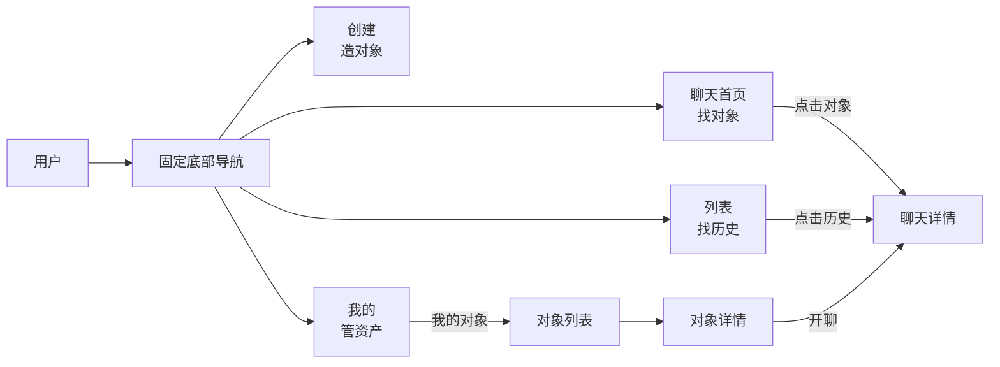
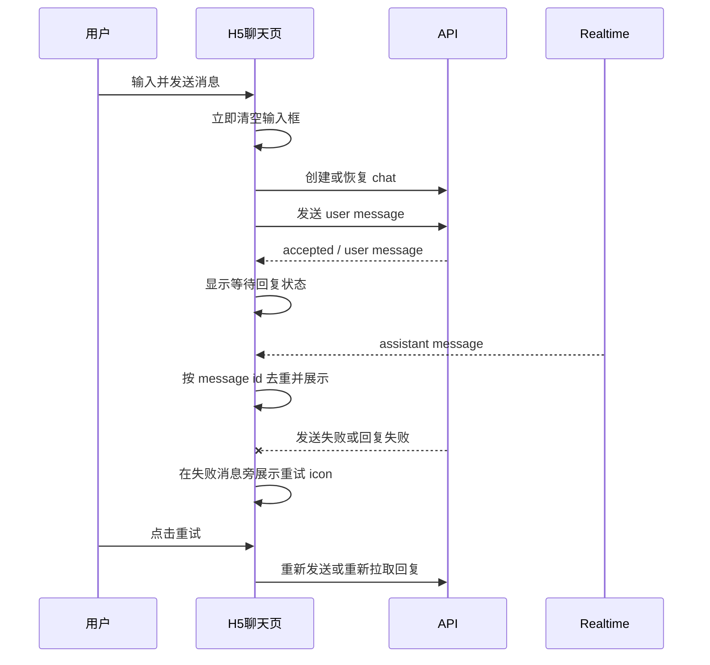
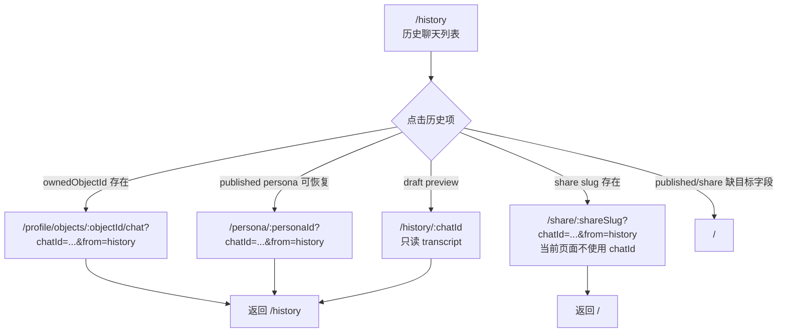
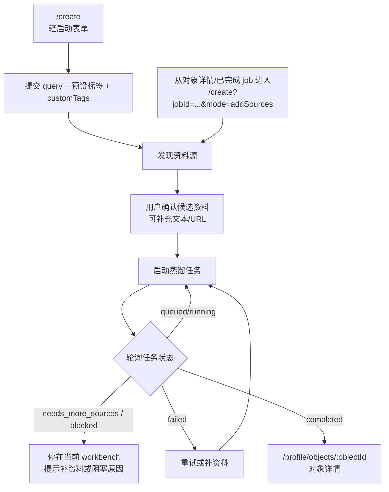
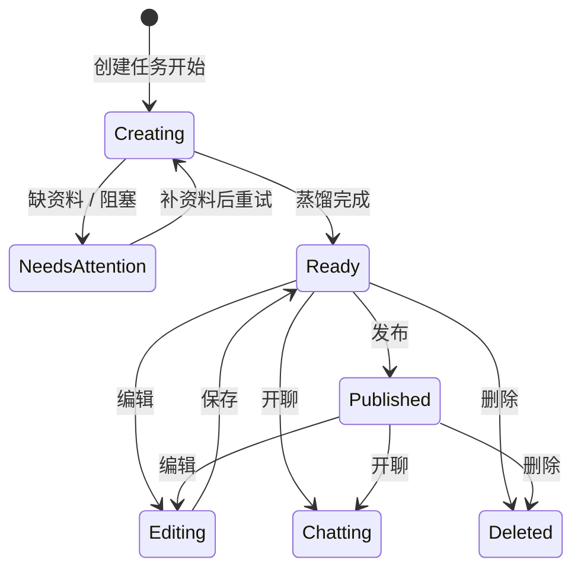

# 前端页面地图与交互地图（2026-05-06）

## 1. 执行计划

这份文档先做产品功能盘点，不做视觉改版。目标是把“现有前端到底有哪些页面、功能区、状态和跳转”固定下来，再基于完整功能地图判断页面是否缺失、交互是否缺失，最后再进入设计重构。

| 步骤 | 产出 | 判断标准 |
| --- | --- | --- |
| 1. 扫描入口 | H5 路由、React 页面、底部导航、主要组件入口 | 能说明当前用户实际能进入哪些页面 |
| 2. 功能盘点 | 按产品功能区整理页面、数据源、主操作 | 能看出每个功能区服务什么用户任务 |
| 3. 页面地图 | 页面层级、入口、出口、状态 | 能判断是否缺页面或入口混乱 |
| 4. 交互地图 | 聊天、历史、创建、我的对象、分享、审核的关键流程 | 能判断是否有断点、重复入口或不一致状态 |
| 5. 独立 review | 让 subagent 对照代码检查文档 | 能发现文档漏项、错误映射和不符合代码的表述 |
| 6. 设计策略 | 下一轮视觉设计的结构原则 | 先减少文字和线框，再做颜色、氛围和高级感 |

## 2. 范围和基准

当前前端以 `apps/client/src/h5-app.ts` 的 H5 runtime 为准。`apps/client/src/pages/*` 和 `apps/client/src/features/*` 中的 React 页面仍存在，但更像旧版/脚手架参考，并没有覆盖当前 H5 的完整信息架构。

主要代码基准：

| 类型 | 文件 | 结论 |
| --- | --- | --- |
| H5 主入口 | `apps/client/src/h5-app.ts` | 当前产品页面、路由、底部导航、聊天脚本都集中在这里 |
| H5 页面测试 | `apps/client/src/dev-h5.test.ts` | 固化了首页、列表、创建、我的、我的对象、聊天页的基本 UI 预期 |
| 聊天行为测试 | `apps/client/src/chat-behavior.test.ts` | 固化了发送清空、失败重试、历史恢复、只读历史、实时消息等行为 |
| React 页面 | `apps/client/src/pages/*` | 页面较旧，不能作为当前最终 IA 的唯一依据 |
| 小程序入口 | `apps/client/src/dev-weapp.ts` | 当前是脚手架提示，尚未实现页面 parity |

## 3. 产品功能区总表

| 功能区 | 当前用户任务 | 主要页面 | 主要数据/接口 | 设计判断 |
| --- | --- | --- | --- | --- |
| 平台对象发现 | 从平台内置对象中挑一个开聊 | `/` | `/v1/personae/featured` | 首页应极简，只展示对象、简介、导航和少量 slogan |
| 对象聊天 | 与平台对象、分享对象、自己创建的对象对话 | `/persona/:personaId`、`/share/:shareSlug`、`/profile/objects/:objectId/chat` | `/v1/chats`、`/v1/me/objects/:objectId/chats`、`/v1/realtime` | 聊天是核心体验，顶部返回、失败重试、输入框清空必须稳定 |
| 聊天历史 | 找回以前聊过的会话 | `/history`、`/history/:chatId` | `/v1/chats` | 列表页只应做历史列表，不要混入对象推荐或管理入口 |
| 对象创建 | 低门槛创建一个会开口的人 | `/create` | `/v1/persona-distill-intents`、`/v1/persona-distill-source-discovery`、`/v1/persona-distill-jobs` | 创建页承担多状态流程，设计上要弱化后台感和表单感 |
| 我的对象 | 管理自己创建的对象和发布状态 | `/profile/objects`、`/profile/objects/:objectId` | `/v1/me/persona-inventory`、`/v1/me/objects/:objectId` | 这是资产管理区，不应塞回首页 |
| 个人中心 | 身份、入口、低频管理 | `/profile` | 匿名会话/本地状态、我的对象接口 | 个人中心应是入口 hub，不应展示过多解释文字 |
| 分享访问 | 通过分享链接进入对象 | `/share/:shareSlug` | 分享详情、聊天创建接口 | 需要和标准聊天页保持体验一致；当前从历史进入 share 不会真正恢复既有会话 |
| 预览兼容 | 旧预览链接跳转到新的对象详情或分享页 | `/preview/:personaVersionId` | `/v1/me/persona-inventory`、persona version detail | 这是兼容页，不应作为主设计页面 |
| 审核后台 | 内部审核资料源和版本 | 当前有 body renderer，但路由未注册 | `/v1/reviews/*` | 如果仍需要，应明确为内部页；否则从前端主地图移除 |

## 4. 页面地图

| 页面层级 | 页面 | 路由 | 入口 | 页面职责 | 主要交互 | 出口 |
| --- | --- | --- | --- | --- | --- | --- |
| 主导航 | 聊天首页 | `/` | 底部导航“聊天” | 展示平台内置对象 carousel | 横向滑动对象、点击指示条、点击对象卡片 | `/persona/:personaId` |
| 主导航 | 聊天列表 | `/history` | 底部导航“列表” | 展示历史聊天列表 | 点击历史项恢复会话、打开 share 页或打开只读历史 | `/persona/:id?chatId=...`、`/profile/objects/:id/chat?chatId=...`、`/share/:slug?chatId=...`、`/history/:chatId`、`/` |
| 主导航 | 创建 | `/create` | 底部导航“创建” | 轻启动对象创建和资料蒸馏 | 填一句创建需求、选标签、发现资料、补资料、启动任务、轮询任务 | `/profile/objects/:objectId`、继续留在 `/create?jobId=...` |
| 主导航 | 我的 | `/profile` | 底部导航“我的” | 身份和管理入口 | 去我的对象、去历史、去创建 | `/profile/objects`、`/history`、`/create` |
| 聊天详情 | 平台对象聊天 | `/persona/:personaId` | 首页对象、历史列表 | 进入标准聊天线程 | 发送消息、失败重试、实时接收、返回来源页 | `/` 或 `/history` |
| 聊天详情 | 分享对象聊天 | `/share/:shareSlug` | 外部分享链接、历史列表 | 通过分享对象聊天 | 发送消息、失败重试、打开对象上下文；当前不读取历史 URL 的 `chatId` | `/` |
| 聊天详情 | 我的对象聊天 | `/profile/objects/:objectId/chat` | 我的对象详情、历史列表 | 与自己创建的对象聊天 | 创建/恢复对象会话、发送消息、失败重试 | `/profile/objects/:objectId` 或 `/history` |
| 聊天详情 | 只读历史 | `/history/:chatId` | `draft_version_preview` 历史 fallback | 查看旧草稿预览会话记录 | 只读消息列表，无输入框 | `/history` |
| 我的对象 | 对象列表 | `/profile/objects` | 我的页 | 按状态分组展示对象资产 | 点击对象进入详情 | `/profile/objects/:objectId` |
| 我的对象 | 对象详情 | `/profile/objects/:objectId` | 对象列表、创建完成页、聊天返回 | 查看对象状态和管理操作 | 开聊、编辑、补资料、确认、发布、分享、删除、重试 | `/profile/objects/:id/chat`、`/create`、share link、`/profile/objects` |
| 兼容 | 预览跳转 | `/preview/:personaVersionId` | 老链接或旧历史 | 判断版本归属并跳转 | 自动跳到对象详情、persona 或 share | `/profile/objects/:id`、persona/share 目标 |
| 内部 | 审核页 | 未注册，body 为 review | 无公开入口 | 审核资料源和对象版本 | reviewer 登录、批准、拒绝 | 需要产品决策 |

## 5. 页面图

## 6. 核心交互图

### 6.1 主导航交互

### 6.2 聊天发送与恢复

### 6.3 历史列表进入聊天

### 6.4 创建对象流程

### 6.5 我的对象生命周期

## 7. 当前页面与交互缺口

| 缺口 | 当前观察 | 风险 | 建议 |
| --- | --- | --- | --- |
| 审核页有实现但未注册路由 | `buildReviewPageBody`、`renderReviewPage` 存在，`buildH5Server` 未注册 `/review` | 功能存在但无法进入，容易造成设计和实现不一致 | 产品决定：删除、隐藏为内部页，或注册到内部入口 |
| React 页面与 H5 页面不一致 | React pages 仍有 home/create/profile/review/share，但 IA 落后于 H5 | 后续小程序/React 迁移时会误用旧结构 | 明确 H5 为准，React 只保留为参考或同步改造 |
| 分享聊天页与标准聊天页结构不完全一致 | persona/object chat 已减少重复 header，share 仍保留更多 landing 信息 | 同一聊天体验可能出现重复信息和视觉噪音 | 下一轮统一三类聊天模板 |
| 分享历史无法真正恢复 | 历史列表会拼出 `/share/:slug?chatId=...&from=history`，但 `/share/:shareSlug` 当前不读取 query，也没有传 `initialChatId` | 用户从列表进入分享会话时看不到旧聊天记录，且返回不是列表 | 作为交互缺口修复：share route 接 query，并和 persona/object chat 使用同一恢复/返回逻辑 |
| 创建页状态过多 | 轻启动、资料确认、补资料、任务轮询、debug trace 都在一个页面脚本内 | 视觉上容易变成后台表单，用户会累 | 设计时拆成“第一屏轻启动 + 资料确认抽屉/分段 + 任务状态卡” |
| 历史列表目标分叉多 | 历史项可能进入 persona、owned object chat、share 页、draft 只读 transcript，部分缺目标字段会回首页 | 用户不理解为什么有些能继续聊、有些只能看 | 列表项增加轻量状态表达，不增加大段解释 |
| 我的对象详情动作密集 | 聊天、编辑、补资料、确认、发布、分享、删除、重试都可能出现 | 线框和按钮过多会显得像管理后台 | 按主次分层：主 CTA 只保留当前最应该做的一步 |
| Profile 功能偏入口化 | 当前是身份和低频管理入口 | 如果堆数据会破坏“我的”页面轻量感 | 保持 hub，细节下钻到对象列表/详情 |
| 小程序页面缺 parity | `dev-weapp.ts` 仍是脚手架 | 后期上小程序时需要重新补页面结构 | 先以本文档作为小程序页面 parity checklist |

## 8. 设计重构前的产品判断

现在“素”的根因不只在颜色，也在信息结构：说明文字太多、状态解释太直白、线框容器承担了过多层级表达。下一轮不应先调色，而应先做页面职责收敛。

| 设计对象 | 应保留的核心信息 | 应减少的内容 | 更适合的表达 |
| --- | --- | --- | --- |
| 首页 | 对象、对象简介、导航、最多一句 slogan | 解释性模块、功能入口堆叠 | 大卡片、头像/首字、情绪化背景、少文字 |
| 聊天页 | 对象名、返回、消息、输入、失败重试 | 重复身份卡、重复说明文案 | 顶部 sticky 信息 + 消息流 |
| 历史页 | name、time、latest message 一行 | 多余说明、复杂分类 | 强主次颜色、头像/首字、状态轻提示 |
| 创建页 | 一句创建需求、标签、资料确认、任务状态 | 长段说明和后台字段感 | 分阶段卡片、进度状态、主 CTA |
| 我的对象 | 对象状态和当前最重要动作 | 全量按钮平铺 | 状态分组 + 主操作优先 |
| 我的页 | 身份、入口、设置/资产入口 | 统计和解释文字堆叠 | 简洁入口 hub |

## 9. 下一步页面设计顺序

| 优先级 | 页面 | 原因 | 设计目标 |
| --- | --- | --- | --- |
| P0 | 首页 `/` | 第一印象，决定产品气质 | 保持功能极简，但增强对象存在感和年轻化氛围 |
| P0 | 聊天页 `/persona`、`/share`、`/profile/objects/:id/chat` | 核心使用场景 | 统一三类聊天模板，减少重复信息 |
| P1 | 历史页 `/history` | 新增关键闭环 | 强化可恢复会话和只读历史的轻差异 |
| P1 | 创建页 `/create` | 当前最容易后台化 | 分阶段，降低表单压迫感 |
| P2 | 我的对象 `/profile/objects`、详情页 | 管理复杂度高 | 用状态和主 CTA 替代线框堆叠 |
| P2 | 我的 `/profile` | 低频入口 | 保持轻，不要做成数据面板 |

## 10. Review 检查清单

subagent review 需要重点检查：

| 检查项 | 期望 |
| --- | --- |
| 路由完整性 | 本文列出的公开路由和 `buildH5Server` 一致 |
| 页面职责 | 页面职责没有把旧 React 页面误认为当前主页面 |
| 聊天行为 | 发送清空、失败重试、历史恢复、只读历史、sticky 返回都与测试一致 |
| 创建流程 | 资料发现、补资料、任务轮询、完成跳对象详情与代码一致 |
| 缺口判断 | `/review` 未注册、share/template 不一致、React stale 等结论可被代码验证 |
| 设计建议 | 建议停留在产品结构和交互层，不提前进入具体 UI 改色 |

## 11. Subagent review 修正记录

| Review 发现 | 修正 |
| --- | --- |
| share 历史项 URL 带 `chatId`，但 `/share/:shareSlug` 不读取 query，也不恢复既有会话 | 页面地图、交互图和缺口表已明确标为当前缺口 |
| 只读历史 fallback 不是所有不可恢复目标，只覆盖 `draft_version_preview` | 页面地图和交互图已收窄到 draft preview，只补充 published/share 缺字段会 fallback 到 `/` |
| 创建流程不是“对象名 + 一句定位 + 标签”，当前 H5 表单是 `query + preset tags + customTags`；`mode=addSources` 不是 needs_more_sources 自动跳转 | 创建流程图和设计保留信息已改为当前代码状态 |
