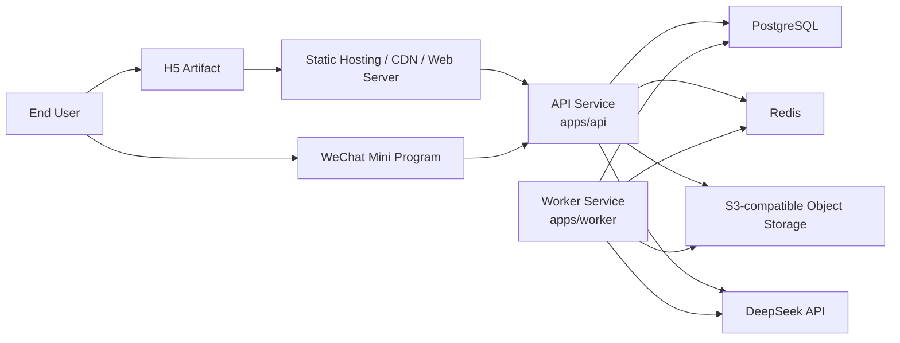

# Hall of Fame 平台无关部署基线

- 日期：2026-04-17
- 状态：基线已确认，可作为后续云厂商选型的统一约束
- 适用范围：
  - 当前 `.worktrees/task1-bootstrap` 工程骨架
  - 后续正式 `H5 + 微信小程序 + API + Worker` 目标态

## 1. 目标

这份文档只定义一件事：

`在不绑定任何云厂商的前提下，先把 Hall of Fame 的部署边界、运行单元、交付方式和环境约束锁住。`

它解决的是：

- 这个项目上线时，最小完整运行拓扑应该是什么
- 哪些部分必须无状态，哪些部分必须持久化
- 后续选阿里云、腾讯云、AWS 或自建 Linux 时，真正需要映射的是哪些能力

它**不解决**：

- 具体买哪家的云
- 控制台怎么点
- 哪个厂商的具体产品名怎么选
- 备案、WAF、CDN、SLB 之类的厂商级实施细节

## 2. 设计原则

这套部署基线必须满足以下原则：

### 2.1 云厂商无关

项目的核心运行依赖只允许建立在这些可替换能力上：

1. `Linux / 容器运行环境`
2. `PostgreSQL`
3. `Redis`
4. `S3-compatible object storage`
5. `HTTPS ingress`

也就是说，应用代码和部署模型不能依赖某一家云的专属运行时，尤其不能把核心业务真相写死在：

- 云函数专属触发器
- 小程序专属后端 runtime
- 厂商私有对象存储 SDK 语义
- 厂商私有任务编排模型

### 2.2 运行单元清晰

部署时必须把这些单元分开看待：

- `H5 artifact`
- `WeChat Mini Program artifact`
- `API service`
- `Worker service`
- `PostgreSQL`
- `Redis`
- `Object storage`
- `External LLM provider`

它们的扩容、发布、回滚和故障边界不应该混在一起。

### 2.3 业务真相单点明确

项目中只有以下位置可以承载业务真相：

- `PostgreSQL`
- 受 PostgreSQL 约束的对象存储元数据引用

不能把业务真相放在：

- `worker` 本地内存
- 容器本地磁盘
- Redis 长期 key
- H5 服务器本地文件

### 2.4 当前态与目标态兼容

当前 bootstrap 的 `apps/client` 还是 `Fastify H5 shell`，目标态则是 `Taro + React` 编译到 `H5 + weapp`。

部署基线必须同时兼容：

- 当前可运行的 H5 Node 进程形态
- 未来收敛到静态 H5 产物形态

这意味着我们定义的是“部署抽象”，不是某一个阶段的暂时脚手架。

## 3. 目标运行拓扑

最小完整上线拓扑就是这 7 个能力：

1. 一个 H5 交付层
2. 一个 API 服务
3. 一个 Worker 服务
4. 一个 PostgreSQL 实例
5. 一个 Redis 实例
6. 一个 S3-compatible 对象存储
7. 一个外部 LLM provider

## 4. 运行单元定义

### 4.1 H5 Artifact

H5 在部署抽象上是“可独立发布的前端交付物”，但当前和未来有两个阶段：

#### 当前阶段

- 形态：`Node/Fastify H5 shell`
- 位置：`apps/client`
- 特征：服务端拼装 HTML、内联脚本发请求到 API

#### 目标阶段

- 形态：`静态 H5 build artifact`
- 位置：仍然由 `apps/client` 产出
- 特征：更适合部署到静态托管、对象存储 + CDN 或任意 Web server

基线约束：

- 无论当前还是未来，H5 都不是业务真相持有者
- H5 只调用统一 API，不直接访问数据库
- H5 的发布必须可以与 API/Worker 解耦

### 4.2 WeChat Mini Program Artifact

- 小程序是独立发布产物
- 只负责前端入口和平台能力适配
- 不承担业务后端职责

基线约束：

- 小程序所有业务数据仍然走统一 API
- 小程序登录可以平台分叉，但登录后的业务协议不能分叉

### 4.3 API Service

- 对外唯一业务 API 面
- 负责用户、对象、版本、审核、聊天、分享、会话
- 是 PostgreSQL 业务真相的主要写入口

基线约束：

- 必须作为独立服务部署
- 必须有显式健康检查
- 必须通过环境变量注入配置
- 不依赖本地磁盘保存业务状态

### 4.4 Worker Service

- 负责 URL 抓取、清洗、蒸馏、异步流程
- 负责长耗时或非同步用户请求链路中的计算任务

基线约束：

- 必须独立部署，不能和 API 强耦合成单进程前提
- 不应对公网暴露业务入口
- 不能成为业务真相的唯一持有者
- 其任务状态可写 Redis / PostgreSQL，但最终业务结论应归档到 PostgreSQL

### 4.5 PostgreSQL

- 主业务数据库
- 保存用户、身份、对象、版本、资料、审核、聊天、分享、反馈

基线约束：

- 作为系统唯一主关系型存储
- migration 需要显式执行
- 不能依赖“启动时顺手建表”作为正式发布机制

### 4.6 Redis

- 承担队列、异步调度、短期缓存、限流等职责

基线约束：

- 允许丢失短期状态，不允许成为业务唯一事实来源
- 用于调度，不用于存放长期必须追溯的对象状态

### 4.7 Object Storage

- 保存源资料快照、上传文件、蒸馏中间产物、分享图、导出文件等

基线约束：

- 必须使用 `S3-compatible` 接口抽象
- 业务代码不能深度绑定某家云对象存储产品名和 SDK 语义
- 元数据和权限控制仍应在 PostgreSQL 中保留主记录

## 5. 交付标准

### 5.1 服务交付必须是标准化产物

服务类运行单元至少要能以如下方式交付：

- `API`：一个可运行镜像
- `Worker`：一个可运行镜像
- `H5`：一个可部署前端产物，当前可为镜像，目标为静态构建产物

这里的重点不是“必须上 Docker”，而是：

`交付物必须脱离开发机环境，具备可复制、可部署、可回滚的标准入口。`

### 5.2 启动入口必须显式

每个运行单元必须有明确启动命令：

- API 启动命令
- Worker 启动命令
- H5 当前启动命令 / 目标构建命令

不能依赖：

- 只在本地 IDE 里能跑的隐式配置
- 手工注入的临时脚本顺序
- 只有作者自己知道的 shell alias

### 5.3 健康检查必须稳定

至少需要：

- API `health` endpoint
- Worker `health` endpoint

健康检查必须只回答“服务能否接流量 / 接任务”，不混入复杂业务探针。

### 5.4 容器本地磁盘不保存关键状态

容器本地磁盘只能用于：

- 临时缓存
- 构建时文件
- 短时中间文件

不能用于：

- 聊天记录
- 资料快照主副本
- 用户上传主文件
- 版本状态

## 6. 配置标准

### 6.1 环境分层

至少区分 3 套环境：

- `dev`
- `staging`
- `prod`

基线约束：

- 三套环境不能共用数据库
- 三套环境不能共用对象存储 bucket 前缀或同一批业务数据
- 密钥必须隔离

### 6.2 配置来源

配置必须通过受控方式注入：

- 环境变量
- secret 管理系统
- 受版本控制的非敏感配置文件

禁止：

- 把密钥写死进仓库
- 把生产配置散落在多个脚本里
- 依赖人工 SSH 上线时临时导出变量

### 6.3 配置分类

配置应至少分成 4 类：

#### 业务公开配置

例如：

- H5 公网 API base URL
- 分享站点 URL

#### 服务运行配置

例如：

- 端口
- 日志级别
- worker 并发参数

#### 基础设施连接配置

例如：

- `DATABASE_URL`
- `REDIS_URL`
- `S3_ENDPOINT`
- `S3_BUCKET`

#### 密钥与凭证

例如：

- `DEEPSEEK_API_KEY`
- 对象存储访问密钥
- 小程序密钥

密钥不能被前端产物打包进去。

## 7. 数据与持久化标准

### 7.1 PostgreSQL 是主业务真相

以下数据必须以 PostgreSQL 为准：

- user / session / identity
- persona / persona_version
- source / review / publish
- chat / message
- share / feedback

### 7.2 Redis 只承担短期状态

Redis 适合：

- queue
- retry state
- temporary lock
- short-lived cache

Redis 不适合：

- 用户永久聊天历史
- 发布版本主记录
- 需要审计追踪的审核结果

### 7.3 Object Storage 只保存文件资产

对象存储里可以放：

- 原始网页快照
- 上传文档
- 图片 / 分享卡
- 导出文件
- 蒸馏中间文件

但文件“属于谁、对应哪个版本、是否可见、是否过期”这类规则仍应由 PostgreSQL 决定。

### 7.4 备份与恢复要求

即使当前还没选云厂商，也必须先锁这条原则：

- PostgreSQL 需要定期备份
- 对象存储需要生命周期和恢复策略
- 恢复演练至少要支持 staging 级别验证

这属于部署基线，不属于某家云的附加项。

## 8. 网络与访问标准

### 8.1 对外入口

对外只建议暴露：

- H5 入口
- API 入口

Worker 默认不对公网直接开放业务入口。

### 8.2 HTTPS 是默认前提

公开访问流量必须使用 HTTPS。

这既是 Web 基线，也是小程序服务域名接入的现实前提。

### 8.3 域名职责建议

平台无关基线建议先抽象为：

- `web domain`
- `api domain`
- `assets domain`

后续无论映射到哪家云，域名职责都不变，只变承载它们的基础设施。

## 9. 发布标准

### 9.1 CI 最小要求

任何正式发布前，至少要完成：

1. install
2. lint
3. typecheck
4. test
5. 构建部署产物

### 9.2 数据库变更必须显式执行

数据库 schema 变更不能隐式依赖应用启动。

基线要求：

- migration 作为独立发布步骤
- migration 成败可观测
- migration 和应用版本有对应关系

### 9.3 回滚原则

回滚必须至少能覆盖：

- 应用版本回滚
- H5 产物回滚
- 配置回滚

数据库回滚不能被默认假设为“总是能自动回滚”，需要单独设计前向兼容策略。

## 10. 可观测性基线

即使先不接具体云监控，也应先固定日志和监控抽象：

### 10.1 日志

- API 输出结构化日志
- Worker 输出结构化日志
- 关键任务链路具备 request id / job id / persona id / version id

### 10.2 指标

至少需要关注：

- API 请求量、错误率、延迟
- Worker 任务数、失败率、重试数
- PostgreSQL 连接和错误
- Redis 可用性

### 10.3 告警

后续接入哪家云都要有以下最低告警语义：

- API 不可用
- Worker 大面积失败
- PostgreSQL 连接异常
- Redis 不可用
- 对象存储访问失败激增

## 11. 安全与权限基线

### 11.1 最小权限

每个运行单元只拿自己需要的权限：

- API 拿自己所需数据库、Redis、对象存储权限
- Worker 拿自己所需数据库、Redis、对象存储权限
- H5 不持有后端密钥

### 11.2 密钥隔离

以下密钥不能共享同一套使用场景：

- 本地开发密钥
- staging 密钥
- production 密钥

### 11.3 内外网边界

如果部署平台支持网络隔离，推荐默认抽象为：

- public ingress
- internal service network
- data service network

即便最终只是部署在 Linux 主机上，这种边界思想也要先保留。

## 12. 后续 B 阶段要映射的能力

当我们进入 `B` 阶段时，无论选阿里云、腾讯云还是自建 Linux，实际只是把下面这些抽象能力映射成具体实现：

1. `Container runtime / container orchestration`
2. `PostgreSQL hosting`
3. `Redis hosting`
4. `S3-compatible object storage`
5. `Static hosting / CDN / web serving`
6. `TLS / domain / ingress`
7. `Secret management`
8. `Logging / monitoring / alerting`

这就是为什么现在先做 `A` 是合理的：

`A` 锁的是系统边界，`B` 只是给这些边界找承载平台。

## 13. 当前仓库的直接结论

基于当前 `.worktrees/task1-bootstrap`，可以先得出这些不带云厂商色彩的结论：

- 这个项目完全可以部署在任意 Linux 容器环境上
- 也可以部署在任意能提供 `PostgreSQL + Redis + S3-compatible storage` 的平台上
- 未来选阿里云还是腾讯云，不会改变核心工程结构
- 真正要避免的不是“选错云”，而是“先写出依赖某家云专属能力的架构”

## 14. 下一步建议

这份基线文档确认后，下一阶段讨论 `B` 时，只需要回答 3 个问题：

1. 你更偏向 `自管 Linux`，还是 `托管服务优先`
2. 你更在意 `运维简单`，还是 `迁移自由度`
3. 当前更可能采购的是哪家平台

然后我们再把本基线映射成一份具体落地方案，而不是反过来让厂商能力定义架构。
