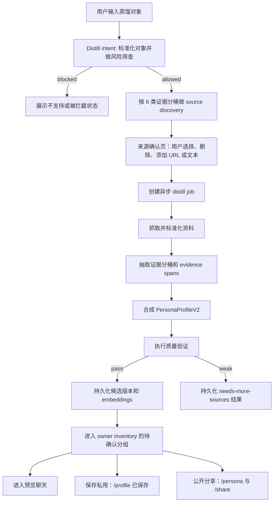

# Nuwa 启发的一键蒸馏 V2 实施计划

> **给后续实现 Agent 的要求：** 实施本计划时必须使用 `superpowers:subagent-driven-development`（推荐）或 `superpowers:executing-plans`，并按任务清单逐项推进。任务项使用 `- [ ]` 格式，便于执行和追踪。

**目标：** 把一键蒸馏从“把几份资料总结成 profile”升级为“构建一个可聊天的人格系统”。生成的人物需要在思维方式、对话习惯、价值取向、表达节奏和边界感上，都让用户感到像被蒸馏对象。

**架构原则：** 延续 `docs/project-evolution-timeline.md` 里已经形成的方向：contract-first、workflow-first、retrieval-first、可观测。不要照搬 Nuwa 的本地 `SKILL.md` 文件产物形态，而是把它的调研、提炼和验证方法转成当前项目可落地的后端合同、数据库产物、worker job、prompt-kit prompt 和 chat runtime context。

**技术栈：** Fastify API、`packages/contracts`、`packages/domain`、Postgres/Supabase、pgvector/Qwen embeddings、Kimi Researcher、DeepSeek reasoner/chat、worker distill jobs、H5 创建流程、chat trace。

**MVP 执行边界：** V1 只交付直接创建闭环：输入蒸馏对象、资料发现、用户确认来源、异步蒸馏任务、候选版本、预览聊天。本阶段不做“帮我推荐一个蒸馏对象”、Skill 文件导出、多 Agent 编排 UI、完整 RAG 管理面。

---

## 1. 当前基础

当前项目已经有可复用基础：

- `persona_versions.profile_json` 已经存结构化人物画像，但 schema 偏薄，主要是 summary、roles、beliefs、reasoning patterns、speaking style、topic strengths、unknowns 和 boundaries。
- `/v1/personae/:personaId/distill` 已经能同步调用 worker 做一次蒸馏。
- `apps/worker/src/jobs/distill/run-distill-job.ts` 已经能调用 DeepSeek structured JSON，并有 deterministic fallback。
- `persona_sources`、`source_documents`、`evidence_spans`、`persona_chunks`、`persona_*_embeddings` 和 chat retrieval 表已经存在。
- 聊天链路已经有 Fast Planner、Kimi Researcher、DeepSeek responder、向量检索、用户记忆 facts 和 trace artifacts。

当前限制是：蒸馏产物还是“资料摘要型 profile”，能支撑基础聊天，但不足以让对象在新问题、新场景里持续像被蒸馏对象。

## 2. 借鉴 Nuwa 的部分

| Nuwa 思路 | 对本产品的价值 | 当前项目里的落地方式 |
| --- | --- | --- |
| 提取 `HOW they think`，不是 `WHAT they said` | 产品承诺是人格相似度，不是人物百科 | 在 profile 中增加 `mentalModels`、`decisionHeuristics`、`valuesAndAntiPatterns`、`expressionDna` |
| 六类证据分桶 | 避免只用百科摘要做低质量蒸馏 | 存储 `WRITINGS`、`CONVERSATIONS`、`EXPRESSION_DNA`、`EXTERNAL_VIEWS`、`DECISIONS`、`TIMELINE` |
| 调研 Review 检查点 | 用户在生成前能看到和编辑资料来源 | source discovery 返回覆盖度、缺失维度、来源质量、用户确认结果 |
| 三重验证 | 过滤掉“所有聪明人都适用”的泛化特质 | 对每个心智模型评分：跨域复现、生成力、排他性 |
| Expression DNA | 直接提升聊天氛围和人物声音 | 作为 runtime prompt 和 profile embedding 的一等字段 |
| Honest boundaries | 避免事实幻觉和危险模仿 | 存储不确定性与边界，并按聊天模式注入 runtime |
| Quality gate | 防止弱资料或高风险对象直接可发布 | 增加蒸馏质量分和 preview/publish 门禁 |
| Agentic protocol | 需要事实时，先查证再回答 | 工具调用由后端 planner/researcher 统一调度，不交给最终 persona prompt 自由发挥 |

不照搬的部分：

- 不生成 Claude `SKILL.md` 文件作为产品产物。
- 不用本地 markdown research 文件作为数据源。
- 不直接把 Nuwa 脚本放进生产流程；只吸收其检查逻辑，重写为后端 service。
- 不让生成出来的人格 prompt 自主决定所有 web search；工具调用必须由后端控制成本、安全和可观测性。

## 3. 目标产品流程



这个流程保持用户侧的一键体验，但后端执行结构化蒸馏流程。
`/profile` 是用户侧 owner inventory：成功 job 创建的 candidate version 必须能在 `/profile` 找回，不能只依赖 preview 页或聊天列表。

## 4. Profile V2 结构

`PersonaProfileV2` 继续存放在 `persona_versions.profile_json`，通过 `schemaVersion: "persona_profile_v2"` 做兼容识别。

```ts
type PersonaProfileV2 = {
  schemaVersion: "persona_profile_v2";
  summary: string;
  roles: string[];
  mentalModels: Array<{
    name: string;
    description: string;
    evidenceRefs: string[];
    useWhen: string[];
    limitations: string[];
    confidence: "high" | "medium" | "low";
  }>;
  decisionHeuristics: Array<{
    rule: string;
    useWhen: string[];
    exampleRefs: string[];
    confidence: "high" | "medium" | "low";
  }>;
  expressionDna: {
    sentenceStyle: string;
    vocabulary: string[];
    pacing: string;
    humorStyle: string | null;
    certaintyStyle: string;
    signatureMoves: string[];
    bannedPhrases: string[];
  };
  valuesAndAntiPatterns: {
    values: string[];
    antiPatterns: string[];
    tensions: string[];
  };
  topicStrengths: string[];
  topicUnknowns: string[];
  honestBoundaries: string[];
  taboosOrBoundaries?: string[]; // 迁移期给 v1 reader 使用的镜像字段。
  sourceSummary: {
    sourceCount: number;
    primarySourceCount: number;
    bucketCoverage: Record<string, number>;
    weakBuckets: string[];
    researchCutoff: string;
  };
  runtimePrompt: {
    version: "v2";
    systemPersona: string;
    styleRules: string[];
    thinkingRules: string[];
    boundaries: string[];
    fallbackBehavior: string[];
  };
};
```

兼容协议：

- 在 `packages/domain/src/persona-profile.ts` 增加 `personaProfileV1Schema`、`personaProfileV2Schema`、`personaProfileAnySchema`。
- 增加 `normalizePersonaRuntimeProfile(profileJson)`，作为 chat 和 embedding 唯一使用的 runtime adapter。
- V2 写入方必须保留顶层 `summary`、`roles`、`topicStrengths`、`topicUnknowns`。
- 迁移期内，V2 写入方必须把 `honestBoundaries` 同步镜像到顶层 `taboosOrBoundaries`，直到所有 runtime 路径都改为 adapter。
- Adapter 映射规则：
  - `boundaries = v2.honestBoundaries ?? v1.taboosOrBoundaries`。
  - `styleSignals = v2.expressionDna.signatureMoves + v2.expressionDna.vocabulary ?? v1.speakingStyle + v1.signaturePhrases`。
  - `thinkingSignals = v2.mentalModels + v2.decisionHeuristics ?? v1.coreBeliefs + v1.reasoningPatterns`。
  - `runtimePrompt = v2.runtimePrompt ?? 从 v1 summary/style/boundaries 派生`。
- 已有官方 seeds 和旧用户版本必须能按 v1 正常解析，不做强迁移。
- 新蒸馏任务必须在 adapter 和 chat runtime 测试完成后，才开始写入 v2。

## 5. 新后端合同

先锁定 contract schema，再实现 route。

### `POST /v1/persona-distill-intents`

用途：标准化用户输入的蒸馏对象，并判断是否允许继续。

请求字段：

- `query`：用户输入的对象名。
- `usageIntent`：`chat_companion | decision_lens | learning | roleplay`。
- `focus`：可选标签，例如表达、商业判断、生平、世界观。

响应字段：

- `intentId`
- `normalizedName`
- `entityType`：`REAL_PERSON | FICTIONAL_CHARACTER | UNKNOWN`
- `riskDecision`：`ALLOW | NEED_REVIEW | BLOCK`
- `riskReasons`
- `coverageHint`：`ENOUGH | LOW | NONE`
- `nextStep`

### `POST /v1/persona-distill-source-discovery`

用途：按 Nuwa 六类证据分桶查找候选来源。

请求字段：

- `intentId`
- `preferredLanguage`
- `maxSourcesPerBucket`

响应字段：

- `discoveryId`
- `bucketCoverage`
- `sourceCandidates`
- `missingBuckets`
- `qualityWarnings`

这是专门服务蒸馏的 source discovery 协议，不能直接复用聊天链路里的 `WebContext`。Kimi 可以作为 web search 执行器，但结果必须经过蒸馏专用 sanitizer。

```ts
type DistillEvidenceBucket =
  | "WRITINGS"
  | "CONVERSATIONS"
  | "EXPRESSION_DNA"
  | "EXTERNAL_VIEWS"
  | "DECISIONS"
  | "TIMELINE";

type DistillSourceCandidate = {
  sourceCandidateId: string;
  bucket: DistillEvidenceBucket;
  title: string;
  url: string | null;
  normalizedUrlHash: string | null;
  publisher: string | null;
  author: string | null;
  publishedAt: string | null;
  snippet: string;
  sourceKind: "PRIMARY" | "SECONDARY" | "SUMMARY";
  trustLevel: "HIGH" | "MEDIUM" | "LOW";
  sourceCategory:
    | "official_primary"
    | "official_secondary"
    | "canon"
    | "adaptation"
    | "fandom_summary"
    | "analysis"
    | "media_report"
    | "unknown";
  isPrimary: boolean;
  recommended: boolean;
  recommendationReason: string;
  dedupeKey: string;
  riskFlags: string[];
};

type DistillSourceDiscoveryOutput = {
  discoveryId: string;
  normalizedName: string;
  entityType: "REAL_PERSON" | "FICTIONAL_CHARACTER" | "UNKNOWN";
  riskDecision: "ALLOW" | "NEED_REVIEW" | "BLOCK";
  bucketCoverage: Record<DistillEvidenceBucket, number>;
  sourceCandidates: DistillSourceCandidate[];
  missingBuckets: DistillEvidenceBucket[];
  qualityWarnings: string[];
  sanitizerVersion: string;
};
```

Sanitizer 规则：

- 先按 normalized URL hash 去重，再按 title/publisher/snippet 相似度去重。
- 拒绝非 http URL、内网 URL、空 snippet、无可用标题的来源。
- 每个 candidate 只能有一个主 bucket；副 bucket 后续可放 metadata。
- 优先推荐一手资料：官方发布、书籍、演讲、长访谈、播客、转写文本、官方小说正文。
- 虚拟人物来源需要标记为 `canon`、`official_secondary`、`adaptation`、`fandom_summary` 或 `analysis`。
- 涉及政治或敏感公共事件风险时，必须先返回 `riskDecision=BLOCK` 或 `NEED_REVIEW`，再决定是否展示候选来源。
- 低可信来源可以作为可选项展示，但不能默认选中。

### `POST /v1/persona-distill-discoveries/:discoveryId/extra-sources`

用途：用户在来源确认页新增 URL/text 后，先持久化并校验为 discovery 级 pending extra source。

请求字段：

- `extraTextSources`
- `extraUrlSources`

响应字段：

- `discoveryId`
- `pendingExtraSources`
- `sourceCandidates`
- `bucketCoverage`
- `missingBuckets`
- `qualityWarnings`

规则：

- 用户新增资料不能只保存在前端 state，也不能等到 job 创建时才作为 raw payload 提交。
- pending extra source 归属于 `discoveryId`，必须可通过后续 job 查询恢复。
- 后端必须对 pending extra source 做 URL 安全、资料风险、sourceKind、bucket、trustLevel、sourceCategory 判断。
- 只有 `status=USABLE` 且被用户选中的 extra source 才能进入 job。

### `POST /v1/persona-distill-jobs`

用途：用户确认来源后，创建异步蒸馏任务。

请求字段：

- `intentId`
- `discoveryId`
- `selectedSourceCandidateIds`
- `selectedExtraSourceIds`

响应字段：

- `jobId`
- `status`
- `currentStep`
- `progress`

job 只在用户确认来源后创建。Source discovery 和用户选择来源不属于 distill job 状态机。

### `GET /v1/persona-distill-jobs/:jobId`

用途：轮询 distill job 状态和结果。

响应字段：

- `status`：`QUEUED | CLAIMED | INGESTING | EXTRACTING | SYNTHESIZING | VALIDATING | PERSISTING | SUCCEEDED | NEEDS_MORE_SOURCES | FAILED | BLOCKED`
- `currentStep`
- `progress`
- `personaId`
- `resultVersionId`
- `intent`
- `discovery`
- `selectedSourceCandidateIds`
- `selectedExtraSourceIds`
- `pendingExtraSources`
- `bucketSummary`
- `missingRequirements`
- `qualityScores`
- `error`

状态流转：

```text
QUEUED
  -> CLAIMED
  -> INGESTING
  -> EXTRACTING
  -> SYNTHESIZING
  -> VALIDATING
  -> PERSISTING
  -> SUCCEEDED

任意阶段 -> FAILED
风险阶段 -> BLOCKED
VALIDATING -> NEEDS_MORE_SOURCES
```

distill job 不存在 `WAITING_USER_SOURCES` 状态。等待用户选择来源发生在 `POST /v1/persona-distill-jobs` 之前的 discovery/source confirmation UI 中。

### `GET /v1/me/persona-inventory`

用途：给 `/profile` 提供 owner inventory。它不是聊天列表，也不是单纯的 persona 表列表，而是聚合 distill job、candidate/private/public version、share 和质量门禁后的产品态。

响应字段：

```ts
type PersonaInventoryItem = {
  itemType: "DISTILL_JOB" | "PERSONA_VERSION";
  displayStatus: "IN_PROGRESS" | "NEEDS_MORE_SOURCES" | "FAILED" | "CANDIDATE" | "PRIVATE" | "PUBLIC";
  personaId: string | null;
  personaVersionId: string | null;
  sourceDistillJobId: string | null;
  displayName: string;
  previewIntro: string | null;
  updatedAt: string;
  primaryAction: "CONTINUE_DISTILL" | "OPEN_PREVIEW" | "OPEN_PRIVATE_OBJECT" | "START_CHAT" | "OPEN_SHARE";
  primaryHref: string;
  secondaryActions: Array<"SAVE_PRIVATE" | "PUBLISH_PUBLIC" | "ADD_SOURCES" | "DISCARD" | "OPEN_SHARE">;
  shareSlug: string | null;
  canPublishPublic: boolean;
  canSavePrivate: boolean;
  qualitySummary: {
    coverageScore: number | null;
    styleScore: number | null;
    reasons: string[];
  };
};

type PersonaInventoryResponse = {
  groups: {
    inProgress: PersonaInventoryItem[];
    needsAttention: PersonaInventoryItem[];
    saved: PersonaInventoryItem[];
    public: PersonaInventoryItem[];
  };
  items: PersonaInventoryItem[];
};
```

状态语义：

- `IN_PROGRESS`：job 仍在 `QUEUED | CLAIMED | INGESTING | EXTRACTING | SYNTHESIZING | VALIDATING | PERSISTING`。
- `NEEDS_MORE_SOURCES`：job 已停在资料不足，主入口 `/create?jobId=...`。
- `FAILED`：job 技术失败，主入口可回到 `/create?jobId=...` 重试或查看错误。
- `CANDIDATE`：job 已 `SUCCEEDED` 且 `resultVersionId` 未保存私用、未公开，主入口 `/preview/:personaVersionId`。
- `PRIVATE`：用户已点击 `PRIVATE` 保存，主入口 `/preview/:personaVersionId` owner-only 私用对象体验。
- `PUBLIC`：用户已公开，主入口 `/persona/:personaId`，辅助入口 `/share/:slug`。

### `POST /v1/persona-versions/:personaVersionId/discard`

用途：用户放弃待确认 candidate version。

规则：

- 仅 owner 或 reviewer 可调用。
- 仅 `CANDIDATE` display status 可放弃。
- 放弃后从 owner inventory 移除。
- V1 可以把底层 version 标记为 `REJECTED` 或新增 `DISCARDED` 状态；如果新增状态，必须同步更新 contracts/domain schema。
- 已保存私用和已公开对象的删除/下架不在 V1 范围。

## 6. 数据模型变更

最终版本仍写入 `persona_versions`。新增蒸馏专用 job 和 artifact 表，不把所有中间状态硬塞进 source 表。

新增表：

- `persona_distill_intents`：对象标准化、风险结果、用户用途、创建人。
- `persona_distill_discoveries`：source discovery 快照和 bucket 覆盖度。
- `persona_distill_source_candidates`：用户确认前的候选来源。
- `persona_distill_extra_sources`：保存用户在 discovery 阶段补充的所有来源，以及 `PENDING | USABLE | REJECTED` 状态、拒绝原因和清洗结果；失败来源也必须可恢复。
- `persona_distill_jobs`：异步任务状态、进度、选中来源、结果版本。
- `persona_distill_artifacts`：按 bucket 和 stage 保存结构化中间产物。
- 后续可选：`persona_distill_quality_checks`，如果质量事件体积过大再单独拆表。

`persona_distill_jobs` 最小字段：

- `id`
- `created_by_user_id`
- `intent_id`
- `discovery_id`
- `query`
- `normalized_name`
- `entity_type`
- `risk_decision`
- `status`
- `current_step`
- `progress`
- `persona_id`
- `result_version_id`
- `selected_source_candidate_ids`
- `selected_extra_source_ids`
- `extra_sources_json`
- `quality_scores_json`
- `missing_requirements_json`
- `claimed_by_worker_id`
- `claimed_at`
- `heartbeat_at`
- `attempt_count`
- `error_code`
- `error_message`
- `created_at`
- `updated_at`

复用已有表：

- `persona_sources`：用户确认后或系统生成后可用的来源。
- `source_documents`：抓取和标准化后的资料正文。
- `evidence_spans`：引用片段和证据锚点。
- `persona_chunks`：和资料文档关联的证据块。
- `persona_source_chunk_embeddings`：可检索的资料 chunk。
- `persona_profile_chunk_embeddings`：可检索的 profile section。

新增状态、bucket、source category 等枚举值，V1 可以先用 `TEXT` 存储以降低迁移复杂度，但 `packages/contracts` 必须用 Zod 约束允许值。

Owner inventory 不要求新增独立表，V1 推荐用 repository 聚合生成：

- `persona_distill_jobs`：生成 `IN_PROGRESS | NEEDS_MORE_SOURCES | FAILED` 项，以及 `SUCCEEDED` job 的来源关系。
- `persona_versions`：生成 `CANDIDATE | PRIVATE | PUBLIC` 项。
- `personae`：提供 `personaId`、`displayName`、`listingStatus`、`currentDraftVersionId`、`currentPublishedVersionId`。
- `share_links` 或现有 share 表：提供 `shareSlug` 和公开入口。

显示状态不能直接等同于单表状态。V1 判定规则：

- 判定优先级必须是 `PUBLIC -> PRIVATE -> CANDIDATE -> JOB`，避免同一个 version 同时命中多个分组。
- `PUBLIC`：`personae.current_published_version_id=persona_versions.id` 或 version 已有 primary share。
- `PRIVATE`：用户已执行 `POST /v1/persona-versions/:id/publish` with `PRIVATE`，并且 `personae.current_draft_version_id=persona_versions.id`，且 `personae.current_published_version_id IS DISTINCT FROM persona_versions.id`，且没有 primary share。
- `CANDIDATE`：`persona_versions.status=CANDIDATE`，且 `personae.current_draft_version_id IS DISTINCT FROM persona_versions.id`，并且 `personae.current_published_version_id IS DISTINCT FROM persona_versions.id`。
- `DISCARDED`/`REJECTED` 不进入 owner inventory。

关键存储约束：

- V2 worker 创建 candidate version 时，不能把该 version 写入 `personae.current_draft_version_id`。
- `current_draft_version_id` 只能在用户点击 `保存到我的` 后设置。
- `listing_status=PRIVATE` 不能单独作为已保存判断，因为新建用户 persona 可能默认就是 private listing。
- owner inventory 必须优先使用显式 user action 后的 draft/published 指针，而不是只看 `listing_status`。

## 7. Job 归属与执行模型

异步蒸馏任务必须明确归属。

API 职责：

- `POST /v1/persona-distill-intents`：创建并持久化 intent。
- `POST /v1/persona-distill-source-discovery`：创建 discovery 快照和 source candidates。
- `POST /v1/persona-distill-jobs`：校验已确认来源，创建 `persona_distill_jobs`，状态为 `QUEUED`，然后立即返回。
- `GET /v1/persona-distill-jobs/:jobId`：读取持久化任务状态和结果字段。
- `GET /v1/me/persona-inventory`：读取 `/profile` owner inventory，聚合 job、candidate/private/public version 和 share。
- `GET /v1/me/persona-distill-jobs`：可保留给 `/create?jobId=` 恢复或调试，但不能作为 `/profile` 的唯一数据源。
- `POST /v1/persona-versions/:personaVersionId/discard`：放弃待确认 candidate version。
- API 不在请求内执行长耗时蒸馏 pipeline。

Worker 职责：

- 增加一个 worker poller，形态类似当前 chat proactive poller。
- 轮询 `persona_distill_jobs` 中 `QUEUED` 的任务。
- 在 DB transaction 内 claim 单个任务，使用 `status='QUEUED'` 的条件更新，或 `FOR UPDATE SKIP LOCKED`。
- 设置 `CLAIMED`、`claimed_by_worker_id`、`claimed_at`、`heartbeat_at`，并递增 `attempt_count`。
- 执行 staged distill workflow。
- 每个阶段更新 `status`、`current_step`、`progress`、`heartbeat_at`。
- 持久化 `persona_sources`、`source_documents`、`evidence_spans`、`persona_chunks`、`persona_versions` 和 embeddings。
- `SUCCEEDED` 时必须写入 `result_version_id`，使该 candidate version 立即能从 `GET /v1/me/persona-inventory` 查询到。
- 最终写入 `SUCCEEDED`、`NEEDS_MORE_SOURCES`、`FAILED` 或 `BLOCKED`。

失败和重试策略：

- 技术异常写入 `FAILED`，附带 `error_code` 和 `error_message`。
- 风险策略失败写入 `BLOCKED`。
- 因资料不足导致质量门禁失败写入 `NEEDS_MORE_SOURCES`。
- V1 支持用户从同一个 intent/discovery 手动创建新 job 进行重试。
- 自动重试后续再加，只用于 fetch/model 等瞬时错误，并受 `attempt_count` 限制。

旧接口策略：

- 暂时保留 `/v1/personae/:personaId/distill` 作为 legacy/manual workbench 行为。
- 默认 H5 创建流程必须迁移到 `persona-distill-*` endpoints。
- 不再基于旧同步接口新增 UI 能力。

版本溯源策略：

- distill job 成功写入 `persona_versions` 时，必须保存 `sourceDistillJobId` 或等价 metadata。
- owner 或 reviewer 访问 `GET /v1/persona-versions/:id` 时必须返回 `sourceDistillJobId`，使 preview 页的“补充资料再蒸馏”能回到 `/create?jobId=...` 并恢复来源上下文。
- 公开 share 访问不返回内部 job id，`sourceDistillJobId` 必须为 `null`。

版本入口策略：

- `CANDIDATE`：owner inventory 主入口 `/preview/:personaVersionId`。
- `PRIVATE`：owner inventory 主入口仍是 `/preview/:personaVersionId`，但 response 需要带 `ownerDisplayStatus=PRIVATE`，让前端渲染为私用对象。
- `PUBLIC`：owner inventory 主入口 `/persona/:personaId`，share 入口 `/share/:slug`。
- candidate/private chat 当前可继续使用 `draft_version_preview` targetType 绑定 `personaVersionId`，保存或公开后不复制、不迁移已有 chat session。

## 8. Worker 工作流

用 staged workflow 替换当前单 prompt 蒸馏：

1. `normalize_input`：去重选中来源，并附加 intent metadata。
2. `ingest_sources`：抓取 URL source、标准化文本、创建 `source_documents`。
3. `bucket_evidence`：把资料分类并抽取到 6 个 evidence buckets。
4. `extract_expression_dna`：抽取句式节奏、词汇偏好、确定性表达、幽默方式、signature moves。
5. `extract_thinking_models`：从重复证据中提取 mental models 和 decision heuristics。
6. `validate_models`：执行三重验证：跨域复现、生成力、排他性。
7. `build_profile_v2`：组装 `PersonaProfileV2`。
8. `build_runtime_prompt`：压缩成聊天可用的人格控制规则。
9. `quality_gate`：计算 source grounding、bucket coverage、voice distinctiveness、uncertainty handling、safety boundary。
10. `persist_version`：创建 candidate persona version、写入 `result_version_id` 和 `sourceDistillJobId` metadata，并 enqueue embeddings；不能更新 `personae.current_draft_version_id`。

DeepSeek reasoner 可以负责 profile section 的合成。Kimi Researcher 主要复用于 source discovery 和 freshness search，不负责最终用户可见聊天回复。

## 9. 质量门禁

V1 的质量门禁必须足够确定，能直接实现。

真人对象最低资料要求：

- `usableSourceCount >= 3`
- `bucketCoverageCount >= 2`
- `primaryOrSecondarySourceCount >= 1`
- 至少一条来源能支撑表达或长线思考：`WRITINGS`、`CONVERSATIONS` 或 `EXPRESSION_DNA`。

虚拟人物最低资料要求：

- `usableSourceCount >= 2`
- `bucketCoverageCount >= 2`
- `canonOrOfficialSourceCount >= 1`
- 只有 fandom summary 不允许通过 preview。

Preview gate：

- `riskDecision` 必须是 `ALLOW`。
- `coverageScore >= 55`
- `groundingScore >= 60`
- `styleScore >= 55`
- `riskScore <= 45`
- 如果最低资料要求不满足，job status 写入 `NEEDS_MORE_SOURCES`。
- `BLOCK` 和 `NEED_REVIEW` 都不能进入普通用户端 job/preview。

Publish gate：

- `coverageScore >= 70`
- `groundingScore >= 75`
- `styleScore >= 70`
- `riskScore <= 35`
- 真人对象至少需要 4 条可用来源和 3 个 bucket 覆盖。
- 虚拟人物至少需要一条 canon/official 来源。
- `NEED_REVIEW` 当前用户端 V1 不允许 preview 或 publish；后续接入 admin review 后再单独定义人工审核流。

分数含义：

- `coverageScore`：bucket 覆盖度、来源数量、来源多样性。
- `groundingScore`：profile claims 中有多少能对应 evidence refs 和 source support。
- `styleScore`：expression DNA 的辨识度和 sample answer 的一致性。
- `riskScore`：政治、安全、法律、名誉风险筛查后的风险程度。

## 10. 聊天 Runtime 影响

Chat runtime 需要显式消费 `PersonaProfileV2`，不能只读 `summary` 和 sample answers。

变更点：

- `profileSummary` 从 `summary + mentalModels + valuesAndAntiPatterns` 构建。
- `styleExamples` 从 `sampleAnswers + expressionDna.signatureMoves` 构建。
- `focusKeywords` 从 `topicStrengths + mentalModels.name + decisionHeuristics.rule` 构建。
- 在 `buildChatSystemPrompt` 中增加压缩后的 `runtimeProfile` section。
- profile embedding chunks 增加 `mentalModels`、`decisionHeuristics`、`expressionDna`、`valuesAndAntiPatterns`、`honestBoundaries`。
- planner/retrieval 每轮选择相关 profile chunks，不要每轮发送完整 profile。

预期行为：

- 普通闲聊使用 expression DNA 和低强度 persona。
- 领域问题使用相关 mental models 和 heuristics。
- 事实问题使用 persona evidence retrieval 或 Kimi web context。
- 高风险问题保留人物口吻，但只给原则和边界。

## 11. 对一键蒸馏的影响

改造前，一键蒸馏主要是“找资料、总结、生成版本”。改造后，它变成“找资料、验证覆盖度、抽取人格操作系统、质量验证、进入预览”。

产品影响：

- 创建页更可信，因为用户在生成前能看到资料覆盖度。
- 蒸馏默认异步，因为 profile 生成有多个阶段。
- 预览聊天质量会提升，因为模型拿到的是具体思维和表达控制规则。
- 低质量对象会在 `NEEDS_MORE_SOURCES` 阶段停住，而不是生成一个弱 persona。
- 虚拟人物可以走同一流程，但来源需要标记 canon、secondary、fandom summary。
- 成功蒸馏产物会进入 owner inventory；用户不保存直接离开，也能从 `/profile` 找回待确认对象。
- 首页仍是官方/精选发现页，聊天列表仍是会话列表，二者都不承担用户对象库职责。

成本和复杂度影响：

- 创建阶段模型调用次数增加。
- DB 写入和 trace artifacts 增加。
- 前端需要更明确的进度 UI。
- 相比一个巨大 prompt，可观测性和调试能力更强。

## 12. 涉及文件和包

Contracts 和 domain：

- `packages/domain/src/persona-profile.ts`
- `packages/contracts/src/persona-distill.ts`
- `packages/contracts/src/worker.ts`
- `packages/contracts/src/personae.ts`
- `packages/contracts/src/persona-inventory.ts`
- `packages/contracts/src/index.ts`

Prompt kit：

- `packages/prompt-kit/src/distill/schemas.ts`
- `packages/prompt-kit/src/distill/prompts.ts`
- `packages/prompt-kit/src/chat/prompts.ts`

API：

- `apps/api/src/db/schema.sql`
- `apps/api/src/db/bootstrap.ts`
- `apps/api/src/routes/persona-distill.ts`
- `apps/api/src/routes/me.ts`
- `apps/api/src/routes/persona-versions.ts`
- `apps/api/src/routes/personae/manage.ts`
- `apps/api/src/store/persona-store.ts`
- `apps/api/src/db/repositories/dynamic-persona-repository.ts`
- 新增 distill jobs/artifacts repository。

Worker：

- `apps/worker/src/app.ts`
- `apps/worker/src/jobs/distill/run-distill-job.ts`
- `apps/worker/src/workflows/distill/run-distill-workflow.ts`
- 新增 bucket extraction、synthesis、validation 相关 distill services。

Retrieval 和 chat：

- `apps/api/src/services/embeddings/persona-embedding-job.ts`
- `apps/api/src/services/chat-memory/assemble-chat-context.ts`
- `apps/api/src/workflows/chat/run-chat-workflow.ts`
- `apps/api/src/routes/chats.ts`

Client：

- `apps/client/src/h5-app.ts`
- `packages/api-client/src/personae.ts`
- 可能需要把 create flow 拆成 subject entry、source review、job progress、preview。

Tests：

- API route tests：intent、discovery、job creation、job polling。
- Owner inventory tests：candidate/private/public 分组、primaryHref、discard。
- Worker tests：Profile V2 output 和 fallback behavior。
- Prompt-kit tests：schema 和 prompt 字段。
- Chat workflow tests：证明 v2 profile 字段被注入，并且不会过量发送完整 profile。
- H5 tests：create flow stages。

## 13. 实施阶段

### 阶段 1：合同和 Schema 锁定

- [ ] 增加 `PersonaProfileV2` schema，并保持 v1 兼容。
- [ ] 增加 `personaProfileAnySchema` 和 `normalizePersonaRuntimeProfile`。
- [ ] 增加 persona distill intent、discovery、source candidate、job、job response contracts。
- [ ] 增加 owner inventory contracts：`PersonaInventoryItem`、`PersonaInventoryResponse`、discard response。
- [ ] 增加六 bucket source discovery output schema 和 sanitizer contract。
- [ ] 锁定单一 distill job 状态机，不包含 `WAITING_USER_SOURCES`。
- [ ] 锁定 preview 和 publish 的 quality gate 阈值。
- [ ] 增加 Nuwa-style distill 的 worker request/response schema。
- [ ] 增加 schema parsing 和 backwards compatibility 测试。

### 阶段 2：数据库和 Repository 基础

- [ ] 增加 distill intent/discovery/source candidate/extra source/job/artifact tables。
- [ ] 增加 worker-owned async execution 需要的 claim、heartbeat、attempt 字段。
- [ ] 给已有 Supabase DB 增加 bootstrap guards。
- [ ] 增加创建、更新、轮询、读取 distill jobs 的 repository。
- [ ] 增加添加和校验 discovery extra sources 的 repository。
- [ ] 增加 `/profile` owner inventory repository，聚合 distill jobs、candidate/private/public versions 和 share。
- [ ] 增加 candidate version discard repository。
- [ ] 增加 worker claim、heartbeat、finalization 的 repository。
- [ ] 增加 transactional DB 测试。

### 阶段 3：资料发现和来源确认

- [ ] 构建 source discovery service：Kimi 只作为 executor，输出使用新的 distill discovery protocol。
- [ ] 增加 discovery sanitizer：去重、风险标记、bucket assignment、trust level。
- [ ] 将 candidates 分类到 Nuwa 六个 bucket。
- [ ] 在允许 job creation 前完成 risk 和 coverage 判断。
- [ ] 将 source candidates 暴露给 H5，供用户确认。
- [ ] 暴露 pending extra source add/check endpoint 处理用户补充 URL/text。

### 阶段 4：Nuwa 风格 Worker 工作流

- [ ] 增加 worker poller，从 DB claim queued distill jobs。
- [ ] 用 staged extraction/synthesis prompts 替换单 prompt。
- [ ] 每个阶段持久化 intermediate artifacts。
- [ ] 生成 `PersonaProfileV2`、preview intro、recommended questions、sample answers、quality scores。
- [ ] 应用 quality gate，并写入 `NEEDS_MORE_SOURCES`、`BLOCKED`、`FAILED` 或 `SUCCEEDED`。
- [ ] `SUCCEEDED` 时写入 `result_version_id` 和 `sourceDistillJobId` metadata，保证 owner inventory 可立即查询到 candidate。
- [ ] deterministic fallback 只用于测试和本地 dev，并明确标记。

### 阶段 5：聊天 Runtime 集成

- [ ] 更新 runtime context builder，读取 v2 字段。
- [ ] 把压缩后的 runtime profile 注入 chat prompt。
- [ ] profile embedding chunks 扩展到 v2 sections。
- [ ] 更新 retrieval/planner context，让 persona chunks 能影响正确的 turn。

### 阶段 6：H5 创建流程

- [ ] 把当前 manual create-first path 改为 subject entry。
- [ ] 增加 source confirmation 页面。
- [ ] 增加基于 job polling 的 distill progress 页面。
- [ ] 成功后跳转 preview chat。
- [ ] 增加 `/profile` owner inventory：`IN_PROGRESS | NEEDS_MORE_SOURCES | FAILED | CANDIDATE | PRIVATE | PUBLIC`。
- [ ] 支持 candidate 放弃、private owner-only 入口、public persona/share 入口。
- [ ] manual source workbench 保留为 advanced edit path，不作为默认流程。

### 阶段 7：可观测性和质量门禁

- [ ] 增加 distill stages 的 trace/log events。
- [ ] 存储 quality details 和 weak bucket reasons。
- [ ] 质量门禁失败时阻止 publish 或要求用户补资料。
- [ ] 如有需要，增加本地 debug view 或 internal API 查看 distill job artifacts。

## 14. 验收标准

- 用户输入允许的真人或虚拟人物后，能拿到 normalized intent 和 risk result。
- 用户能看到按 evidence bucket 分组的 source candidates，并能添加或删除来源。
- distill job 只在用户确认来源后创建。
- distill job 是异步的，由 worker 拥有，可 claim，可 heartbeat 更新，可轮询。
- 用户可以通过 `/create?jobId=...` 和 `/profile` 恢复 active/incomplete distill job。
- 成功 job 会创建带 `PersonaProfileV2` 的 `CANDIDATE` persona version。
- 成功 job 的 `CANDIDATE` version 会立即出现在 `/profile` owner inventory 的待确认分组。
- 用户未保存直接离开，也能从 `/profile` 回到 `/preview/:personaVersionId`。
- 用户保存私用后，对象进入 `/profile` 已保存分组，入口为 `/preview/:personaVersionId` owner-only 私用体验。
- 用户公开后，对象进入 `/profile` 已公开分组，入口为 `/persona/:personaId` 和 `/share/:slug`。
- `/history` 只展示 chat sessions，不承担对象库。
- 弱资料 job 返回 `NEEDS_MORE_SOURCES` 和缺失原因，不生成低质量 persona。
- 被阻断的 job 不创建 persona sources 或 persona versions。
- Chat 使用 v2 profile 字段控制思维方式、声音和边界。
- 现有官方 seeds 和 v1 profile versions 仍能工作。
- Chat trace 和 distill logs 能解释使用了哪个 profile 和哪些 context。

## 15. 剩余决策

- Source provider：先复用 Kimi web search，还是接入更可控的独立搜索 API。
- 虚拟人物来源策略：canon、official wiki、fandom wiki、analysis posts、adaptations 的权重如何排序。
- 模型分工：是否全部由 DeepSeek reasoner 合成，还是 Kimi 参与长资料抽取。
- UI 披露：创建和聊天中，“基于公开资料的风格化推断，非本人观点”要展示到什么强度。
- Profile size budget：v2 profile 哪些内容直接注入，哪些必须依赖 retrieval chunks。
