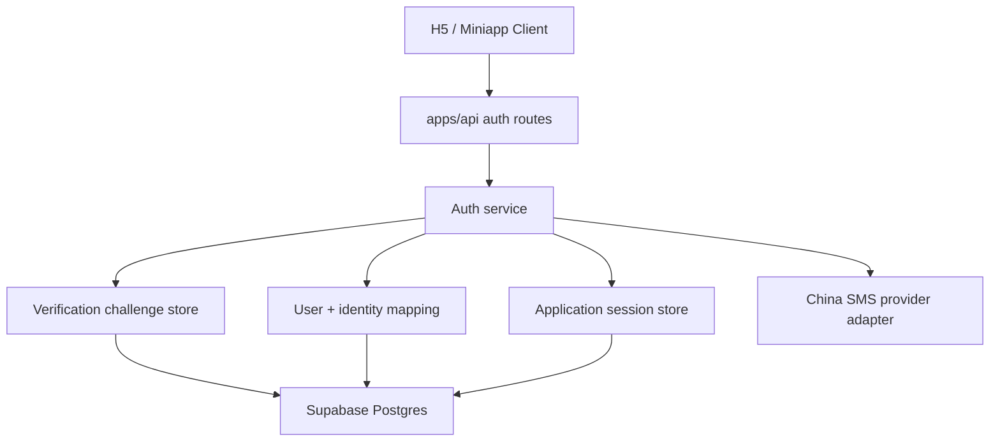

# China SMS Authentication Design

- Date: 2026-04-16
- Status: Approved design baseline
- Scope: design only, no implementation in this phase
- Related docs:
  - [产品规格](/Users/wentao.yu/Documents/code/hall-of-fame-miniapp/.worktrees/task1-bootstrap/docs/product-specification.md)
  - [技术方案](/Users/wentao.yu/Documents/code/hall-of-fame-miniapp/.worktrees/task1-bootstrap/docs/technical-architecture.md)
  - [项目架构蓝图](/Users/wentao.yu/Documents/code/hall-of-fame-miniapp/.worktrees/task1-bootstrap/docs/Project_Architecture_Blueprint.md)

## 1. Problem Statement

The project currently uses in-memory auth/session state only. That is acceptable for local development, but it is not compatible with:

- Supabase Postgres as the source of truth
- stable deployment across multiple processes or instances
- persistent anonymous-to-user ownership transfer
- production-grade SMS verification controls

We need a first production-oriented auth design for mainland China users that:

- preserves anonymous trial sessions
- adds mainland China phone number + SMS verification login
- keeps business authorization inside our own backend
- prepares the codebase for Supabase Postgres migration
- does not introduce Supabase Auth as a dependency

## 2. Goals

This design must achieve the following:

1. Keep `anonymous session -> later bind phone` as the primary onboarding path.
2. Support mainland China mobile numbers only in v1 auth.
3. Let our backend generate, store, validate, and expire verification challenges.
4. Let the SMS provider only send messages; it must not own user/session state.
5. Persist users, identities, challenges, and sessions in Postgres-compatible tables.
6. Keep the design compatible with Supabase as a managed Postgres provider.

## 3. Non-Goals

This design explicitly does not include:

- overseas auth providers
- Supabase Auth
- email login
- password login
- reviewer production auth
- WeChat production auth redesign
- frontend direct database access

Those may come later, but are not part of this phase.

## 4. Design Decision Summary

The chosen direction is:

- `China-only SMS OTP` for the first formal login method
- `backend-owned verification challenge + backend-owned sessions`
- `SMS provider as delivery adapter only`
- `Supabase used as Postgres only`
- `anonymous experience remains the default entry path`

This is the right tradeoff because the project already has a custom business API and custom role model. Replacing that with a provider-led auth stack now would create unnecessary coupling and rework.

## 5. Recommended Architecture

## 5.1 High-Level Auth Layers

## 5.2 Responsibility Split

### SMS Provider

The provider only does:

- accept a verified, normalized phone number
- send a template-based verification message
- return provider request metadata

The provider does not do:

- user creation
- user identity binding
- session issuance
- permission judgment
- anonymous ownership merge

### Our Backend

Our backend owns:

- phone number normalization
- challenge creation
- code hashing
- attempt counting
- cooldown and rate limits
- challenge validation
- user identity lookup/creation
- anonymous-to-user merge
- session issuance and refresh

## 6. Authentication Flow

## 6.1 Anonymous Trial

1. Client calls `POST /v1/auth/anonymous`.
2. Backend creates a guest user if needed.
3. Backend issues our own access token + refresh token.
4. User can browse, chat, and start creation in anonymous mode.

This flow stays exactly because it is core to cold-start conversion.

## 6.2 Request SMS Code

1. Client calls `POST /v1/auth/web/sms/request`.
2. Backend validates phone number as mainland China mobile.
3. Backend applies rate limiting by:
   - phone
   - IP
   - device/session if available
4. Backend generates a random one-time code.
5. Backend stores only a code hash and challenge metadata in Postgres.
6. Backend sends the code through the chosen SMS provider.
7. Backend returns a `challengeId` or opaque `requestId`.

## 6.3 Verify SMS Code

1. Client calls `POST /v1/auth/web/sms/verify`.
2. Backend loads the active challenge.
3. Backend checks:
   - challenge exists
   - challenge not expired
   - challenge not consumed
   - attempt count not exceeded
4. Backend compares submitted code to stored hash.
5. Backend marks challenge as consumed.
6. Backend finds or creates the corresponding local user.
7. If the request came from an authenticated anonymous session, backend merges ownership.
8. Backend issues our own application session.

## 6.4 Anonymous Upgrade

This must remain supported:

- anonymous user creates or edits persona
- later verifies phone number
- backend moves persona ownership from anonymous user id to formal user id

That merge remains an application concern, not an SMS provider concern.

## 7. Data Model

## 7.1 Existing Tables We Can Reuse

The current schema already provides a good base:

- `users`
- `auth_identities`
- `sessions`

Those tables should remain the canonical auth-state tables.

### `users`

Use as the local user shadow table.

Purpose:

- stable user id for all business tables
- decouple business ownership from provider specifics

### `auth_identities`

Use for provider bindings.

For SMS login:

- `provider = WEB_SMS`
- `provider_subject = normalized_phone`

This is enough to preserve a provider abstraction later.

### `sessions`

Use for access/refresh lifecycle.

Keep current schema direction:

- store token hashes, not raw tokens
- keep `anonymous_session_id` for merge lineage if useful

## 7.2 New Table Required

We need a dedicated verification challenge table.

Recommended table:

`auth_verification_challenges`

Suggested columns:

- `id UUID PRIMARY KEY`
- `channel TEXT NOT NULL`
- `target TEXT NOT NULL`
- `code_hash TEXT NOT NULL`
- `purpose TEXT NOT NULL`
- `provider_name TEXT`
- `provider_request_id TEXT`
- `attempt_count INTEGER NOT NULL DEFAULT 0`
- `max_attempts INTEGER NOT NULL`
- `cooldown_until TIMESTAMPTZ`
- `expires_at TIMESTAMPTZ NOT NULL`
- `consumed_at TIMESTAMPTZ`
- `ip_hash TEXT`
- `device_fingerprint_hash TEXT`
- `created_at TIMESTAMPTZ NOT NULL DEFAULT now()`

For v1:

- `channel` can be fixed as `SMS_CN`
- `purpose` can be fixed as `LOGIN_BIND`

But keep them as columns so we do not paint ourselves into a corner.

## 7.3 Phone Normalization Rule

The project should support mainland China numbers only in this phase.

Canonical storage rule:

- store phone numbers normalized to E.164-like form with country code
- example: `+8613812345678`

This gives us:

- one canonical identity key
- clean uniqueness constraint
- easier future provider replacement

## 8. Session Design

## 8.1 Session Ownership

The application continues to own:

- access tokens
- refresh tokens
- roles
- session kind

The session design must not depend on any external provider token format.

## 8.2 Token Storage

Recommended rule:

- raw access/refresh tokens are returned once to client
- only token hashes are stored in Postgres

This matches the existing schema direction and is safer than persisting raw tokens.

## 8.3 Session Kinds

Retain the current logical distinction:

- `ANONYMOUS`
- `AUTHENTICATED`

Retain the current role distinction:

- `ANONYMOUS`
- `USER`
- `REVIEWER`

Reviewer auth can remain a separate dev/internal path for now.

## 9. API Shape

The current route shape is already close to correct and should be preserved.

## 9.1 Request Code

`POST /v1/auth/web/sms/request`

Request:

- `phoneNumber`

Response:

- `ok`
- `requestId`

The response should not reveal whether the number already belongs to an existing user.

## 9.2 Verify Code

`POST /v1/auth/web/sms/verify`

Request:

- `phoneNumber`
- `code`
- optional current anonymous bearer token in header

Response:

- `userId`
- `accessToken`
- `refreshToken`
- `role`
- `sessionKind`

## 9.3 Refresh

`POST /v1/auth/refresh`

This remains an application session concern and does not change because of SMS login.

## 10. SMS Provider Strategy

## 10.1 Adapter Interface

We should formalize a provider adapter boundary now, even before implementation.

Suggested internal interface:

- `sendVerificationCode(input): Promise<{ provider: string; requestId?: string | null }>`

The adapter must receive:

- normalized phone
- code
- template parameters

The adapter must not know:

- user ids
- persona ownership
- business roles

## 10.2 Recommended Provider Choice

For the first mainland China implementation, the best default choice is:

- `Tencent Cloud SMS`

Reason:

- China-first product context
- likely better operational fit if WeChat Miniapp remains part of product strategy
- mature SMS API and review process

Fallback provider:

- `Alibaba Cloud SMS`

The abstraction should make provider replacement cheap.

## 10.3 Provider-Specific Fields Must Not Leak

Do not place provider-specific status fields in core user/session tables.

Provider request metadata belongs only in:

- the challenge table
- provider adapter logs

## 11. Security and Abuse Controls

These are not optional.

## 11.1 Code Generation

- numeric one-time code
- high enough entropy for SMS OTP
- never reuse a previous active code

## 11.2 Storage

- store only code hash
- never store raw OTP after send

## 11.3 Expiration

Recommended:

- challenge valid for `5 minutes`

## 11.4 Attempt Limits

Recommended:

- max verify attempts per challenge: `5`

After that:

- challenge becomes invalid
- user must request a new code

## 11.5 Send Rate Limits

Minimum required:

- per phone rolling window
- per IP rolling window
- short resend cooldown

Recommended baseline:

- resend cooldown: `60 seconds`
- phone daily cap
- IP daily cap

## 11.6 Enumeration Resistance

The request and verify responses should not tell the client:

- whether the phone number already exists
- whether the number is registered but blocked

## 11.7 Auditability

At minimum, log:

- request accepted/rejected
- verify accepted/rejected
- provider send result
- merge from anonymous success/failure

## 12. Supabase Compatibility

This design is explicitly shaped to be compatible with Supabase as managed Postgres.

## 12.1 What We Will Use Supabase For

- Postgres hosting
- connection pooling
- backups and operational convenience

## 12.2 What We Will Not Use Supabase For

- Supabase Auth
- frontend-direct auth/session
- RLS as the primary application permission system

## 12.3 Why This Stays Compatible

Because the design relies only on:

- ordinary relational tables
- backend-owned session logic
- backend-owned verification logic

Nothing in this design requires:

- proprietary Supabase auth tables
- Supabase-issued JWTs
- provider-owned session state

That means we can:

- run locally on plain Postgres
- deploy on Supabase Postgres in production
- move away from Supabase later if needed

without rewriting the auth model.

## 13. Migration Strategy

This section defines how auth should fit into the broader Postgres migration without forcing us to implement everything at once.

## 13.1 Phase 1

Implement:

- persistent `users`
- persistent `auth_identities`
- persistent `sessions`
- persistent `auth_verification_challenges`
- anonymous upgrade path

Do not implement:

- WeChat production auth redesign
- reviewer production auth redesign
- overseas auth

## 13.2 Phase 2

After core business data is on Postgres:

- replace dev reviewer shortcut with proper internal auth path
- align WeChat login persistence with the same identity/session model

## 13.3 Phase 3

Only if product needs it:

- add additional identity providers
- add stronger risk controls
- add challenge purposes beyond login/bind

## 14. Open Implementation Constraints

These are constraints, not unresolved design questions:

- auth stays backend-owned
- anonymous flow remains
- SMS provider is delivery-only
- first region is mainland China only
- session issuance stays local to our API

## 15. What This Enables

Once implemented, this design gives us:

- deployable persistent auth compatible with Supabase Postgres
- anonymous-to-user continuity
- no lock-in to Supabase Auth
- no coupling between SMS provider and business permissions
- a clean path to add future providers without rewriting business ownership tables

## 16. Final Recommendation

The correct first production-oriented auth path for this project is:

- keep anonymous trial
- add mainland China SMS OTP
- generate and validate OTP in our backend
- store users, identities, challenges, and sessions in Postgres
- use Supabase only as the Postgres host

This is the narrowest change that solves the current deployment problem without introducing a second auth architecture that we would later have to unwind.
