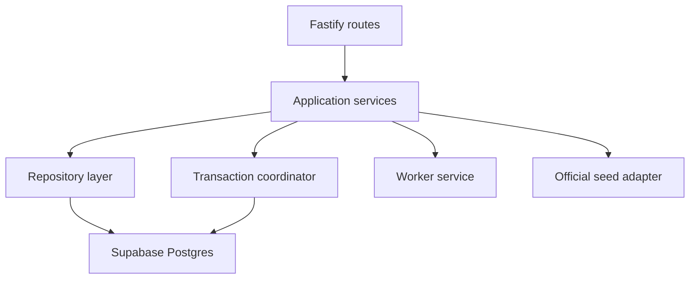

# Supabase Postgres Migration Design

- Date: 2026-04-16
- Status: Approved design baseline
- Scope: design only, no implementation in this phase
- Related docs:
  - [项目架构蓝图](/Users/wentao.yu/Documents/code/hall-of-fame-miniapp/.worktrees/task1-bootstrap/docs/Project_Architecture_Blueprint.md)
  - [China SMS Authentication Design](/Users/wentao.yu/Documents/code/hall-of-fame-miniapp/.worktrees/task1-bootstrap/docs/superpowers/specs/2026-04-16-cn-sms-auth-design.md)
  - [技术方案](/Users/wentao.yu/Documents/code/hall-of-fame-miniapp/.worktrees/task1-bootstrap/docs/technical-architecture.md)
  - [数据库草案](/Users/wentao.yu/Documents/code/hall-of-fame-miniapp/.worktrees/task1-bootstrap/apps/api/src/db/schema.sql)

## 1. Problem Statement

The project already has:

- a substantial relational schema draft
- route contracts and business semantics built around versions, sources, shares, chats, and reviews
- worker-backed ingest and distill flows

But the running application still persists nearly all state in in-memory stores:

- `auth-store.ts`
- `chat-store.ts`
- `persona-store.ts`

That makes the current runtime incompatible with:

- deployment across multiple instances
- stable sessions across restarts
- Supabase Postgres as production storage
- durable review/publish/share state
- reliable chat persistence

The migration must move the project from in-memory application state to Postgres without rewriting the entire product architecture.

## 2. Primary Goal

Use Supabase as a managed Postgres backend while preserving:

- backend-owned business rules
- backend-owned authorization semantics
- worker/API split
- version-first share and publish model
- current route surface as much as possible

## 3. Non-Goals

This migration design does not include:

- Supabase Auth
- frontend direct database access
- RLS-driven application authorization
- complete official-seed-to-database migration
- queue/event-architecture redesign
- storage migration to Supabase Storage

## 4. Core Migration Decision

The chosen direction is:

- `Supabase = managed Postgres only`
- `application server remains source of business logic`
- `repositories replace in-memory stores`
- `official seeds stay code-backed in phase 1`
- `worker continues to return structured results to API`
- `API owns persistence writes for primary business aggregates`

This is the narrowest change that produces deployable persistence without changing the product model.

## 5. Why Not Use Supabase as the Application Layer

We are explicitly not choosing:

- frontend direct `supabase-js`
- database-driven auth/session enforcement
- RLS as the primary authorization layer

Reason:

- the project already has a meaningful backend API boundary
- permissions depend on business state, not only row ownership
- chat/share/review/publish logic is application-level, not CRUD-level
- moving business rules into DB policies now would increase coupling and reduce velocity

## 6. Current State Assessment

## 6.1 Store Boundaries Today

### `auth-store.ts`

Currently owns:

- anonymous session creation
- SMS and WeChat identity binding
- reviewer session shortcut
- refresh flow
- access-token lookup

### `chat-store.ts`

Currently owns:

- chat session persistence only

### `persona-store.ts`

Currently owns far too much:

- featured hall composition
- persona creation and update
- persona version lifecycle
- ownership checks
- source creation and source review
- source-document/evidence materialization
- distill input preparation
- distilled-version persistence
- publish submission and publish review
- share creation and share resolution
- chat target resolution
- fallback dynamic reply
- feedback persistence

This file is not only a store. It is acting as:

- repository
- domain service
- transaction coordinator
- seed adapter
- share slug generator
- review and publish policy layer

That is the biggest migration risk.

## 6.2 Existing Schema Coverage

The schema draft already covers the right major aggregates:

- users
- auth_identities
- sessions
- personae
- persona_versions
- persona_sources
- source_documents
- evidence_spans
- persona_chunks
- persona_version_sources
- share_links
- chats
- chat_messages
- persona_feedback
- source_reviews
- persona_version_publish_reviews

This means the migration problem is not schema absence.
It is application-layer restructuring.

## 7. Target Architecture After Migration

Key rule:

- routes should stop talking directly to giant store files
- services should own use-case orchestration
- repositories should own database IO only
- transactions should be explicit for multi-table business operations

## 8. Repository Design

## 8.1 Required Repository Split

The in-memory stores should be replaced by repositories aligned to aggregates.

Recommended split:

- `user-repository`
- `identity-repository`
- `session-repository`
- `persona-repository`
- `persona-version-repository`
- `source-repository`
- `source-document-repository`
- `share-repository`
- `chat-repository`
- `review-repository`
- `feedback-repository`

This is intentionally more granular than the current stores.

## 8.2 Why This Split Is Necessary

Because otherwise we will simply rebuild `persona-store.ts` as a SQL-backed god module.

That would:

- preserve current coupling
- make transactions opaque
- make testing difficult
- make auth and worker integration harder later

## 8.3 Repository Responsibilities

### Persona Repository

Owns:

- create persona
- update persona fields
- get persona summary
- set current draft/published version pointers
- featured-hall DB queries for user-created data

Does not own:

- share creation
- distill orchestration
- publish review logic

### Persona Version Repository

Owns:

- create version
- fetch version
- list versions by persona
- update version status and timestamps
- attach version-source snapshots

### Source Repository

Owns:

- create text source
- create URL source
- update source review state
- list sources
- list approved sources for distill input

### Source Document Repository

Owns:

- persist worker ingest result
- create source document records
- create evidence spans
- read evidence for chat runtime

### Share Repository

Owns:

- create share link for published version
- resolve share slug
- enforce unique primary share per version

### Chat Repository

Owns:

- create chat session
- fetch chat session
- append chat messages
- fetch chat history

### Review Repository

Owns:

- pending source review queue
- pending publish review queue
- record source review decision
- record publish review decision

### Feedback Repository

Owns:

- persist post-chat feedback

## 9. Application Service Design

Repositories alone are not enough.
We need use-case level services that coordinate business rules.

Recommended service modules:

- `persona-service`
- `source-service`
- `distill-service`
- `publish-service`
- `share-service`
- `chat-service`
- `review-service`
- `feedback-service`

These services should absorb orchestration now buried inside routes and `persona-store.ts`.

## 10. Transaction Boundaries

These operations must become explicit database transactions.

## 10.1 Create Persona

Transaction contents:

- create `personae`
- create initial `persona_versions`
- update `current_draft_version_id`

## 10.2 Persist URL Ingest Result

Transaction contents:

- update `persona_sources`
- create `source_documents`
- create `evidence_spans`

## 10.3 Persist Distilled Version

Transaction contents:

- create new `persona_versions`
- create `persona_version_sources`
- update `personae.current_draft_version_id`
- update persona status if needed

## 10.4 Review Source

Transaction contents:

- update `persona_sources.review_status`
- set `reviewed_by_user_id`, `reviewed_at`, `review_reason`
- insert `source_reviews`

## 10.5 Submit Publish Review

Transaction contents:

- update version status to `PENDING_PUBLISH_REVIEW`
- set submission timestamp

## 10.6 Approve Publish

Transaction contents:

- insert publish review record
- mark current published version as `SUPERSEDED` if necessary
- mark approved version as `PUBLISHED`
- set persona `current_published_version_id`
- create primary `share_links`
- update persona status to `PUBLISHED`

This is the most critical transaction in the whole system.

## 10.7 Reject Publish

Transaction contents:

- insert publish review record
- update version status to `REJECTED`

## 10.8 Append Chat Message

Recommended transaction:

- insert user message
- insert assistant message

This keeps the chat timeline consistent if one insert fails.

## 11. Official Seed Strategy

This needs to be explicit.

## 11.1 Phase 1 Rule

Official personae remain code-backed:

- featured list for official seeds continues to come from `seed/official-personae.ts`
- official share resolution continues to be seed-aware
- official runtime context continues to be built from seed records

## 11.2 Why This Is Correct

Trying to migrate official seeds into the database during the same phase would combine:

- persistence migration
- content import pipeline
- canonical seed source decision

That is too much scope for one migration.

## 11.3 Consequence

Phase 1 is intentionally hybrid:

- user-created data in Postgres
- official seed data in code

That is acceptable as a transitional architecture.

## 12. Chat Persistence Design

## 12.1 Current State

`chat-store.ts` only stores chat sessions in memory.

## 12.2 Target State

Chats move entirely to relational persistence:

- `chats`
- `chat_messages`

## 12.3 Important Rules

- target type remains one of:
  - `published_persona`
  - `draft_version_preview`
  - `share_link`
- target version is always persisted on chat creation
- message rows keep:
  - content
  - basis
  - basis_summary
  - inference_level
  - refusal_reason
  - conflict_detected

The chat runtime itself does not need to change shape.
Only the persistence backend changes.

## 13. Auth Scope Relative to This Migration

This migration should stay compatible with the separate China SMS auth design.

## 13.1 Phase 1 Choice

We do **not** block business-data migration on full auth redesign.

But the migration architecture must reserve room for:

- persistent users
- persistent identities
- persistent sessions

## 13.2 Practical Rule

Implementation order may be:

1. business aggregates first
2. auth/session persistence next

But schema and repository layout should not assume auth will stay in-memory permanently.

## 14. Supabase-Specific Guidance

## 14.1 What We Need from Supabase

At implementation time we will need:

- `DATABASE_URL`
- ideally `DIRECT_DATABASE_URL` for migrations/admin access

No other Supabase product is required for this phase.

## 14.2 Recommended Access Pattern

The application should connect to Supabase Postgres using a standard Node Postgres client.

Recommended library:

- `postgres`

Reason:

- lightweight
- ESM-friendly
- enough for current repository-first migration
- avoids ORM overreach in the first persistence pass

## 14.3 What We Should Not Do

- do not use `supabase-js` as the primary server-side data layer
- do not let frontend read/write business tables directly
- do not move authorization semantics into RLS first

## 15. Migration Phases

## 15.1 Phase A: Database Foundation

Deliverables:

- DB client module
- migration runner
- environment wiring
- health check for DB connectivity

No route behavior change yet.

## 15.2 Phase B: User-Created Persona Persistence

Move to DB:

- personae
- persona_versions
- persona_sources
- source_documents
- evidence_spans
- persona_version_sources

Keep official seeds in code.

## 15.3 Phase C: Review + Publish + Share Persistence

Move to DB:

- source_reviews
- persona_version_publish_reviews
- share_links

This phase must also add explicit transaction handling.

## 15.4 Phase D: Chat Persistence

Move to DB:

- chats
- chat_messages
- persona_feedback

## 15.5 Phase E: Auth Persistence

Align with the China SMS auth design:

- users
- auth_identities
- sessions
- verification challenges

This phase can happen immediately after D, or sooner if deployment needs force it.

## 16. Testing Strategy

## 16.1 Local Testing

Do not test against production Supabase.

Use:

- local Postgres via Docker for automated tests
- Supabase only as the hosted production/staging database target

## 16.2 Test Layers

We need:

- repository tests
- service tests around transaction-heavy flows
- API integration tests

The current in-memory tests should be progressively replaced or duplicated with DB-backed equivalents.

## 16.3 Seed and Fixture Strategy

For repository tests:

- use explicit SQL fixture setup
- avoid hidden global state
- isolate each test case with transaction rollback or fresh schema

## 17. Risks

## 17.1 Biggest Technical Risk

Mechanical migration of `persona-store.ts` into SQL calls.

That would create:

- giant repository modules
- hidden transaction coupling
- poor testability

This must be avoided.

## 17.2 Secondary Risk

Mixing official-seed import work into the persistence migration.

That expands scope without helping deployment.

## 17.3 Operational Risk

Using hosted Supabase for development tests too early.

That creates:

- slower iteration
- accidental shared-state failures
- fragile local development

## 18. Deliverables for the Implementation Phase

When this design turns into implementation, the deliverables should be:

- database client setup
- migration runner and migration files
- repository layer
- service layer extraction from stores
- route rewiring
- DB-backed tests

Success means:

- no primary business state remains in in-memory Maps
- user-created personas survive restart/deploy
- reviews, publishes, shares, and chats survive restart/deploy
- API behavior remains functionally compatible

## 19. Final Recommendation

The correct path is not:

- “replace stores with SQL one function at a time”

The correct path is:

1. create DB foundation
2. split repositories by aggregate
3. move orchestration into services
4. add explicit transactions for review/publish/share/chat writes
5. keep official seeds code-backed during phase 1

This is the lowest-risk route to make the system deployable on Supabase Postgres without rewriting the application model.
