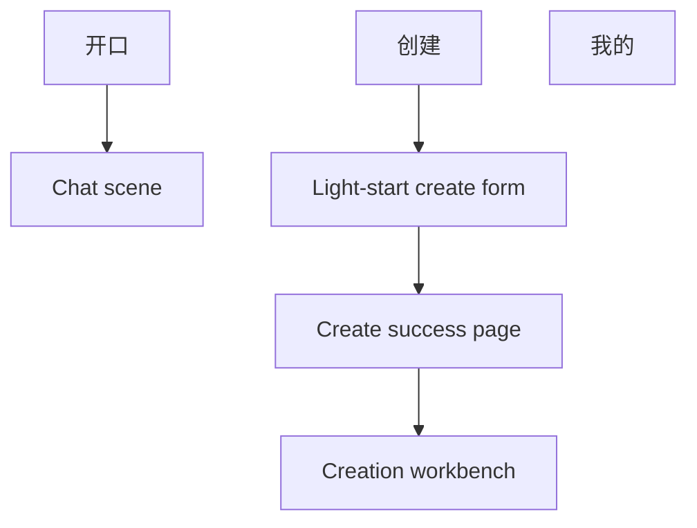

# Consumer Surface Redesign Design

- Date: 2026-04-22
- Status: Approved design baseline
- Scope: design only, no implementation in this phase
- Related docs:
  - [产品规格](/Users/wentao.yu/Documents/code/hall-of-fame-miniapp/.worktrees/task1-bootstrap/docs/product-specification.md)
  - [技术方案](/Users/wentao.yu/Documents/code/hall-of-fame-miniapp/.worktrees/task1-bootstrap/docs/technical-architecture.md)
  - [项目架构蓝图](/Users/wentao.yu/Documents/code/hall-of-fame-miniapp/.worktrees/task1-bootstrap/docs/Project_Architecture_Blueprint.md)

## 1. Problem Statement

The current consumer-facing surface has three design problems:

- the color system is too single-note and visually fatiguing
- the global navigation and page responsibilities are blurred
- the homepage and create flow carry too much product weight in the wrong places

That creates several concrete product issues:

- users must mentally choose between "homepage" and "chat" before they can talk
- the homepage is at risk of becoming a mixed dashboard instead of a clean entry scene
- the create entry feels too heavy if it starts as a full editor
- the shared bottom navigation can easily become a generic tool bar

We need a cleaner consumer IA that:

- feels younger and more premium
- stays compatible with a future miniapp shell
- keeps the homepage narrow and object-first
- preserves a clear path into chat
- lowers the barrier to creation without losing a full workbench later
- supports both light and dark mode without splitting the product architecture

## 2. Design Goals

This redesign must achieve the following:

1. Resolve the old `homepage vs chat` ambiguity by making the primary entry obvious.
2. Give the product a younger, sharper, more premium visual language.
3. Keep the consumer homepage minimal instead of turning it into a portal.
4. Preserve a stable global navigation model that works for H5 and miniapp.
5. Make creation feel easy to start and structured to continue.
6. Keep the same information architecture across light and dark themes.

## 3. Non-Goals

This design explicitly does not include:

- backend contract changes
- reviewer/admin product redesign as a first-class consumer surface
- recommendation feed design
- creator marketplace design
- implementation details for animations or component APIs
- code changes in this phase

## 4. Core Design Decision Summary

The chosen direction is:

- three first-level tabs only: `开口 / 创建 / 我的`
- `开口` becomes the primary consumer scene
- the `开口` homepage shows platform-built-in chat objects only
- homepage interaction is a horizontal swipe main-card carousel
- tapping the active persona card enters chat directly
- homepage copy budget is extremely small: one slogan and one short intro per object
- global navigation uses a `floating dock`, not a heavy embedded tab bar
- default light mode uses `Trend Tech A`: chrome-silver surfaces with `signal blue`
- dark mode uses `Trend Tech B`: carbon surfaces with `volt green`
- `创建` starts with a light-start form, then expands into a full workbench
- the workbench priority order is fixed: `对象定义 -> 资料管理 -> 预览 -> 发布`

This is the narrowest redesign that fixes the product's current visual and structural problems without inventing a completely different product model.

## 5. High-Level Information Architecture

Key rule:

- chat remains an important scene, but it is no longer a first-level tab
- `开口` is the primary consumer landing surface
- `创建` is the production entry
- `我的` is the management and settings surface

## 6. First-Level Navigation

## 6.1 Navigation Model

The first-level navigation is permanently reduced to:

- `开口`
- `创建`
- `我的`

Responsibility split:

### `开口`

Owns:

- browsing platform-built-in chat objects
- choosing who to talk to
- entering the chat scene directly

Does not own:

- creator management
- settings
- review operations
- dashboard-style status blocks

### `创建`

Owns:

- starting a new object
- continuing creation work
- entering the creation workbench

### `我的`

Owns:

- account and preferences
- theme switching
- created objects
- drafts and published objects
- share-related management
- reviewer/admin secondary entry if needed later

This is important because reviewer/admin is not a high-frequency consumer action and should not consume a first-level tab.

## 6.2 Navigation Presentation

The chosen shared navigation shell is a `floating dock`.

Hard requirements:

- exactly three visible labeled items
- bottom-thumb reachable
- light mode active state uses `signal blue`
- dark mode active state uses `volt green`
- text labels are required, not icon-only

Hard rejections:

- no raised center create button
- no heavy embedded system tab bar
- no complex sci-fi container shape
- no fourth first-level item for chat or review

## 7. Visual System

## 7.1 Brand and Mood Direction

The approved visual direction is not soft editorial minimalism.
It is a younger `trend-tech` system:

- brighter in default mode
- higher contrast
- more premium and sharp
- less beige, less muted, less "lifestyle brochure"

The product should feel closer to a young digital brand than a documentation tool or admin console.

## 7.2 Theme Strategy

The app supports a real theme switch:

- default = light mode
- alternate = dark mode

The two modes share:

- the same information architecture
- the same page responsibilities
- the same navigation model
- the same hierarchy and interaction structure

The two modes do not share the same emotional color balance:

- light mode is cleaner and more polished
- dark mode is more energetic and more nightlife-adjacent

This is not a naive dark inversion. It is one product architecture expressed through two material systems.

## 7.3 Color Tokens

Recommended implementation baseline:

### Light mode

- page background: `#EEF2F8`
- elevated surface gradient: `#F9FBFF -> #D7DEEA`
- primary text: `#0F141A`
- secondary text: `#3C4758`
- primary accent: `#3870FF` (`signal blue`)
- outline / divider: low-opacity graphite, not pure gray

### Dark mode

- page background: `#101315 -> #171B1F`
- elevated surface gradient: `#1B2126 -> #242D35`
- primary text: `#EEF3EE`
- secondary text: `#D5DFD2`
- primary accent: `#B1FF3B` (`volt green`)
- support accent: `#44DBFF` for sparse metadata, indicators, and secondary emphasis

Usage rules:

- every theme has one primary action color only
- support accents stay sparse and must not compete with the main CTA
- large surfaces are carried by layered neutrals, not by fully saturated backgrounds
- the design must avoid falling back to a single muddy neutral tone across the whole page

## 7.4 Typography Direction

Typography should keep a clear contrast between identity and interface:

- display typography for slogan and persona names
- clean sans-serif UI typography for labels, controls, and metadata

The exact font pair may be finalized during implementation, but the contrast is required.
The product should not use a purely generic system-font look if that removes the approved brand feeling.

## 8. `开口` Homepage

## 8.1 Purpose

`开口` is not a classic information homepage.
It is a narrow object-selection scene.

Its only job is to let users pick a built-in object and enter conversation.

## 8.2 Content Scope

The homepage contains only:

- one short slogan
- a horizontal swipe main-card carousel
- one very short intro for the currently visible object
- the global floating dock

The homepage shows platform-built-in objects only.

Hard exclusions:

- no "continue chat" block
- no recommendation path module
- no creator status cards
- no share management entry
- no creation shortcuts
- no stacked feature sections

If a future version needs richer discovery, it should be added as a separate product problem, not smuggled back into this homepage.

## 8.3 Interaction Model

The homepage interaction is fixed as:

- a horizontal swipe main-card carousel
- the focused card is the visual center
- adjacent cards may peek to communicate swiping
- the active card itself is the click target
- tapping the active card enters chat directly
- there is no extra CTA button inside the card

This is deliberate.
The card should feel like the destination, not like a marketing block plus a button.

## 8.4 Copy Budget

The homepage copy budget is intentionally strict:

- slogan: maximum one short line
- object intro: maximum one short sentence

This rule exists to prevent the page from becoming noisy again.

## 9. Chat Scene Positioning

The chat scene remains central to the product, but it is not a first-level tab.

Entry points:

- tap a persona card from `开口`
- other direct routes such as shares may also enter chat later

Design rule:

- chat should remain conversation-first
- it should not re-import homepage modules, discovery blocks, or creator controls into the conversation surface

## 10. `创建` Entry Flow

## 10.1 Product Role

`创建` is not supposed to drop the user into a full backend editor on first contact.

The approved direction is `light-start`.

## 10.2 First Screen Fields

The initial create form contains exactly:

- object name
- one-line positioning
- style tags

Style tags use:

- preset choices
- optional custom input

This gives enough structure to define a creation shell without making the very first step feel like paperwork.

## 10.3 Post-Submit Flow

The post-submit flow is:

1. light-start form
2. create success page
3. primary action: `补资料`
4. enter full creation workbench

We explicitly do not jump straight from the first form into a dense editor.
The success page creates a clean transition between "I started something" and "now I continue building it."

## 11. Creation Workbench

## 11.1 Fixed Priority Order

The workbench order is not decorative.
It is the real product priority order:

1. `对象定义`
2. `资料管理`
3. `预览`
4. `发布`

The page should follow that order from top to bottom.

## 11.2 Section Behavior Rules

The workbench must behave as follows:

- only the current stage gets the main visual emphasis and primary action
- completed stages collapse into lighter summary cards but remain editable
- future stages stay visible for orientation but should not compete for action priority
- if `对象定义` is already complete, the workbench focus should land on `资料管理`

This prevents the page from turning into four equally loud modules.

## 11.3 Data Ingestion Priority

Inside `资料管理`, two actions are visible:

- `添加文本资料`
- `导入链接`

But the default primary push is:

- `添加文本资料`

Reason:

- it is the lowest-friction input path
- it reduces user hesitation
- it avoids making the first meaningful creation step depend on source quality or URL parsing

## 11.4 Preview Before Publish

`预览` is positioned before `发布` on purpose.

The intended mental model is:

- define the object
- feed the object
- hear how it talks
- only then prepare it for publish/review

This keeps the product grounded in conversational quality instead of administrative completion.

## 12. `我的`

`我的` is the low-frequency management surface.

It should own:

- profile and account settings
- theme switch
- my created objects
- draft list
- published list
- share-related management
- reviewer/admin secondary entry if needed

Theme switching belongs here by default.
It should not be forced onto the homepage if that makes the homepage heavier.

## 13. Explicit Design Guardrails

The redesign should reject the following regressions:

- bringing back separate first-level `homepage` and `chat` tabs
- turning `开口` into a feed or dashboard
- putting more than three first-level tabs in the dock
- making `创建` the visually overgrown center action in the dock
- starting creation with a full workbench instead of light-start
- making the workbench feel like a backend control panel
- using an over-muted, low-accent color system that feels old or tiring
- using too many accent colors at once so the interface becomes noisy

## 14. Acceptance Criteria for Implementation

The implementation should be considered aligned with this design only if:

1. The consumer shell has exactly `开口 / 创建 / 我的` as first-level tabs.
2. `开口` contains only a slogan, swipeable persona cards, short intros, and the dock.
3. The active homepage card is itself the tap target into chat.
4. Light mode defaults to the chrome-silver plus `signal blue` system.
5. Dark mode switches to the carbon plus `volt green` system without changing IA.
6. `创建` starts with the three-field light-start form.
7. Create submit lands on a success page before the workbench.
8. The workbench is visibly ordered as `对象定义 -> 资料管理 -> 预览 -> 发布`.
9. `资料管理` visibly exposes both text and link ingestion, while prioritizing text.
10. `我的` carries theme switching and management concerns instead of pushing them into the homepage.
