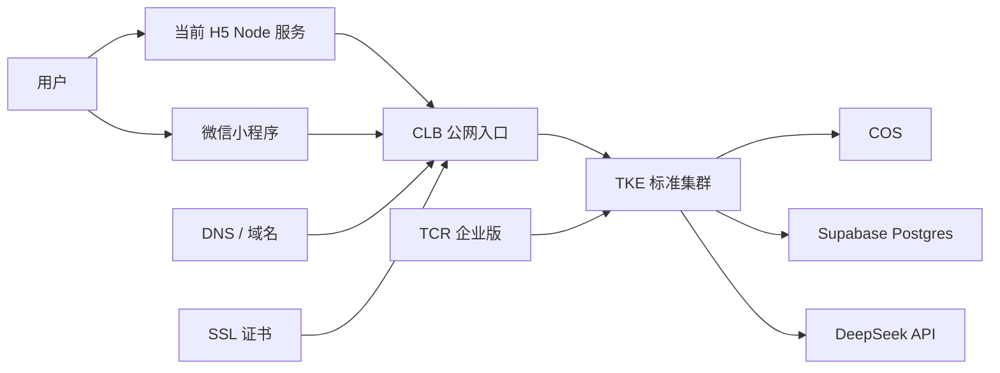
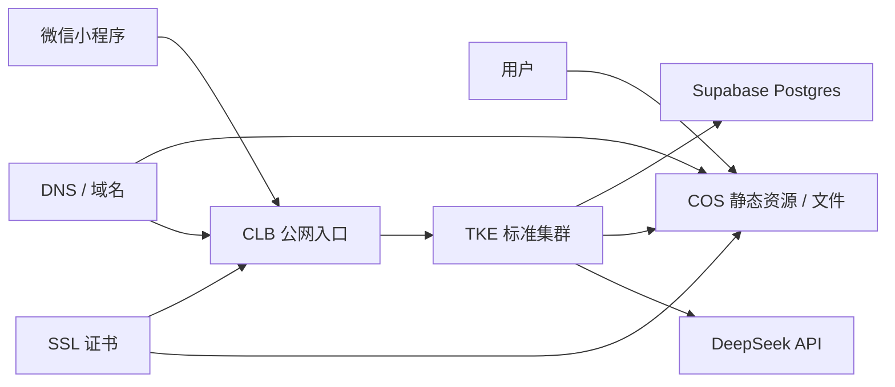

# Hall of Fame 腾讯云部署方案

- 日期：2026-04-21
- 状态：建议采用，可进入实际采购与实施阶段
- 适用范围：
  - 当前 `.worktrees/task1-bootstrap` 工程骨架
  - 当前确认的部署边界：`应用层上腾讯云，PostgreSQL 继续保留 Supabase`

## 1. 方案边界

这份文档只定义当前阶段的腾讯云部署方案，不改变已经确认的数据库路线。

当前边界如下：

1. `apps/api` 部署到腾讯云
2. `apps/worker` 部署到腾讯云
3. 当前 `apps/client` 的 H5 Node 服务先部署到腾讯云
4. 未来 H5 收敛为静态产物后，再从容器切到静态托管
5. `PostgreSQL` 继续使用 `Supabase Postgres`
6. `Redis` 只作为后续能力预留，不假设当前业务已经接入
7. 对象存储、HTTPS 入口、镜像仓库放在腾讯云

这意味着当前不是“全量迁云”，而是：

`应用层上腾讯云，数据主库继续保留在 Supabase。`

## 2. 为什么当前不迁 PostgreSQL

当前仓库已经明确把 `Supabase` 当成托管 PostgreSQL 提供商，而不是临时占位：

- README 已写明可以直接使用 `Supabase Session Pooler`
- API 数据库配置已经内置当前项目的 Supabase pooler host
- 当前讨论的目标是先把部署形态稳定，而不是在同一阶段同时更换数据库供应商

所以当前腾讯云方案里：

- 不默认购买 `TencentDB for PostgreSQL`
- 不把数据库迁移当作本阶段前置条件

后续如果你明确要降低跨云依赖，再单独讨论 `Supabase -> TencentDB for PostgreSQL` 的迁移窗口。

## 3. 当前项目的现实约束

### 3.1 H5 现在不是静态站点

当前 `apps/client` 还是 `Fastify` 进程形态，适合作为容器运行，而不是直接按静态站点托管：

- `apps/client/src/dev-h5.ts`
- `apps/client/src/h5-app.ts`

所以腾讯云第一阶段更合理的部署方式是：

`H5 先和 API/Worker 一样进入容器体系。`

### 3.2 Redis 现在还不是正式运行依赖

当前仓库里已经有：

- 本地 `docker-compose` 的 `redis`
- 环境变量里的 `REDIS_URL`
- 架构文档中的 `Redis + BullMQ` 目标设计

但当前代码还没有真正把 `Redis` 接入业务运行链路，`api -> worker` 仍然主要是直接 HTTP 调用。

所以这份腾讯云方案里对 Redis 的处理原则是：

- 架构上预留
- 采购上暂缓
- 不把它写成“上线前必须买”的前置资源

## 4. 推荐部署拓扑

### 4.1 当前阶段

### 4.2 目标阶段

当 `apps/client` 收敛成正式静态 H5 构建产物后，建议切成下面这个结构：

核心变化只有一件事：

`H5 从容器服务切到静态交付层，但 API / Worker / Supabase 的关系保持不变。`

这就是这套方案迁移成本低的原因。

## 5. 腾讯云产品映射

| 部署能力 | 当前推荐产品 | 作用 | 当前是否建议购买 |
| --- | --- | --- | --- |
| 容器运行环境 | `TKE 标准集群` | 运行 `api`、`worker`、当前 H5 Node 服务 | 是 |
| 镜像仓库 | `TCR 企业版` | 存储和分发业务镜像 | 是 |
| 对象存储 | `COS` | 替代本地 `MinIO`，保存上传文件、源资料快照、分享图等 | 是 |
| 公网 HTTPS 入口 | `CLB` | 对外暴露 `api` 和当前 H5 | 是 |
| 证书管理 | `SSL 证书` | 给 `CLB` 和后续静态域名挂 HTTPS | 是 |
| 主数据库 | `Supabase Postgres` | 当前主业务数据库 | 保持现状 |
| 缓存 / 队列 | `TencentDB for Redis` | 为后续 Redis/BullMQ 预留 | 否，暂缓 |
| 主数据库替代 | `TencentDB for PostgreSQL` | 只有未来收数据库上云时才需要 | 否，不买 |

## 6. 地域建议

腾讯云官方在创建 TKE 集群文档里明确提醒：地域购买后不能更换，并建议选择靠近用户的地域以降低延时。

结合当前项目实际情况，我的建议是：

1. 如果当前数据库继续保留在 `Supabase Singapore`，腾讯云优先看 `新加坡` 或 `中国香港`
2. 不建议第一阶段把应用层直接放到中国内地地域
3. 原因不是腾讯云本身不行，而是当前数据库连接会变成更长、更复杂的跨境链路

这里第 3 点是我基于当前仓库配置做出的工程判断，不是腾讯云文档原话。

## 7. 采购顺序

### 7.1 第一批，建议立即处理

1. `TKE 标准集群`
2. `TCR 企业版`
3. `COS`
4. `CLB`
5. `SSL 证书`

### 7.2 第二批，等代码接入后再处理

1. `TencentDB for Redis`

### 7.3 当前不处理

1. `TencentDB for PostgreSQL`

## 8. 推荐购买与开通入口

以下链接均为腾讯云官网当前可用入口，校验时间为 `2026-04-21`。其中部分“购买”链接会先跳转腾讯云登录页，这是正常行为。

### 8.1 TKE 标准集群

- 产品页：[容器服务 TKE](https://cloud.tencent.com/product/tke)
- 集群入口：[TKE 控制台](https://console.cloud.tencent.com/tke2/cluster)
- 创建文档：[创建集群](https://cloud.tencent.com/document/product/457/103981)

推荐理由：

- 适合直接运行 `api`、`worker`、当前 H5 Node 服务
- 保持后续扩容、灰度、滚动发布空间
- 不把项目核心运行时绑定到云厂商专属应用托管模型

### 8.2 TCR 企业版

- 购买入口：[TCR 立即选购](https://buy.cloud.tencent.com/tcr)
- 产品页：[容器镜像服务 TCR](https://cloud.tencent.com/product/tcr)
- 快速入门：[企业版快速入门](https://cloud.tencent.com/document/product/1141/39287)

推荐理由：

- 当前项目已经是多服务结构，正式环境不建议长期依赖个人版镜像仓库
- TCR 企业版支持实例、命名空间、访问控制，更适合后续 `staging / prod` 分层

### 8.3 COS

- 产品页：[对象存储 COS](https://cloud.tencent.com/product/cos)
- 购买入口：[COS 资源包购买](https://buy.cloud.tencent.com/cos)

推荐理由：

- 可以替代当前本地 `MinIO`
- 后续 H5 变为静态构建后，也可以直接承接静态资源分发

采购建议：

- 如果只是先把系统跑起来，不一定要一开始就买资源包
- 最小路径是先开通 COS 并创建 bucket
- 资源包可以等流量和存储量稳定后再补

### 8.4 CLB

- 购买入口：[CLB 立即选购](https://buy.cloud.tencent.com/clb)
- 产品页：[负载均衡 CLB](https://cloud.tencent.com/product/clb)
- 健康检查文档：[配置健康检查](https://cloud.tencent.com/document/product/214/50011)

推荐理由：

- 当前 H5 和 API 都需要稳定公网 HTTPS 入口
- 可以把 H5、API 的健康检查、转发规则和证书挂载收敛到统一入口层

### 8.5 SSL 证书

- 购买入口：[SSL 立即选购](https://buy.cloud.tencent.com/ssl?fromSource=ssl)
- 产品页：[SSL 证书](https://cloud.tencent.com/product/ssl)
- 免费证书文档：[免费 SSL 证书申请流程](https://cloud.tencent.com/document/product/400/6814)

推荐理由：

- 测试环境可以先用免费证书
- 正式环境再根据域名数量和证书类型决定是否购买付费证书

## 9. 当前明确不推荐的两种走法

### 9.1 不推荐直接把 PostgreSQL 切到腾讯云

原因很简单：

- 当前项目已经围绕 `Supabase Postgres` 建立了配置和文档
- 本阶段的目标是先稳定部署与迁移边界
- 同时更换部署平台和数据库供应商，会把风险叠加在一个窗口里

### 9.2 不推荐把 Redis 写成当前正式依赖

因为现在代码里还没有真正把 Redis 接起来。

如果现在直接买 `TencentDB for Redis`，它更像是“未来要用的预采购”，不是对当前上线闭环有直接价值的必要资源。

## 10. 最小落地建议

如果你现在就要开始实际部署，建议先按这条最小路径推进：

1. 建一个 `TKE 标准集群`
2. 建一个 `TCR 企业版` 实例
3. 在 `COS` 建一个业务 bucket
4. 购买或申请 `SSL`，再创建 `CLB`
5. 让 `apps/api`、`apps/worker`、当前 H5 都以镜像方式进入 `TKE`
6. 让 API 继续连现有 `Supabase Postgres`
7. 先不引入腾讯云 Redis

这条路径的优点是：

- 和当前仓库结构一致
- 迁移动作集中在“承载层”，不碰数据库真相
- 后续 H5 静态化时，只需要替换前端交付层，不需要重做整个后端部署体系
