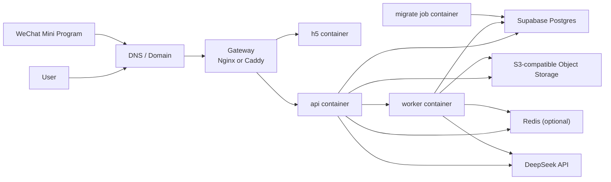

# Hall of Fame 统一 Docker 部署方案

- 日期：2026-04-22
- 状态：已确认，可作为后续实施稿
- 适用范围：
  - 当前 `.worktrees/task1-bootstrap` 工程骨架
  - 当前确认的部署目标：`统一容器交付，一个 Docker 环境可部署全部业务服务`

## 1. 目标

这份方案解决的是：

`如何用一套统一的 Docker 交付方式，把当前项目的全部业务服务稳定部署起来，同时保留后续迁移和扩容空间。`

这里的“全部服务”指的是：

- `gateway`
- `h5`
- `api`
- `worker`
- `migrate`

它**不意味着**把所有基础设施都塞进同一台机器。

当前方案明确区分两层：

1. `业务服务层`：统一进入 Docker
2. `数据与外部能力层`：优先使用外部托管能力

## 2. 最终定案

最终采用这版：

`单机 Docker Compose 统一部署业务服务，外部托管关键数据层。`

具体来说：

- 所有业务服务统一以 Docker 镜像交付
- 服务器上统一由 `docker compose` 编排
- `PostgreSQL` 继续保留 `Supabase`
- `Object Storage` 使用 `S3-compatible` 托管对象存储
- `Redis` 作为可选容器能力预留，不假设当前业务已正式接入
- 小程序不是容器服务，但它继续复用同一套 `api`

## 3. 为什么这版最适合当前项目

当前仓库的服务边界已经很清楚：

- `apps/api`
- `apps/worker`
- `apps/client`

并且三个服务已经有独立启动入口：

- `api` 默认端口 `3000`：[server.ts](/Users/wentao.yu/Documents/code/hall-of-fame-miniapp/.worktrees/task1-bootstrap/apps/api/src/server.ts:8)
- `worker` 默认端口 `3001`：[index.ts](/Users/wentao.yu/Documents/code/hall-of-fame-miniapp/.worktrees/task1-bootstrap/apps/worker/src/index.ts:8)
- `h5` 默认端口 `3100`：[dev-h5.ts](/Users/wentao.yu/Documents/code/hall-of-fame-miniapp/.worktrees/task1-bootstrap/apps/client/src/dev-h5.ts:8)

健康检查也已经具备：

- `api`：`/health`
- `worker`：`/health`
- `h5`：`/health`

这意味着当前最合理的做法不是强行上 Kubernetes，而是先把：

- 服务边界
- 镜像边界
- 环境变量边界
- 发布/回滚边界

全部固定下来。

Docker Compose 正好足够承接这一阶段。

## 4. 部署拓扑

这套拓扑的关键点：

- `gateway` 对公网暴露 `80/443`
- `api` 和 `h5` 由 `gateway` 按域名或路径转发
- `worker` 不对公网开放
- `migrate` 是一次性任务容器，不常驻
- 业务真相只在外部数据库和对象存储

## 5. 容器边界

### 5.1 `gateway`

职责：

- 统一公网入口
- 终止 HTTPS
- 根据域名/路径转发到 `h5` 或 `api`
- 统一处理 gzip、基础安全头、超时和转发头

推荐：

- 优先 `Caddy`，因为 HTTPS 和配置更轻
- 如果团队更熟 `Nginx`，也可以直接用 `Nginx`

### 5.2 `h5`

职责：

- 运行当前 `Node/Fastify` 形态的 H5 服务

当前结论：

- 当前阶段仍以容器方式运行
- 后续如果 H5 收敛为静态构建产物，再从容器切为静态托管

### 5.3 `api`

职责：

- 对外唯一业务 API
- 承载用户、人格、版本、聊天、审核、分享等核心接口

要求：

- 对内暴露 `3000`
- 必须提供健康检查
- 所有配置通过环境变量注入

### 5.4 `worker`

职责：

- 长耗时任务
- 抓取、清洗、蒸馏、异步流程

要求：

- 对内暴露 `3001`
- 不开放公网端口
- 默认只允许内部网络访问

### 5.5 `migrate`

职责：

- 执行数据库迁移
- 执行必要的初始化任务

要求：

- 只在发布时运行
- 完成后退出
- 不能作为常驻服务混入 `api` 启动过程

### 5.6 `redis`

当前定位：

- 不是当前上线必需
- 但 compose 结构里预留位置

建议：

- 本地开发可直接用本地容器
- 生产环境暂时默认关闭
- 等代码真正切到队列/缓存后再决定是否常驻部署

## 6. 统一镜像策略

推荐采用：

- 一个 monorepo 根级多阶段 `Dockerfile`
- 三个正式运行镜像
- 一个迁移任务镜像

建议镜像名：

- `hof-api`
- `hof-worker`
- `hof-h5`
- `hof-migrate`

建议镜像 tag 规则：

- `git-sha`
- `staging-latest`
- `prod-latest`

不要只用裸 `latest`。

## 7. Compose 结构

推荐拆成三层：

### 7.1 基础层

`compose.yml`

只定义：

- 网络
- 服务拓扑
- 共享卷
- 服务间依赖
- 默认容器名和默认端口

### 7.2 环境覆盖层

`compose.staging.yml`

覆盖内容：

- staging 镜像 tag
- staging 域名
- staging 环境变量
- staging 副本策略

`compose.prod.yml`

覆盖内容：

- prod 镜像 tag
- prod 域名
- prod 资源限制
- prod 日志与重启策略

### 7.3 本地开发层

`compose.local.yml`

只服务开发机：

- 本地 `postgres`
- 本地 `redis`
- 本地 `minio`
- 挂载源码或本地端口映射

不要把这层和生产部署文件混用。

## 8. 网络与端口约定

建议固定如下：

- `gateway`: `80`, `443`
- `h5`: `3100`
- `api`: `3000`
- `worker`: `3001`
- `redis`: `6379`，仅内部网络

建议创建一个内部桥接网络，例如：

- `hof-internal`

要求：

- `gateway` 连 `public + internal`
- `h5/api/worker/redis` 只连 `internal`
- `worker` 不做主机端口映射

## 9. 域名与路由规则

推荐两种方式，二选一：

### 9.1 子域名拆分

- `www.example.com` -> `h5`
- `api.example.com` -> `api`

优点：

- 最清晰
- H5 和 API 边界明确
- 后续把 H5 改成静态托管时最容易切换

这是推荐默认方案。

### 9.2 单域名路径拆分

- `example.com/` -> `h5`
- `example.com/api/*` -> `api`

优点：

- 域名数量少

缺点：

- 代理和跨域策略更容易变复杂
- 后续静态迁移不如子域名干净

## 10. 环境变量分层

建议统一拆成：

- `.env.common`
- `.env.staging`
- `.env.production`

### 10.1 通用变量

- `NODE_ENV`
- `APP_PORT`
- `WORKER_PORT`
- `H5_PORT`
- `LOG_LEVEL`

### 10.2 数据库变量

- `DATABASE_URL`
- `POSTGRES_PASSWORD`

当前生产建议：

- 继续显式使用 `Supabase`
- 不在生产机本地自建 `PostgreSQL`

### 10.3 对象存储变量

- `S3_ENDPOINT`
- `S3_REGION`
- `S3_BUCKET`
- `S3_ACCESS_KEY_ID`
- `S3_SECRET_ACCESS_KEY`

### 10.4 Redis 变量

- `REDIS_URL`

当前建议：

- 保留变量定义
- 生产环境可以先不启用

### 10.5 第三方能力变量

- `DEEPSEEK_API_KEY`
- 认证、短信、分享等后续第三方密钥

## 11. 数据与持久化原则

正式环境里：

- 不在容器本地磁盘保存业务数据
- 不在容器卷里保存数据库真相
- 不把用户上传或抓取资料落在宿主机目录

允许保留的本地卷只有：

- `gateway` 的证书缓存
- 临时日志缓冲
- 非关键缓存

核心原则不变：

- 关系数据进 `Supabase Postgres`
- 文件进对象存储
- Redis 只承接短期状态

## 12. 发布流程

统一采用这条流程：

1. CI 构建镜像
2. 推送镜像到镜像仓库
3. 服务器拉取新镜像
4. 执行 `migrate` 容器
5. `docker compose up -d`
6. 执行健康检查
7. 验证路由与关键页面

要求：

- 不在生产机现场构建镜像
- 不在生产机手工改代码
- 不把数据库迁移混进 `api` 启动命令里

## 13. 回滚流程

回滚必须建立在镜像 tag 可追溯前提下。

统一规则：

1. 切回上一版镜像 tag
2. 再次执行 `docker compose up -d`
3. 验证健康检查和关键路径

如果某次变更包含数据库结构升级：

- 回滚前必须确认 migration 是否可逆
- 不可逆 migration 不能和高风险业务改动捆绑发布

## 14. 扩容路径

这套方案的好处是扩容路径很清楚：

### 第一阶段

- 单机 Docker Compose
- `h5 + api + worker + gateway`

### 第二阶段

- 把 `worker` 单独迁到第二台机器
- 仍然使用同一批镜像
- 仍然沿用同一套环境变量

### 第三阶段

- H5 改为静态托管
- `gateway` 只保留 API 入口

### 第四阶段

- 如果服务数、发布频率、弹性需求明显上升，再迁 Kubernetes

也就是说：

`这套 Docker 方案不是临时凑合，它本身就是可迁移的第一阶段正式架构。`

## 15. 当前明确不建议的做法

1. 不建议把 `PostgreSQL + Redis + MinIO + 全部业务服务` 长期塞进一台生产机
2. 不建议让 `worker` 直接暴露公网
3. 不建议把 `api + worker + h5` 强行合并成一个进程
4. 不建议依赖手工 SSH 到服务器后临时执行一串命令完成发布
5. 不建议现在为了“统一”去引入 Kubernetes

## 16. 实施落地顺序

下一步实施建议按这个顺序推进：

1. 补根级多阶段 `Dockerfile`
2. 补 `api / worker / h5 / migrate` 的正式运行入口
3. 补 `compose.yml + compose.staging.yml + compose.prod.yml`
4. 补 `gateway` 配置
5. 补环境变量模板
6. 补镜像构建与发布 CI
7. 补最小健康检查与发布后验证脚本

如果只保留一句话作为最终部署结论，那就是：

`所有业务服务统一进 Docker，用 Compose 管理；数据库和对象存储继续外部托管；后续通过拆机和静态化完成扩容。`
